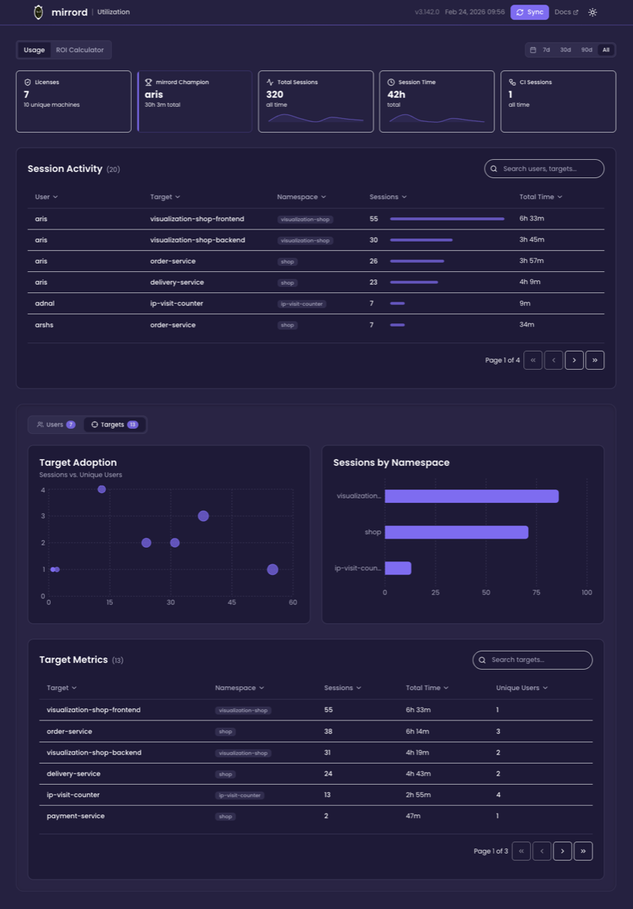
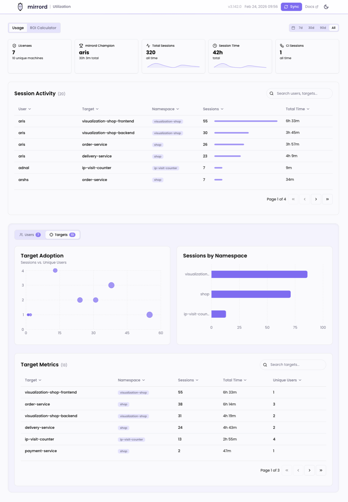
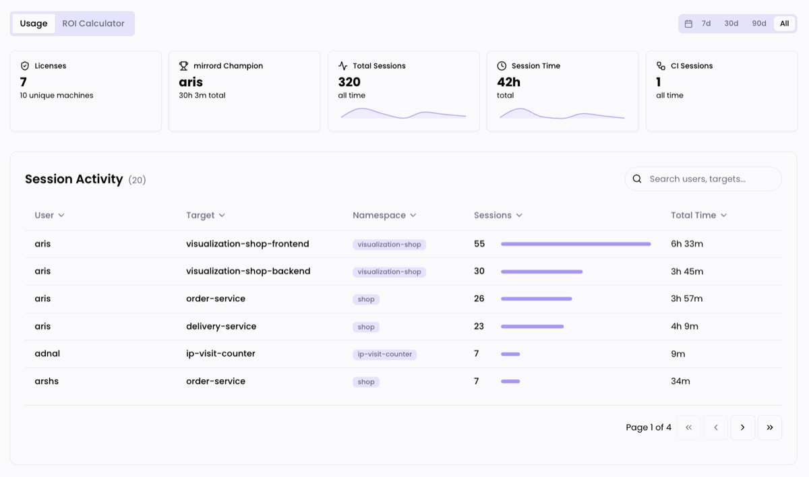
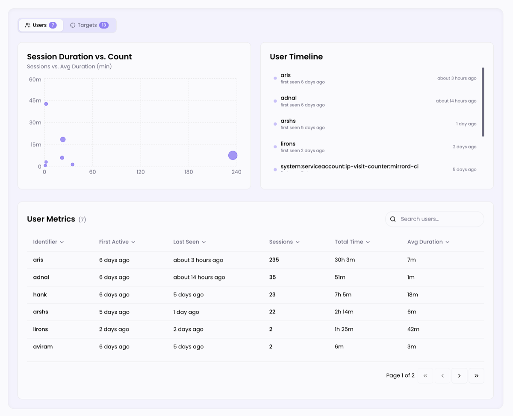
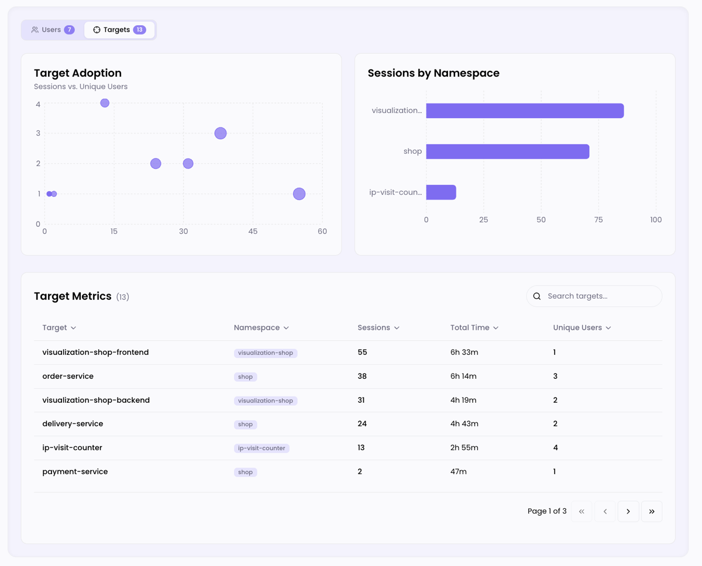
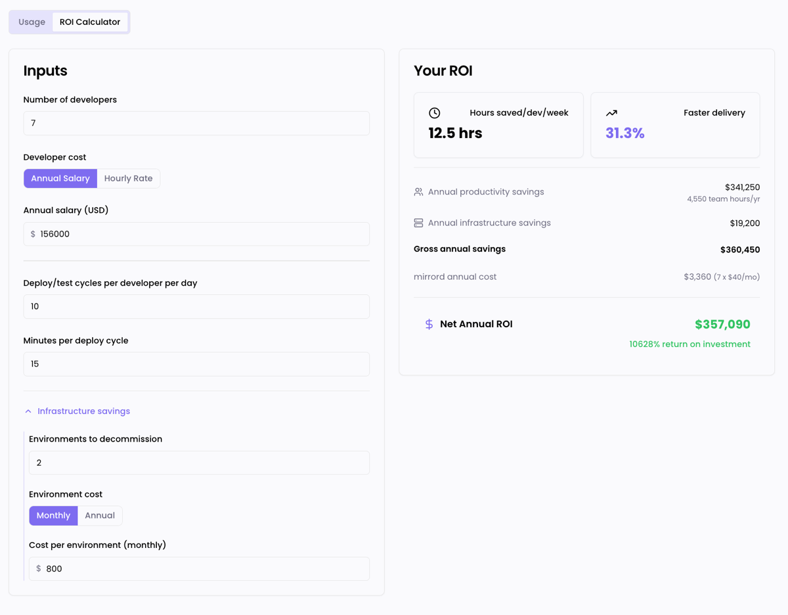

# Dashboard

The mirrord Dashboard is a web-based interface for monitoring mirrord usage across your organization. It provides real-time visibility into sessions, users, targets, CI pipelines, and overall adoption trends, all served directly from the license server.


This feature is available to users on the Enterprise pricing plan. See [Quick Start](#quick-start) below to enable it.


| Dark mode | Light mode |
|-----------|------------|
|  |  |

## Quick Start

1. Add `dashboard.enabled: true` to your license server Helm values:

```yaml
# values.yaml
dashboard:
  enabled: true
```

2. Upgrade the license server:

```bash
helm repo update metalbear
helm upgrade mirrord-operator-license-server metalbear/mirrord-license-server -f ./values.yaml --wait
```

3. **Via `kubectl port-forward`:** Forward the dashboard port to your local machine:

```bash
kubectl port-forward -n mirrord svc/mirrord-operator-license-server 8050:8050
```

4. Open [http://localhost:8050/](http://localhost:8050/) in your browser.

The dashboard reads from the license server's existing session database, so your historical usage data appears immediately. Target workload breakdowns (namespace, deployment name) are available for sessions recorded after the upgrade.


The dashboard does not require authentication beyond network access to the license server. Access control is handled by your cluster networking configuration.


## Usage Tab

The Usage tab is the main view, showing metrics, session activity, and analytics charts.

### Metric Cards and Session Activity



The top row displays five key metrics at a glance:

| Metric | Description |
|--------|-------------|
| **Licenses** | Total license count and number of active unique machines |
| **mirrord Champion** | The most active mirrord user and their total session time |
| **Total Sessions** | Cumulative number of mirrord sessions, with a sparkline trend |
| **Session Time** | Total cumulative session time, with a sparkline trend |
| **CI Sessions** | Total CI pipeline sessions, with max concurrency |

Use the time range selector in the top-right corner (**7d**, **30d**, **90d**, **All**) to adjust the data to the selected time period.

Below the metrics, the **Session Activity** table shows a cross-referenced view of users and their target workloads. Each row shows the user, target, namespace, session count with a visual bar, and total time. The table is searchable and sortable by any column, with pagination for large datasets.

### Users View



Switch to the **Users** tab to see user-focused analytics:

- **Session Duration vs. Count**: A scatter chart plotting each user's total sessions against their average session duration. Larger bubbles indicate more total session time, helping you spot power users and usage patterns.
- **User Timeline**: Shows when each user was first seen and their most recent activity, giving a quick view of adoption over time.
- **User Metrics** table: A detailed, searchable table with columns for identifier, first active date, last seen date, total sessions, cumulative time, and average duration. Click any column header to sort.

### Targets View



Switch to the **Targets** tab to see target-focused analytics:

- **Target Adoption**: A scatter chart showing sessions vs. unique users per target. This helps identify which workloads are broadly adopted vs. heavily used by a few people.
- **Sessions by Namespace**: A horizontal bar chart breaking down session distribution across Kubernetes namespaces.
- **Target Metrics** table: A searchable table listing each target workload with its namespace, session count, total time, and number of unique users.

## ROI Calculator



The **ROI Calculator** tab estimates the time and cost savings from using mirrord. Configure the inputs on the left and see the calculated results on the right:

**Inputs:**
- **Number of developers**: How many developers use mirrord
- **Developer cost**: Annual salary or hourly rate
- **Deploy/test cycles per developer per day**: How many code-deploy-test loops each developer does daily
- **Minutes per deploy cycle**: Time saved per cycle by using mirrord instead of deploying to the cluster
- **Infrastructure savings** (expandable): Number of staging environments decommissioned and their monthly or annual cost

**Results:**
- **Hours saved per developer per week**
- **Faster delivery** percentage
- **Annual productivity savings** (team hours and dollar value)
- **Annual infrastructure savings**
- **Net Annual ROI** after subtracting the mirrord license cost

## Features

### Dark Mode

Toggle between light and dark themes using the moon/sun icon in the top-right corner of the app bar. Your preference is saved in the browser's local storage.

### Manual Sync

Click the **Sync** button in the app bar to manually refresh all dashboard data. The last updated timestamp is displayed next to the button.

### Operator Version

The operator version is displayed in the app bar for quick reference (e.g., `v3.142.0`).

## Helm Configuration

| Setting | Default | Description |
|---------|---------|-------------|
| `dashboard.enabled` | `false` | Enable the dashboard |
| `dashboard.port` | `8050` | Port the dashboard is served on |

The chart automatically configures the container port, service port, and required environment variables when `dashboard.enabled` is set to `true`.

## API Endpoints

The dashboard consumes two API endpoints from the license server. These are also available for programmatic access:

- `GET /api/v1/reports/usage?format=json` returns the full usage report (users, targets, sessions, CI metrics, machines).
- `GET /api/v1/reports/usage/trends?days=30` returns time-series data (daily sessions, active users, CI sessions, user adoption).

Both endpoints require the `x-license-key` header. This is the license key configured in the license server's Helm values (`license.key`). When the dashboard is served by the license server, this header is injected automatically. For direct API access (e.g., via `curl`), pass it manually:

```bash
curl -H "x-license-key: <your-license-key>" \
  http://localhost:8050/api/v1/reports/usage?format=json
```

For spreadsheet reports (Excel format), see [Getting a Utilisation Report](../managing-mirrord/license-server.md#getting-a-utilisation-report-from-the-license-server).
