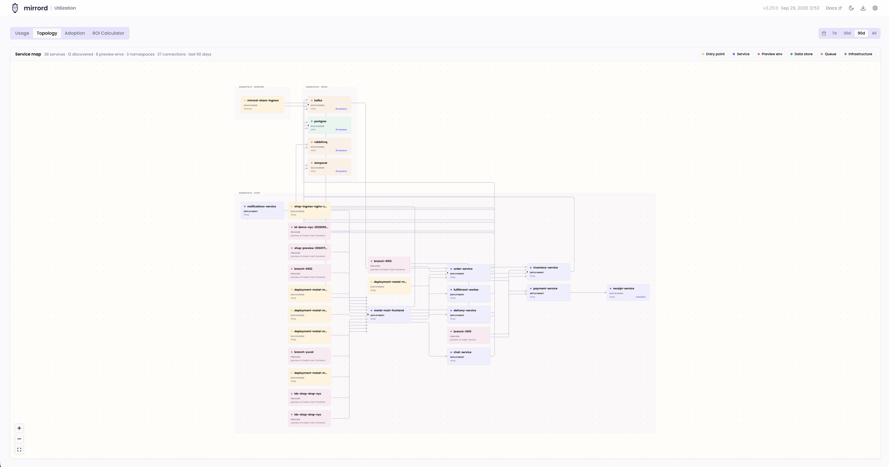

# Topology

The **Topology** tab in the dashboard draws the services in your cluster and the connections between them. The map is built from mirrord sessions: when a session opens a connection to a Kubernetes Service, or receives one, the operator records it. You don't declare dependencies anywhere; the map shows what sessions actually connected to.



## Requirements

- Operator chart 3.211.0 or newer.
- A dashboard, set up either way: [Cloud Setup](cloud.md) or [License Server Setup](license-server.md). With a license server, run the license server from the same release or newer.
- On the cloud dashboard, identity sharing turned on for the operator's API key, and `cloud.anonymizeData` left at `false`. Service names only leave the cluster with identity, so otherwise the tab stays empty.

## Turn it on

Topology is off by default. Set it in the operator's Helm values and upgrade:

```yaml
# values.yaml
operator:
  topology: true
```

```bash
helm upgrade mirrord-operator metalbear/mirrord-operator -f values.yaml
```

With this on, the operator watches every Service and EndpointSlice in the cluster so it can tell which Service an address belongs to. The chart makes two RBAC changes for this:

- The operator's ClusterRole gets `get`, `list` and `watch` on `endpointslices`.
- The user ClusterRole gets `get` and `list` on `mirrordclusterservicegraphs`, the operator's read-only view of the graph.

Then run a few sessions. A session reports its connections when it ends, so a new edge shows up on the map shortly after the session that made it stops.

## What gets recorded

- **Outgoing**: the local process connects through mirrord to an address in the cluster, the connection succeeds, and the address belongs to a Service (its cluster IP, or a pod behind it). The edge runs from the session's target to that Service.
- **Incoming**: a request reaches the session's target from a pod behind a Service. The edge runs from the caller to the target. The local process has to be listening on the target's port for mirrord to pass the request through.
- **Preview environments**: connections a preview pod accepts from other Services. Preview pods don't run mirrord, so their own outgoing calls aren't recorded. The preview gets its own node, labelled with its key, and its connections are reported when the preview stops.

Each edge keeps the number of sessions that produced it, a user count, and when it was last reported. When the same connection is reported from both ends, the sessions add up but the user count is the higher of the two, so it can undercount distinct users. What's recorded is connection metadata: the Service's name and namespace, the direction, and the port for outgoing connections. Request and response contents are never recorded.

## Reading the map

Services are grouped by namespace. On a large cluster the map opens with every namespace folded; click one to open it, or use **Expand all**.

Nodes are colored by category:

| Category | How it's decided |
| --- | --- |
| **Entry point** | Discovered, and only ever seen calling other services |
| **Service** | Anything that fits none of the other categories |
| **Data store** | Reached on a well-known database port (Postgres, MySQL, Redis, MongoDB, and so on) |
| **Queue** | Reached on a well-known broker port (Kafka, RabbitMQ, NATS, and so on) |
| **Infrastructure** | Reached on a well-known infrastructure port |
| **Preview env** | A preview environment |

Categories come from ports and from which end of a connection a service was on. Service names are never used to guess them, so a Postgres served on a custom port shows up as a plain **Service**. Click a chip in the legend to hide that category.

A node marked **Discovered** was only ever seen as the other end of a connection. No session targeted it, so its session count is the sum over the edges pointing at it, and its user count is the highest count on any single edge it's part of.

Other controls:

- **Find a service** searches by name. Press `/` to jump to it.
- **Busiest paths** keeps the busiest quarter of the edges lit and dims the rest.
- Click a node to open its details: when it was last seen, and its incoming and outgoing connections with sessions and users for each. **Copy link** copies a URL that opens the map with that node selected.
- **List** shows the same connections as a table of caller, callee, sessions, users and last seen.
- **Export as PNG** saves the map as an image.
- Press `f` to fit the map to the window and `Esc` to clear the focus.

The time range selector applies here too. It filters by session, not by individual connection: the cloud dashboard uses the time the session started, and the license server uses the time the session was reported. The map shows at most the 500 busiest connections in the range.

## Why a connection is missing

The map only knows about traffic that went through a mirrord session. If two services talk to each other but no session was part of that conversation, there's no edge. For example, `order-service` calling `payment-service` shows up only when:

- a session targeting `order-service` made that call from the local process, or
- a session targeting `payment-service` received the call from `order-service`, with the local process listening on the port it arrived on.

Some other cases that leave gaps:

- The address doesn't belong to a Service: an external host, or a pod no Service selects.
- The connection failed. Only successful connections count.
- The address belongs to more than one Service with different pods behind them, so it can't be attributed to one.
- The connection used UDP. Only TCP is recorded.
- The session targeted pods by label selector instead of a workload.
- The service called itself. Connections to the session's own target aren't recorded.
- The connection happened in the first moments after the operator started, before it finished loading the cluster's Services.
- The session connected to a very large number of Services. Each session reports a limited list, keeping the most recent ones.
- The session is still running. Edges are reported when the session ends.
- On the cloud dashboard, the session ran with identity sharing off or `cloud.anonymizeData: true`.

To see a service's connections, run a session against the workload and exercise the connections you want to inspect.
