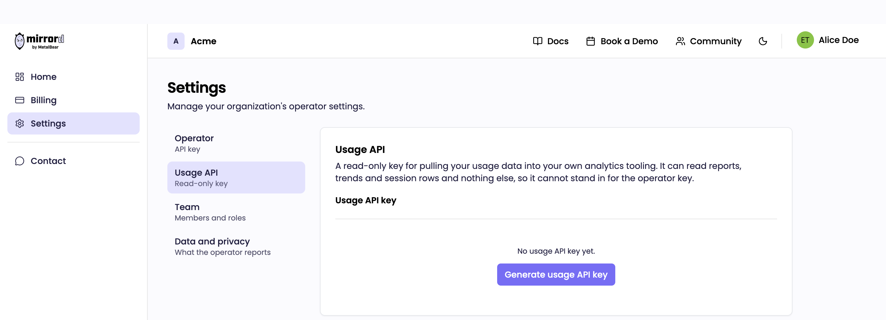
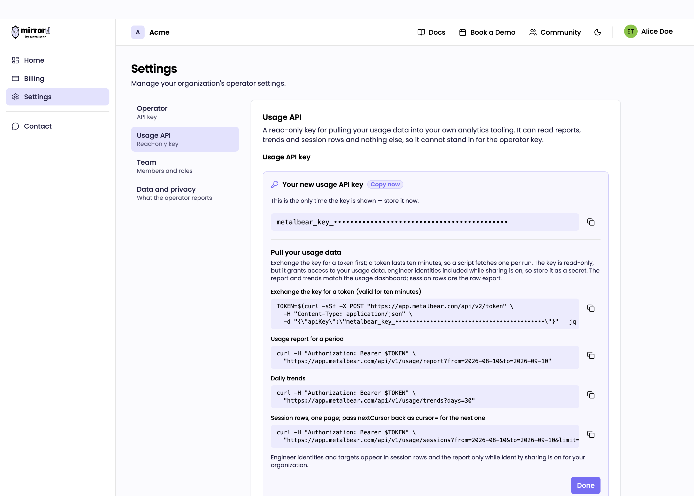
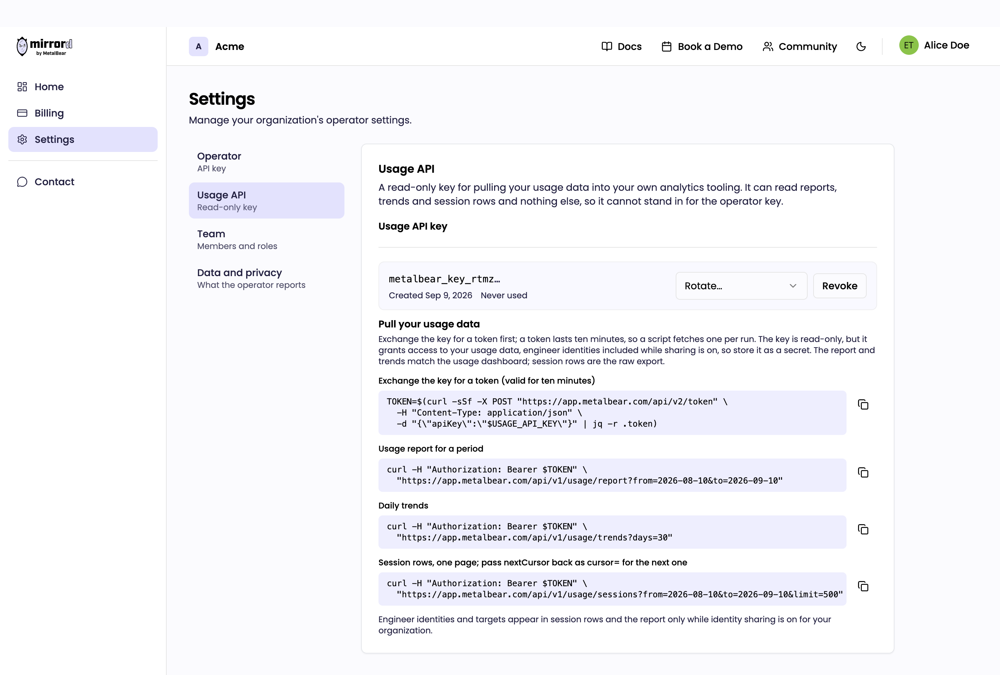

# Usage API


This is the cloud dashboard's data over HTTPS. It only has something to return if your operator runs with a cloud API key, see [Cloud Setup](cloud.md). An operator without one sends no identified session data to us, so there is nothing here to read. Running a self-hosted license server does not by itself rule this out: an operator can use a license server and a cloud API key at the same time.


The dashboard at [app.metalbear.com](https://app.metalbear.com) is fine for looking at usage. It is less fine when you want the numbers in Looker, or a weekly script that lists who stopped using mirrord. The usage API returns the same report and trends the dashboard renders, plus the raw session rows the dashboard never shows, behind a key you can give to a cron job.

## Get a key

Go to **Settings** and open **Usage API**. You need to be an organization admin. Generate a key; it is shown once, so copy it then.



The key starts with `metalbear_key_`, like the operator's key, but it is a different kind of key. It can read usage data and nothing else. If you hand it to an operator, the operator is refused.

The page that shows the new key also shows the calls below, filled in with your key, so you can paste them straight into a terminal.



One usage key is active per organization. **Rotate** issues a new key and keeps the old one working for a grace period you pick, 0 for immediate. **Revoke** stops it now, though a token already minted from it keeps working until its ten minutes are up. The page shows when the key was last used, meaning the last time it was exchanged for a token, not the last data call. A job that gets a token and then fails still moves it, and the timestamp only advances once a minute, so treat it as "recently alive" rather than an exact time.



Store it as a secret anyway. With identity sharing on it returns your engineers' usernames and hostnames.

## Get a token

The key is not sent to the data endpoints. Exchange it for a token first. A token lasts ten minutes, which is plenty for one run of a script, so fetch one per run rather than caching it.

```bash
TOKEN=$(curl -sSf -X POST "https://app.metalbear.com/api/v2/token" \
  -H "Content-Type: application/json" \
  -d "{\"apiKey\":\"$USAGE_API_KEY\"}" | jq -r .token)
```

Every call below takes `Authorization: Bearer $TOKEN`.

## Endpoints

All three live under `https://app.metalbear.com/api/v1/usage` and answer JSON.

### Report

```
GET /api/v1/usage/report?from=2026-08-01&to=2026-08-31
```

The object the dashboard is drawn from, for the period you ask for:

| Field | What it holds |
| --- | --- |
| `generalMetrics` | Tier, seat count, active users in the period, the resolved `reportPeriod`. `operatorVersion` and `lastOperatorEvent` are always `null` here |
| `allTimeMetrics` | `totalSessionCount` and `totalSessionTimeSeconds` for `exec` sessions, plus `totalCiSessionCount` for machine sessions, since the organization started reporting |
| `ciMetrics` | Machine sessions in the period: `totalCiSessions`, `maxConcurrentCiSessions`, `avgCiSessionDurationSeconds`. `currentRunningSessions` is different twice over: it counts `ci` only, and it is what is running right now, not something about the period |
| `userMetrics` | One row per engineer: `identifier`, `displayName`, `firstActive`, `lastSeen`, `totalSessionCount`, `totalSessionTimeSeconds`, daily and per-session averages |
| `targetMetrics` | Sessions and unique users per target (`namespace`, `target`), top 50 by session count |
| `userTargetMetrics` | The same broken down by engineer and target, top 200 by session count |

Despite the names, everything labelled "CI" above counts **machine sessions**, which is `ci` and `preview` rows together. Only `exec` sessions count towards `totalSessionCount` and `activeUsers`. If you want CI and preview environments apart, take them from the session rows and group by `kind`.

`authErrorMetrics`, `adoptionActionItems`, `ciPipelineMetrics`, `ciProviderMetrics`, `uniqueMachines` and `rejectedConnectionCount` belong to the self-hosted license server's report and are never returned here. Pipeline and provider names in particular reach us hashed, so the cloud cannot name them. They are omitted from the JSON rather than sent empty, so read them defensively if you share code with the license server's API.

### Trends

```
GET /api/v1/usage/trends?days=30
```

Daily series for charts: `dailySessions` (count and total duration per day), `dailyActiveUsers`, `dailyCiSessions`, and `userAdoption` with `newUsers` and `cumulativeUsers` per day. `days` defaults to 30 and is capped at 3650.

`dailySessions` and `dailyActiveUsers` are `exec` only; `dailyCiSessions` counts machine sessions, so `ci` and `preview` together. The window ends now and runs back `days`, so it ignores `from` and `to`. The three activity series start at the beginning of that UTC day, `userAdoption` starts at the exact instant, so the two can disagree by a few hours at the far edge.

These are sparse, not dense. A day with no sessions has no entry at all, and `userAdoption` only carries days that gained a user. Fill the gaps yourself if you are drawing a continuous axis.

### Sessions

```
GET /api/v1/usage/sessions?from=2026-08-01&to=2026-08-31&limit=1000
```

Raw rows, oldest first, one object per session:

```json
{
  "sessions": [
    {
      "id": 48213,
      "startedAt": "2026-08-26T09:14:02Z",
      "stoppedAt": "2026-08-26T09:34:11Z",
      "durationSeconds": 1209,
      "kind": "exec",
      "clusterId": "35700d83-2c6e-4b8e-9d3d-0f1a6d1a5a9e",
      "user": {
        "id": "yeV7wcVsjhI0",
        "kubernetesUsername": "alice@example.com",
        "clientUsername": "alice",
        "clientHostname": "alice-mbp"
      },
      "target": {
        "namespace": "shop",
        "kind": "Deployment",
        "name": "checkout",
        "container": null
      }
    }
  ],
  "nextCursor": "..."
}
```

`kind` is `exec` for an engineer's session, `ci` for `mirrord ci start`, `preview` for a preview environment. Preview rows have no target, so with identity sharing on their `target` object is present with every field `null`. A `ci` row can carry a target.

Pages hold up to `limit` rows, 500 by default and 1000 at most. Every non-empty page carries a `nextCursor`; pass it back as `cursor=` to get the next one. The first page that comes back empty is the end. Cursors are opaque, don't try to build one.

Send the first request with no `cursor` at all. An empty `cursor=` is rejected with `400 invalid cursor`, so build the query string rather than always interpolating the variable:

```bash
cursor=""
while :; do
  url="https://app.metalbear.com/api/v1/usage/sessions?from=2026-08-01&to=2026-08-31&limit=1000"
  [ -n "$cursor" ] && url="$url&cursor=$cursor"
  page=$(curl -sSf -H "Authorization: Bearer $TOKEN" "$url")
  rows=$(jq '.sessions | length' <<<"$page")
  [ "$rows" -eq 0 ] && break
  jq -c '.sessions[]' <<<"$page" >> august.jsonl
  cursor=$(jq -r '.nextCursor // empty' <<<"$page")
done
```

## Dates and periods

`from` and `to` accept a date (`2026-08-01`), a timestamp with an offset (`2026-08-01T09:00:00+02:00`), or a timestamp without one, which is read as UTC. An offset's `+` has to be percent-encoded as `%2B` in the query string, otherwise it arrives as a space and you get a 400. `curl --get --data-urlencode` does it for you. A date given as `to` covers that whole day, so `to=2026-08-31` includes August 31. Otherwise the window is half-open: `from` is included, `to` is not. Leave `from` out and it starts at the beginning of time; leave `to` out and it ends now. `from` has to be before `to` or you get a 400.

A session belongs to the period it started in. That is the rule for the counts and totals in the report, for the trends and for the session rows. A session that started at 23:50 on August 31 and ended at 00:20 on September 1 is an August session in all of them.

Two fields sit outside that rule. `maxConcurrentCiSessions` is a peak over the window, so it counts any machine session **overlapping** it, including one that started in July and was still running on August 1. `currentRunningSessions` ignores the window entirely and reports what is running as you ask.

The rows do reconcile with the report, but only once you group by `kind`: rows where `kind` is `exec` match `totalSessionCount`, and `ci` plus `preview` together match `totalCiSessions`. Counting every row and comparing it against either one on its own will not add up.

## Identity sharing

The report and the session rows carry engineer identities only while identity sharing is on for your organization, the same switch that decides what the dashboard shows. It is set when the operator's cloud API key is generated and can be changed under **Settings**. With it off, `displayName` and `user.id` are pseudonymous hashes, and `kubernetesUsername`, `clientUsername` and `clientHostname` are `null`. `target` is dropped from the session rows entirely rather than sent as `null`, and `targetMetrics` and `userTargetMetrics` disappear from the report the same way. A change applies to the next token you fetch, not to one you already hold.

## Errors and limits

| Status | Meaning |
| --- | --- |
| `400` | A bad parameter: `from` at or after `to`, a date outside 1970 to 9999, an unparseable date, or a `cursor` you did not get from `nextCursor` (an empty one included) |
| `401` | No token, a malformed one, or an expired one. Fetch a new token |
| `403` | Right token, wrong door: an operator token on this API, or a usage token on an operator endpoint |
| `429` | Over the limit. `Retry-After` says how many seconds to wait |

The limit is 60 requests a minute per organization, counted across the three endpoints. A full export of a large month is a handful of pages, so a script that pauses on 429 and honours `Retry-After` will not notice it.
