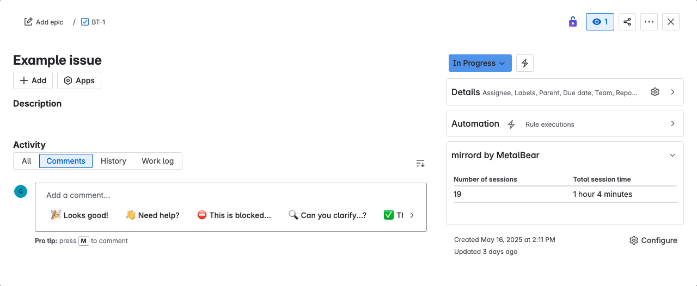

## Jira Integration

With the mirrord Jira integration you can track how much mirrord has been used for each task on a per-issue basis, both as total time of use and the number of times it was used.

The operator is able to report mirrord session times to the mirrord app installed on your Jira instance, which allows you to view the total time and number of sessions that developers have spent using mirrord for each Jira issue.

### Setting up Jira integration

1. Go to the [installation link](https://developer.atlassian.com/console/install/0d3d68b7-02c0-40cb-bb77-4bfd62a50809?signature=AYABeMCVvOZTCiLuXYFwuf%2FRfHkAAAADAAdhd3Mta21zAEthcm46YXdzOmttczp1cy1lYXN0LTE6NzA5NTg3ODM1MjQzOmtleS83ZjcxNzcxZC02OWM4LTRlOWItYWU5Ny05MzJkMmNhZjM0NDIAuAECAQB4KVgoNesMySI2pXEz4J5S%2B4but%2FgpPvEEG0vL8V0Jz5cB2SxqloVOOU%2FY31ulUC4PDQAAAH4wfAYJKoZIhvcNAQcGoG8wbQIBADBoBgkqhkiG9w0BBwEwHgYJYIZIAWUDBAEuMBEEDA1l49kXEmuUkKrN2AIBEIA7nYC5CHsOdweVt1yl3gcEkbEohsPUZPNZZbh6JM3RwdhSox2A%2F8PAJ6VhbQE1x4SWd8Srdx4DlVUFpZ0AB2F3cy1rbXMAS2Fybjphd3M6a21zOmV1LXdlc3QtMTo3MDk1ODc4MzUyNDM6a2V5LzU1OWQ0NTE2LWE3OTEtNDdkZi1iYmVkLTAyNjFlODY4ZWE1YwC4AQICAHig7hOcRWe1S%2BcRRsjD9q0WpZcapmXa1oPX3jm4ao883gGcIb0YC89QGvFCgCZ4WG51AAAAfjB8BgkqhkiG9w0BBwagbzBtAgEAMGgGCSqGSIb3DQEHATAeBglghkgBZQMEAS4wEQQMgllPRYZPa7jP%2BpaXAgEQgDs0PPvXTg5TwxmItXE28ERHcME6M52JP0E1wVnGsdWTqv3CIRGV7P1nhf8SH1IXqbBB2gD2WK4N3P7iUwAHYXdzLWttcwBLYXJuOmF3czprbXM6dXMtd2VzdC0yOjcwOTU4NzgzNTI0MzprZXkvM2M0YjQzMzctYTQzOS00ZmNhLWEwZDItNDcyYzE2ZWRhZmRjALgBAgIAeBeusbAYURagY7RdQhCHwxFswh7l65V7cwKp%2BDc1WGoHAQaBnNXPZs8XrOh2qPkcESkAAAB%2BMHwGCSqGSIb3DQEHBqBvMG0CAQAwaAYJKoZIhvcNAQcBMB4GCWCGSAFlAwQBLjARBAxAr20zw%2FgAlLesfdkCARCAO3u5jhG38dg7t2lZfnMwLoqw8pPOjuSJRws5aeDDdAi7lP0dbrIeSpe7qqdipPtflIDyywtAQe0HRoY9AgAAAAAMAAAQAAAAAAAAAAAAAAAAAEkMb0Uq%2FXx0HKcQ9MNoWXD%2F%2F%2F%2F%2FAAAAAQAAAAAAAAAAAAAAAQAAADJpw6xquljgWJiLi06NO2iPfWekCK6luBVTpH%2FZSuhrzqYR1CVS0r3DElyPMw1pcSlBApqihMQRmTUNDndqAlZBJ48%3D&product=jira) to install the `mirrord for Jira` app (you must be a Jira admin).
2. In Jira, go to the mirrord admin page under `Jira admin settings` > `Apps` > `mirrord by MetalBear` and choose which projects to display the panel on. _If you skip this step, the metrics will not be displayed on any issues in your Jira instance._
3. Update the operator according to the instructions on the admin page.
4. Ensure everything is up to date (mirrord IDE plugins and mirrord binary version, as well as the CLI tool):

| Application     | Minimum Version |
| --------------- | --------------- |
| operator        | 3.116.1         |
| operator chart  | 1.29.1          |
| mirrord         | 3.145.0         |
| VSCode plugin   | 3.66.0          |
| IntelliJ plugin | 3.68.0          |

> To verify that the app in installed properly, navigate to an issue in a project you selected in step 2 and check for the `mirrord by MetalBear` context panel in the right sidebar.

### Using the Jira integration

When viewing an issue in Jira, the number of sessions and total session duration will be shown in a context panel in the right sidebar called `mirrord by MetalBear`. This panel will be displayed on all issues belonging to the projects that were selected in the admin page.

To use the Jira integration while running mirrord, users must be on a git branch containing the (case sensitive) Jira issue key of the issue they're working on, eg. `my-new-branch-KEY-123-latest` for issue `KEY-123`.

### Troubleshooting

The operator will emit logs with details upon successful session reporting, or upon encountering an error. When metrics are successfully reported, the operator will emit a `DEBUG` log with a link to the Jira issue that was updated. If the operator is up to date with the Jira webhook configured but did _not_ successfully report metrics:

- If no branch name was recieved by the operator, a `DEBUG` log will be emitted. This can happen if a mirrord user is not using the latest version of the mirrord CLI or plugin, or if they are not currently on a git branch.
- If the branch name was present but the operator still fails to report metric to the Jira app, a `WARN` log will be emitted with more details.

### Data security

When a session ends, the session data is sent by the operator via HTTP request to a [Jira Forge webtrigger](https://developer.atlassian.com/platform/forge/runtime-reference/web-trigger/) URL and is not stored by the operator.

The Jira app stores usage data for each issue in [encrypted key-value storage](https://developer.atlassian.com/platform/forge/runtime-reference/storage-api-secret/). It is not visible to anyone outside those with access to the current Jira instance; the only way to access the data is through the context panel on an issue.

### Known Issues

- Metrics reporting will not work for `jj` users, as `jj` operates in detached HEAD mode.
- Fetching the user's branch name may rarely be unreliable with the IntelliJ plugin, causing metrics reporting to be skipped. In this case you can use the CLI instead, and in the future users will be able to manually override the branch name in config.
