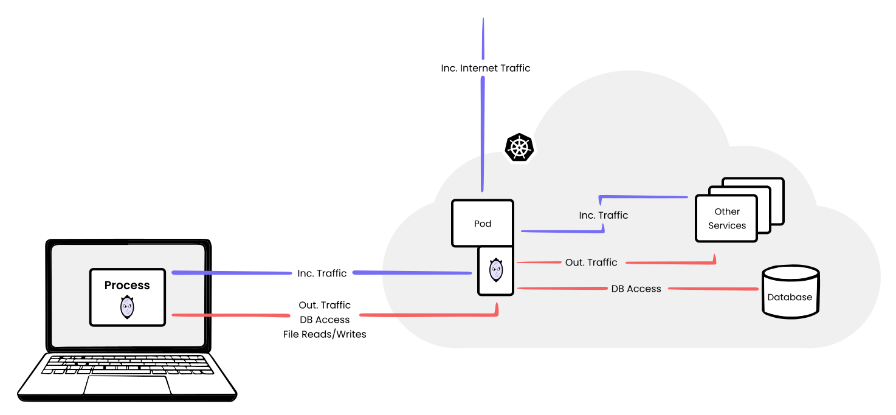

# Architecture

mirrord is composed of the following components:

* `mirrord-agent` - Rust binary that is packaged as a container image. mirrord-agent runs in the cloud and acts as a proxy for the local process.
* `mirrord-layer` - Rust dynamic library for Unix systems (so/dylib) that loads to the local process, hooks its filesystem, network APIs and relays them to the agent.
* `mirrord-layer-win` - Rust dynamic library for Windows (dll) that loads to the local process, hooks its filesystem, network APIs and relays them to the agent.
* `mirrord-cli` - Rust binary that wraps the behavior of the respective mirrord layer in a user friendly CLI.
* `VS Code extension` - Exposes the same functionality as - mirrord-cli within the VS Code IDE.
* `IntelliJ plugin` - Exposes the same functionality as - mirrord-cli within the IntelliJ IDEs. 

## mirrord-agent

mirrord-agent is a Kubernetes job that runs in the same Linux namespace as the pod being impersonated in the cluster. This lets the mirrored-agent sniff the network traffic and gain access to the filesystem of the impersonated pod. It then relays file operations from the local process to the impersonated pod and incoming traffic from the impersonated pod to the local process. Outgoing traffic is intercepted at the local process and emitted by the agent as if originating from the impersonated pod. The connection between the agent and the impersonated pod is terminated if the agent pod hits a timeout.

mirrord-agent does **not** run as a privileged container in the cluster. However, it requires some [Linux capabilities](https://man7.org/linux/man-pages/man7/capabilities.7.html) to be able to impersonate the targeted pod. These capabilities are:

* `CAP_NET_ADMIN` and `CAP_NET_RAW` - required for modifying routing tables
* `CAP_SYS_PTRACE` - required for reading target pod environment
* `CAP_SYS_ADMIN` - required for joining target pod network namespace

However, you can disable any subset of those in the configuration using [agent.disabled\_capabilities](https://app.gitbook.com/s/Z7vBpFMZTH8vUGJBGRZ4/options#agent.disabled_capabilities) option. This will possibly limit mirrord functionalities or even make it unusable in some setups.

## mirrord-layer

mirrord-layer is a `.dylib` file for OSX systems and `.so` file on Linux distributions. mirrord-layer is loaded through `LD_PRELOAD/DYLD_INSERT_LIBRARIES` environment variable with the local process, which lets mirrord-layer selectively override libc functions. The overridden functions are then responsible for maintaining coordination between the process and incoming/outgoing requests for network traffic/file access. mirrord-layer sends and receives events from the agent using port-forwarding.

## mirrord-layer-win
mirrord-layer-win is a `.dll` file. It is dynamically loaded into the local process, started in a frozen state, and execution begins after the library has been fully initialized. It selectively overrides functions at the lowest level we can get to in user-mode, often right before your operation is dispatched to the kernel through a syscall. The overriden functions are then responsible for maintaining coordination between the process and incoming/outgoing requests for network traffic/file access.

## mirrord-cli

mirrord-cli is a user friendly interface over the essential functionality provided by the respective mirrord layer. When you run mirrord-cli, it runs the process provided as an argument with the respective mirrord layer loaded into it.

## VS Code Extension

mirrord’s VS Code extension provides mirrord’s functionality within VS Code’s UI. When you debug a process with mirrord enabled in VS Code, it prompts you for a pod to impersonate, then runs the debugged process with the respective mirrord layer loaded into it.

## IntelliJ Plugin

mirrord’s IntelliJ Plugin provides mirrord’s functionality within the IntelliJ UI. When you debug a process with mirrord enabled in IntelliJ, it prompts you for a pod to impersonate, then runs the debugged process with the respective mirrord layer loaded into it.
