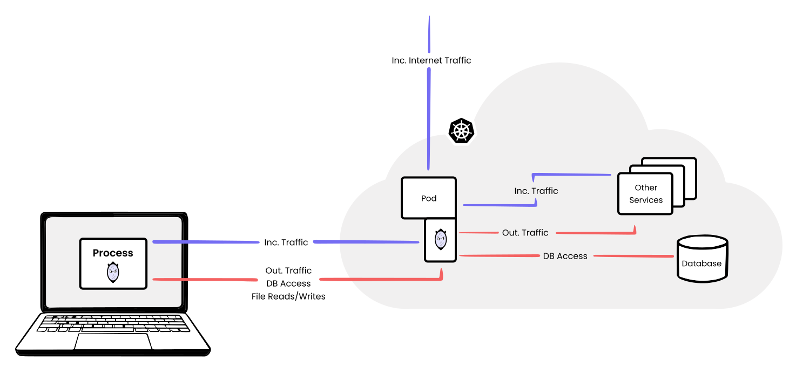

mirrord runs the user's local process unchanged, but rewires its syscalls so file, network, DNS, and environment operations happen in the context of a remote Kubernetes target.

## Components

- **`mirrord-cli`**: user-facing binary. Resolves the target, launches intproxy, injects the layer via `LD_PRELOAD`/`DYLD_INSERT_LIBRARIES`, and `exec`s the user command. Also fronts the VS Code and JetBrains extensions.
- **`mirrord-layer` / `mirrord-layer-win`**: a dynamic library loaded into the user process. Hooks libc functions for file, socket, DNS, and exec operations. Each intercepted call either bypasses to the original implementation (for paths that should stay local) or becomes a protocol request to intproxy.
- **`mirrord-intproxy`**: a local subprocess that owns the connection to the agent and routes messages to/from the layer. Lets multiple processes in the same session (forks, execs) share one agent connection.
- **`mirrord-agent`**: a Rust binary packaged as a container image, scheduled on the same node as the target. Joins the target's network and mount namespaces and does the actual remote work: traffic mirroring/stealing, outgoing connections, DNS resolution, file ops, env reads.
- **`mirrord-operator`** (Teams): cluster-wide controller that fronts the agent for Teams users. Allows multiple users to attach to the same workload, enforces policies, and provides sharing primitives ([queue splitting](../sharing-the-cluster/queue-splitting.md), [DB branching](../sharing-the-cluster/db-branching.md), [profiles](../sharing-the-cluster/profiles.md)).

In OSS, intproxy talks directly to the agent via `kubectl port-forward`. With the operator, intproxy talks to the operator, which proxies to the agent.

## Agent capabilities

The agent is not privileged (it does not run as root in the cluster sense), but it does need Linux capabilities to impersonate the target pod:

| Capability | Why |
|---|---|
| `CAP_NET_ADMIN`, `CAP_NET_RAW` | Modify routing tables, set up traffic mirroring/stealing |
| `CAP_SYS_PTRACE` | Read the target pod's environment (`/proc/<pid>/environ`) |
| `CAP_SYS_ADMIN` | Join the target pod's network and mount namespaces |

You can drop any subset via [`agent.disabled_capabilities`](https://metalbear.com/mirrord/docs/config#agent.disabled_capabilities), which will disable the corresponding features.

The agent only operates on the targets the user is authorized to access (via Kubernetes RBAC or, for Teams, the operator's policy layer).

## Related

- [Targets](targets.md): what kinds of resources can be impersonated
- [Network Traffic](traffic.md): incoming, outgoing, and DNS
- [File Operations](fileops.md): how fs syscalls are intercepted and routed
- [Environment Variables](env.md): how the env fetch works
- [Sharing the cluster](../sharing-the-cluster/overview.md): what the operator unlocks
