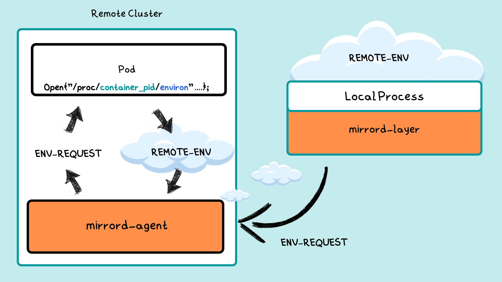

mirrord makes the target pod's environment available to the local process. This page describes how the feature works end-to-end, the full configuration surface, the always-excluded variables, and the gotchas worth knowing.

For the quick how-to, see [Using mirrord → Environment Variables](../using-mirrord/environment-variables.md).

## How it works



```
┌──────────────────────────┐
│ Local process            │
│ ┌──────────────────────┐ │
│ │ mirrord-layer        │ │  Before the process starts, the
│ │   fetch_env_vars()   │ │  layer asks the agent for the
│ └──────────┬───────────┘ │  target pod's env.
└────────────┼─────────────┘
             │ GetEnvVarsRequest
             │   { env_vars_select, env_vars_filter }
┌────────────▼─────────────┐
│ mirrord-intproxy         │  Routes the request to the agent.
└────────────┬─────────────┘
             │
┌────────────▼─────────────┐
│ mirrord-agent            │  Reads `/proc/<pid>/environ` of the
│   select_env_vars()      │  target container's main process,
└────────────┬─────────────┘  applies include + exclude filters.
             │ GetEnvVarsResponse
             ▼
        full env map
```

Once the layer has the map, it applies four post-fetch transformations in this order:

1. **`env_file`** — merge variables from the dotenv file specified by `env_file` (overrides remote values).
2. **`mapping`** — apply regex-based value replacement.
3. **`override`** — apply user-specified key/value overrides (final word).
4. The resulting environment is set on the process before its entry point runs.

For frameworks where the env can't be modified from inside the process (notably Go), `unset` runs from the CLI/extension before exec.

## Configuration surface

```json
{
  "feature": {
    "env": {
      "include": "DATABASE_URL;PUBLIC_*",
      "exclude": "SECRET_*",
      "override": {
        "REGION": "us-east-1"
      },
      "env_file": "./.env.local",
      "mapping": {
        ".+_TIMEOUT": "10000"
      },
      "unset": ["AWS_PROFILE"],
      "load_from_process": false
    }
  }
}
```

| Field | Type | Default | Behavior |
|---|---|---|---|
| `include` | string \| array | — | Allowlist. Supports `*` and `?` wildcards. Mutually exclusive with `exclude`. |
| `exclude` | string \| array | — | Denylist applied on top of the [built-in always-excluded list](#always-excluded-variables). Mutually exclusive with `include`. |
| `override` | object | — | Key/value pairs set on the local process. Wins over remote values and `env_file`. |
| `env_file` | path | — | Dotenv file merged into the remote env. Values override the remote ones. |
| `mapping` | object | — | Regex → replacement applied to **values** (not keys). Capture groups allowed. |
| `unset` | string \| array | — | Variables removed entirely. Case-insensitive. Required for Go (env can't be modified post-start). |
| `load_from_process` | bool | `false` | Fetch env after the user process starts instead of before. WSL+IntelliJ workaround when the remote env is very large. |

### `include` and `exclude` are mutually exclusive

Setting both causes the layer to panic at startup. Use one or the other.

When neither is set, the layer requests `*` (all remote variables).

### Wildcard syntax

`include` and `exclude` use `wildmatch` (not regex):

- `*` — zero or more of any character
- `?` — exactly one of any character

Use the `mapping` field if you need full regex on values.

### `mapping` operates on values, not keys

The pattern is matched against each variable's **value**; the replacement becomes the new value. Capture groups are supported via standard Rust `regex` `replace` syntax (`$1`, `${name}`).

## Always-excluded variables

The agent always strips these from the response, regardless of what `include` requests. This prevents the remote pod's toolchain paths from breaking the local interpreter/runtime.

```
BUNDLER_ORIG_BUNDLER_ORIG_MANPATH    GEM_HOME            PATH
BUNDLER_ORIG_BUNDLER_VERSION         GEM_PATH            PWD
BUNDLER_ORIG_BUNDLE_BIN_PATH         GOMODCACHE          PYTHONPATH
BUNDLER_ORIG_BUNDLE_GEMFILE          GOPATH              RUBYLIB
BUNDLER_ORIG_GEM_HOME                HOME                RUBYOPT
BUNDLER_ORIG_MANPATH                 HOMEPATH            RUST_LOG
BUNDLER_ORIG_PATH                    JAVA_EXE            _JAVA_OPTIONS
BUNDLER_ORIG_RB_USER_INSTALL         JAVA_HOME
BUNDLER_ORIG_RUBYLIB                 JAVA_TOOL_OPTIONS
BUNDLER_ORIG_RUBYOPT
BUNDLER_VERSION
BUNDLE_APP_CONFIG / _BIN_PATH /
  _FORCE_RUBY_PLATFORM / _GEMFILE /
  _GEM_PATH / _PATH / _WITHOUT
CATALINA_HOME                        DOTNET_EnableDiagnostics
CLASSPATH                            DOTNET_STARTUP_HOOKS
```

User-supplied `exclude` patterns are **added to** this list — they do not replace it.

The canonical list lives in `mirrord-agent/src/env.rs`.

## How the agent reads the env

The agent enters the target container's PID namespace and reads `/proc/<target-pid>/environ` (NUL-delimited `KEY=VALUE` pairs). It does **not** spawn anything in the container — there's no exec, no shell evaluation. What you get is exactly what was set on the process at start (so runtime `os.setenv()` calls inside the pod won't show up).

This is also why containers running things like nginx, which rewrite `/proc/self/environ` after start, can return surprising results.

## Equivalent environment variables

Each config field has a matching env var, useful from CLI/CI:

| Config | Env var |
|---|---|
| `feature.env.include` | `MIRRORD_OVERRIDE_ENV_VARS_INCLUDE` |
| `feature.env.exclude` | `MIRRORD_OVERRIDE_ENV_VARS_EXCLUDE` |
| `feature.env.env_file` | `MIRRORD_OVERRIDE_ENV_VARS_FILE` |
| `feature.env.load_from_process` | `MIRRORD_ENV_LOAD_FROM_PROCESS` |

## Related

- [`feature.env` config reference](https://metalbear.com/mirrord/docs/config#feature.env) — full schema
- [Architecture](architecture.md) — layer/intproxy/agent message flow
- [Using mirrord → Environment Variables](../using-mirrord/environment-variables.md) — quick how-to
