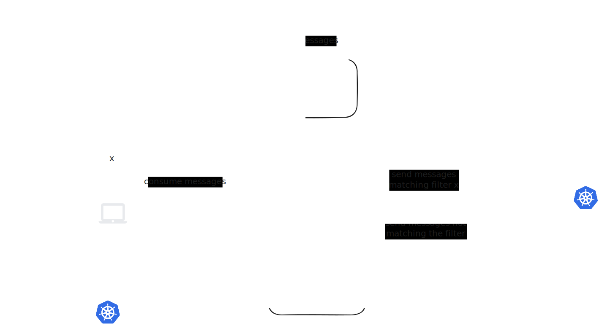
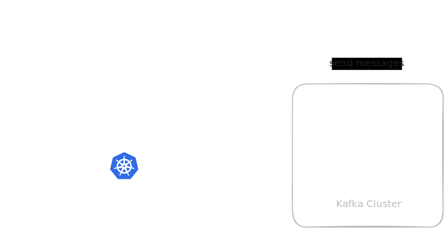
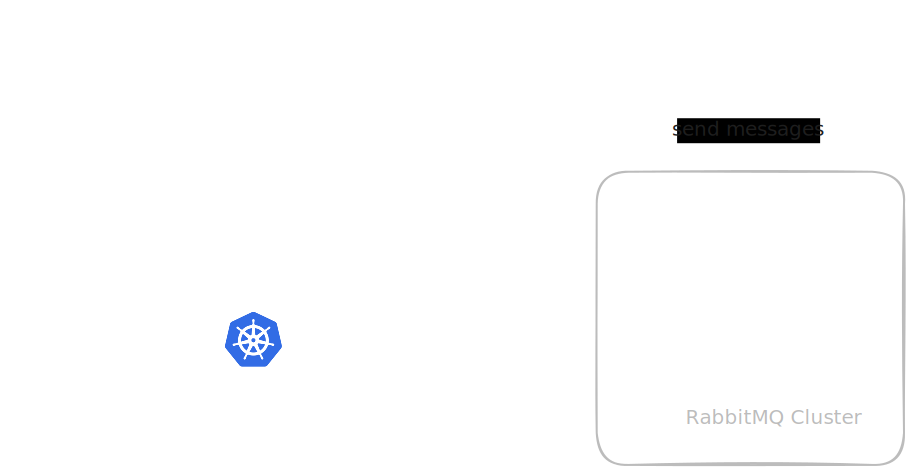
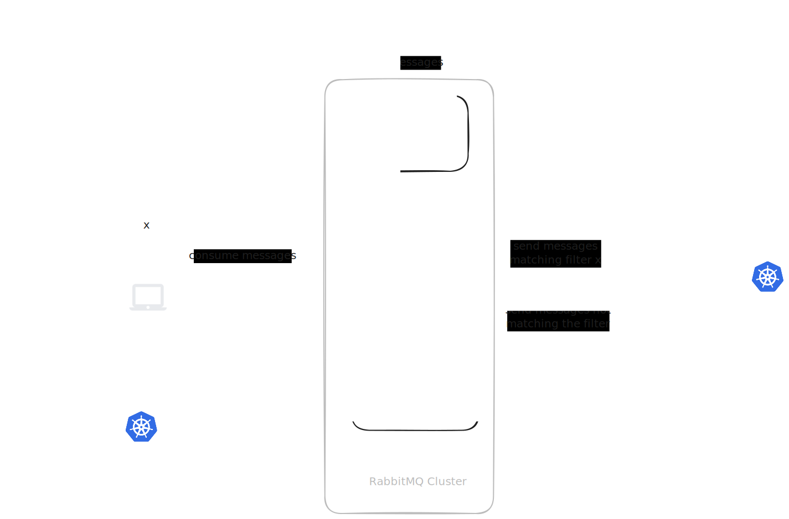
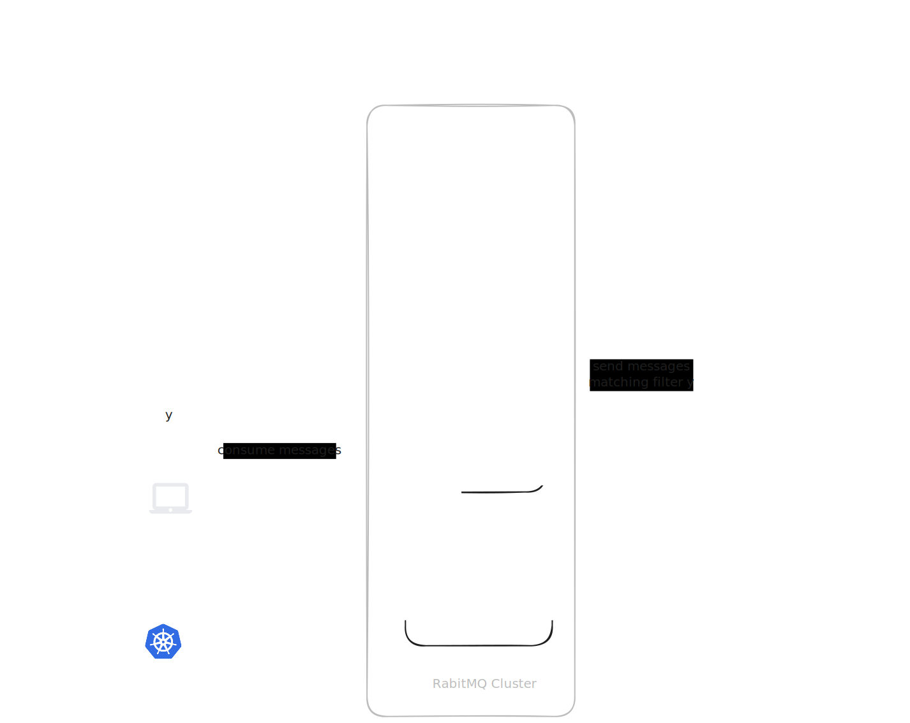

If your application consumes messages from a queue service, you should choose a configuration that matches your intention:

1. Running your application with mirrord without any special configuration will result in your local application competing with the deployed application (and potentially other mirrord runs by teammates) for queue messages.
2. Running your application with [`copy_target` + `scale_down`](../using-mirrord/copy-target.md#replacing-a-whole-deployment-using-scale_down) will result in the deployed application not consuming any messages, and your local application being the exclusive consumer of queue messages.
3. If you want to control which messages will be consumed by the deployed application, and which ones will reach your local application, set up queue splitting for the relevant target, and define a messages filter in the mirrord configuration. Messages that match the filter will reach your local application, and messages that do not, will reach either the deployed application, or another teammate's local application, if they match their filter.


This feature is available to users on the Team and Enterprise pricing plans.



Queue splitting is currently available for [Amazon SQS](https://aws.amazon.com/sqs/), [Kafka](https://kafka.apache.org/), [RabbitMQ](https://www.rabbitmq.com), [Google Cloud Pub/Sub](https://cloud.google.com/pubsub), and [Azure Service Bus](https://azure.microsoft.com/en-us/products/service-bus).
The word "queue" in this doc is used to also refer to "topic" in the context of Kafka and Azure Service Bus, and "subscription" in the context of Google Cloud Pub/Sub.


### How It Works

When a queue splitting session starts, the mirrord operator patches the target workload (e.g. deployment or rollout) to consume messages from a different, temporary queue.
That temporary queue is *exclusive* to the target workload.
Similarly, the local application is reconfigured to consume messages from its own *exclusive* temporary queue.


Queue splitting requires that the application read the queue name from an environment variable.
This lets the operator override the environment variable to change the queue that the application reads from.


Once all temporary queues are prepared, the mirrord operator starts consuming messages from the original queue, and publishing them to one of the temporary queues, based on message filters provided by the users in their mirrord configs.
This routing is based on message filters provided by the users in their mirrord configs.





First, we have a consumer app reading messages from an SQS queue:


When the first mirrord SQS splitting session starts, two temporary queues are created (one for the target deployed in the cluster, one for the user's local application),
and the mirrord operator routes messages according to the [user's filter](queue-splitting.md#setting-a-filter-for-a-mirrord-run):



If a second user then starts a mirrord SQS splitting session on the same queue, a the third temporary queue is created (for the second user's local application).
The mirrord operator includes the new queue and the second user's filter in the routing logic.


If the filters defined by the two users both match some message, one of the users will receive the message at random.





First, we have a consumer app reading messages from a Kafka queue:



When the first mirrord Kafka splitting session starts, two temporary queues are created (one for the target deployed in the cluster, one for the user's local application),
and the mirrord operator routes messages according to the [user's filter](queue-splitting.md#setting-a-filter-for-a-mirrord-run):


If a second user then starts a mirrord Kafka splitting session on the same queue, a third temporary queue is created (for the second user's local application).
The mirrord operator includes the new queue and the second user's filter in the routing logic.


If the filters defined by the two users both match some message, one of the users will receive the message at random.





First, we have a consumer app reading messages from a RabbitMQ queue:



When the first mirrord RabbitMQ splitting session starts, two temporary queues are created (one for the target deployed in the cluster, one for the user's local application),
and the mirrord operator routes messages according to the [user's filter](queue-splitting.md#setting-a-filter-for-a-mirrord-run):



If a second user then starts a mirrord RabbitMQ splitting session on the same queue, a third temporary queue is created (for the second user's local application).
The mirrord operator includes the new queue and the second user's filter in the routing logic.



If the filters defined by the two users both match some message, one of the users will receive the messages at random.





First, we have a consumer app reading messages from a Google Cloud Pub/Sub subscription.

When the first mirrord Pub/Sub splitting session starts, the operator creates temporary topics and subscriptions (one set for the target deployed in the cluster, one for the user's local application), and routes messages according to the [user's filter](queue-splitting.md#setting-a-filter-for-a-mirrord-run).

If a second user then starts a mirrord Pub/Sub splitting session on the same subscription, an additional temporary topic and subscription are created for the second user's local application. The operator includes the new subscription and the second user's filter in the routing logic.

If the filters defined by the two users both match some message, one of the users will receive the message at random.





Azure Service Bus supports two messaging models - **Queues** (point-to-point) and **Topics/Subscriptions** (pub/sub). Queue splitting works with both, but each uses a different routing mechanism.

**Queue model** 
When the first mirrord splitting session starts, two temporary queues are created (one for the target deployed in the cluster, one for the user's local application), and the mirrord operator routes messages according to the [user's filter](queue-splitting.md#setting-a-filter-for-a-mirrord-run). Routing is based on the AMQP application properties set on each message. If a second user then starts a session on the same queue, a third temporary queue is created for their local application, and the operator includes the new queue and filter in the routing logic.

**Topic/Subscription model**
Here the operator splits the topic using native Service Bus subscription rules, without creating a temporary topic and without restarting the deployed application (so it works with frameworks like MassTransit that choose their own topic names). The operator adds a temporary subscription on the original topic to capture incoming messages, reads them, evaluates the [user's filter](queue-splitting.md#setting-a-filter-for-a-mirrord-run), and re-publishes each message to the same topic with a routing marker. Native subscription rules then deliver each copy to the right place: messages matching a user's filter go to a temporary per-session subscription that their local application reads, while everything else goes to the deployed application's own subscription, which is left untouched. When re-publishing, the operator preserves the message body, application properties, and the standard system fields (message id, correlation id, subject, content type, and so on). Each additional user who starts a session on the same topic gets their own per-session subscription and filter.

In both models, if the filters defined by two users both match some message, one of the users will receive the message at random.





Temporary queues are managed by the mirrord operator and garbage collected in the background. After all queue splitting sessions end, the operator promptly deletes the allocated resources.

Please note that:
1. Temporary queues created for the deployed targets will not be deleted as long as there are any targets' pods that use them.
2. In case of SQS splitting, deployed targets will keep reading from the temporary queues as long as their temporary queues have unconsumed messages.
3. For Google Cloud Pub/Sub, the operator creates temporary topics and subscriptions. The target workload's subscription environment variable is patched to read from a temporary subscription, while the operator drains the original subscription and forwards messages through temporary topics.


### Enabling Queue Splitting in Your Cluster








#### Enable SQS splitting in the Helm chart

Enable the `operator.sqsSplitting` setting in the [mirrord-operator Helm chart](https://github.com/metalbear-co/charts/blob/main/mirrord-operator/values.yaml).




#### Authenticate and authorize the mirrord operator

The mirrord operator will need to be able to perform operations on the SQS queues.
To do this, it will build an SQS client, using the default credentials provider chain.

The easiest way to provide the credentials for the operator is with IAM role assumption.
For that, an IAM role with an appropriate policy has to be assigned to the operator's service account. Please follow [AWS's documentation on how to do that](https://docs.aws.amazon.com/eks/latest/userguide/associate-service-account-role.html). Note that operator's service account can be annotated with the IAM role's ARN with the `sa.roleArn` setting in the [mirrord-operator Helm chart](https://github.com/metalbear-co/charts/blob/main/mirrord-operator/values.yaml).

Some of the SQS permissions are needed for your actual queues that you would like to split, and some permissions are only needed for the temporary queues, managed by the operator.
Here is an overview:

| SQS Permission     | needed for your queues | needed for temporary queues |
| ------------------ | :--------------------: | :-------------------------: |
| GetQueueUrl        |            ✓           |                             |
| ListQueueTags      |            ✓           |                             |
| ReceiveMessage     |            ✓           |                             |
| DeleteMessage      |            ✓           |                             |
| GetQueueAttributes |            ✓           |          ✓ (both!)          |
| CreateQueue        |                        |              ✓              |
| TagQueue           |                        |              ✓              |
| SendMessage        |                        |              ✓              |
| DeleteQueue        |                        |              ✓              |

And here we provide a short explanation for each required permission:

* `sqs:GetQueueUrl`: the operator finds queue names to split in the provided source, and then it fetches the URL from SQS in order to make other API calls.
* `sqs:GetQueueAttributes`: the operator queries your queue's attributes, in order to clone these attributes to all derived temporary queues. It also reads the attributes of the temporary queues, in order to check the number of remaining messages.
* `sqs:ListQueueTags`: the operator queries your queue's tags, in order to clone these tags to all derived temporary queues.
* `sqs:ReceiveMessage`: the operator reads messages from the queues you split.
* `sqs:DeleteMessage`: after reading a message and forwarding it to a temporary queue, the operator deletes the message from the split queue.
* `sqs:CreateQueue`: the operator creates temporary queues in your SQS account.
* `sqs:TagQueue`: the operator sets tags on the temporary queues.
* `sqs:SendMessage`: the operator sends messages to the temporary queues.
* `sqs:DeleteQueue`: the operator deletes stale temporary queues in the background.

This is an example for a policy that gives the operator's roles the minimal permissions it needs to split a queue called `ClientUploads`:

```json
{
  "Version": "2012-10-17",
  "Statement": [
    {
      "Effect": "Allow",
      "Action": [
        "sqs:GetQueueUrl",
        "sqs:GetQueueAttributes",
        "sqs:ListQueueTags",
        "sqs:ReceiveMessage",
        "sqs:DeleteMessage"
      ],
      "Resource": [
        "arn:aws:sqs:eu-north-1:314159265359:ClientUploads"
      ]
    },
    {
      "Effect": "Allow",
      "Action": [
        "sqs:CreateQueue",
        "sqs:TagQueue",
        "sqs:SendMessage",
        "sqs:GetQueueAttributes",
        "sqs:DeleteQueue"
      ],
      "Resource": "arn:aws:sqs:eu-north-1:314159265359:mirrord-*"
    }
  ]
}
```

*   The first statement gives the role the permissions it needs for your original queues.

    Instead of specifying the queues you would like to be able to split in the first statement, you could alternatively make that statement apply for all resources in the account, and limit the queues it applies to using conditions instead of resource names. For example, you could add a condition that makes the statement only apply to queues with the tag `splittable=true` or `env=dev` etc. and set those tags for all queues you would like to allow the operator to split.
*   The second statement in the example gives the role the permissions it needs for the temporary queues. Since all the temporary queues created by mirrord are created with the name prefix `mirrord-`, that statement in the example is limited to resources with that prefix in their name.

    If you would like to limit the second statement with conditions instead of (only) with the resource name, you can [set a condition that requires a tag](https://docs.aws.amazon.com/AWSSimpleQueueService/latest/SQSDeveloperGuide/sqs-abac-tagging-resource-control.html), and in the `MirrordWorkloadQueueRegistry` resource you can specify for each queue tags that mirrord will set for temporary queues that it creates for that original queue (see [relevant section](queue-splitting.md#create-the-queue-registry)).

If the queue messages are encrypted, the operator's IAM role should also have the following permissions:

* `kms:Encrypt`
* `kms:Decrypt`
* `kms:GenerateDataKey`

If you enable `s3Event` for an SQS queue registry entry, the operator will also fetch S3 object metadata for jq filtering.
In that case, grant the operator:

* `s3:GetObject` on the relevant buckets / object prefixes.
* `s3:ListBucket` on the relevant buckets if you want S3 to return `404 Not Found` for deleted or missing objects instead of `403 Forbidden`.




#### Authorize deployed consumers

In order to be targeted with SQS splitting, a deployed consumer must be able to use the temporary queues created by mirrord.
E.g. if the consumer application retrieves the queue's URL based on its name, lists queue's tags, consumes and deletes messages from the queue — it must be able to do the same on a temporary queue.

Any temporary queues managed by mirrord are created with the same policy as the original queues they are splitting (with the single change of updating the queue name in the policy).
Therefore, access control based on SQS policies should automatically be taken care of.

However, if the consumer's access to the queue is controlled by an IAM policy (and not an SQS policy, see [SQS docs](https://docs.aws.amazon.com/AWSSimpleQueueService/latest/SQSDeveloperGuide/sqs-using-identity-based-policies.html#sqs-using-sqs-and-iam-policies)), you will need to adjust it.




#### Provide application context

On operator installation with `operator.sqsSplitting` enabled, a new [`CustomResource`](https://kubernetes.io/docs/concepts/extend-kubernetes/api-extension/custom-resources/)
type is defined in your cluster — `MirrordWorkloadQueueRegistry`. Users with permissions to get CRDs can verify its existence
with `kubectl get crd mirrordworkloadqueueregistries.queues.mirrord.metalbear.co`.
Before you can run sessions with SQS splitting, you must create a queue registry for the desired target.
This is because the queue registry contains additional application context required by the mirrord operator.
For example, the operator needs to know which environment variables contain the names of the SQS queues to split.

See an example queue registry defined for a deployment `meme-app` living in namespace `meme`:

```yaml
apiVersion: queues.mirrord.metalbear.co/v1alpha
kind: MirrordWorkloadQueueRegistry
metadata:
  name: meme-app-q-registry
  namespace: meme
spec:
  consumer:
    name: meme-app
    workloadType: Deployment
    container: main
  queues:
    meme-queue:
      queueType: SQS
      nameSource:
        envVar: INCOMING_MEME_QUEUE_NAME
      tags:
        tool: mirrord
      sns: true
    ad-queue:
      queueType: SQS
      nameSource:
        envVar: AD_QUEUE_NAME
      tags:
        tool: mirrord
```

The registry above says that:
1. It provides context for container `main` running in deployment `meme-app` in namespace `meme`.
2. The container consumes two SQS queues. Their names are read from environment variables `INCOMING_MEME_QUEUE_NAME` and `AD_QUEUE_NAME`.
3. The SQS queues can be referenced in a mirrord config under IDs `meme-queue` and `ad-queue`, respectively.
4. When creating a temporary queue derived from either of the two queues, mirrord operator should add the tag `tool=mirrord`.

##### Link the registry to the deployed consumer

The queue registry is a namespaced resource, so it can only reference a consumer deployed in the same namespace.
The reference is specified with `spec.consumer`:
* `name` — name of the Kubernetes workload of the deployed consumer.
* `workloadType` — type of the Kubernetes workload of the deployed consumer. Right now only consumers deployed in deployments and rollouts are supported.
* `container` — name of the exact container running in the workload. This field is optional. If you omit it, the registry will reference all of the workload's containers.

##### Desribe consumed queues in the registry

The queue registry describes SQS queues consumed by the referenced consumer.
The queues are described in entries of the `spec.queues` object.

The entry's key can be arbitrary, as it will only be [referenced](queue-splitting.md#setting-a-filter-for-a-mirrord-run) from the user's mirrord config.

The entry's value is an object describing single or multiple SQS queues consumed by the workload:

* `nameSource` describes which environment variables contain names/URLs of the consumed queues. Either `envVar` or `regexPattern` field is required.
  * `envVar` stores a name of a single environment variables.
  * `regexPattern` selects multiple environment variables based on a regular expression.
* `fallbackName` stores an optional fallback name/URL, in case `nameSource` is not found in the workload spec.
  `nameSource` will still be used to inject the name/URL of the temporary queue.
* `namesFromJsonMap` specifies how to process the values of environment variables that contain queue names/URLs.
  If set to `true`, values of all variables of will be parsed as JSON objects with string values. All values in these objects will be treated as queue names/URLs.
  If set to `false`, values of all variables will be treated directly as queue names/URLs.
  Defaults to `false`.
* `tags` specifies additional tags to be set on all created temporary queues.
* `sns` specifies whether the queues contains SQS messages created from SNS notifications.
  If set to `true`, message bodies will be parsed and matched against users' filters,
  as SNS notification attributes are found in the SQS message body.
  If set to `false`, message attributes will be used matched against users' filters.
  Defaults to `false`.
* `s3Event` specifies whether the operator should try to parse incoming message JSON as an S3
  event notification and, when parsing succeeds, fetch user-defined S3 object metadata for the
  referenced object and expose it to `jq_filter` as `S3Metadata`.
  Supported delivery paths:
  * **S3 → SQS** (direct): set only `s3Event: true`.
  * **S3 → SNS → SQS**: set both `sns: true` and `s3Event: true`.
  Defaults to `false`.

For example, a queue registry entry for S3 event notifications delivered directly to SQS:

```yaml
uploads-queue:
  queueType: SQS
  nameSource:
    envVar: UPLOAD_EVENTS_QUEUE_NAME
  s3Event: true
```

For S3 event notifications delivered through SNS:

```yaml
uploads-queue:
  queueType: SQS
  nameSource:
    envVar: UPLOAD_EVENTS_QUEUE_NAME
  sns: true
  s3Event: true
```


The mirrord operator can only read consumer's environment variables if they are either:
1. defined directly in the workload's pod template, with the value defined in `value` or in `valueFrom` via config map reference; or
2. loaded from config maps using `envFrom`.











#### Enable Kafka splitting in the Helm chart

Enable the `operator.kafkaSplitting` setting in the [mirrord-operator Helm chart](https://github.com/metalbear-co/charts/blob/main/mirrord-operator/values.yaml).




#### Configure the operator's Kafka client

The mirrord operator will need to be able to perform some operations on the Kafka cluster.
To allow for properly configuring the operator's Kafka client, on operator installation with `operator.kafkaSplitting` enabled,
a new [`CustomResource`](https://kubernetes.io/docs/concepts/extend-kubernetes/api-extension/custom-resources/) type is defined in your cluster
— `MirrordKafkaClientConfig`. Users with permissions to get CRDs can verify its existence with `kubectl get crd mirrordkafkaclientconfigs.queues.mirrord.metalbear.co`.

The resource allows for specifying a list of properties for the Kafka client, like this:

```yaml
apiVersion: queues.mirrord.metalbear.co/v1alpha
kind: MirrordKafkaClientConfig
metadata:
  name: base-config
  namespace: mirrord
spec:
  properties:
  - name: bootstrap.servers
    value: kafka.default.svc.cluster.local:9092
  - name: client.id
    value: mirrord-operator
```

When used by the mirrord Operator for Kafka splitting, the example below will be resolved to following `.properties` file:

```properties
bootstrap.servers=kafka.default.svc.cluster.local:9092
client.id=mirrord-operator
```

This file will be used when creating a Kafka client for managing temporary queues, consuming messages from the original queue and producing messages to the temporary queues. Full list of available properties can be found [here](https://github.com/confluentinc/librdkafka/blob/master/CONFIGURATION.md).


`group.id` property will always be overwritten by mirrord Operator when resolving the `.properties` file.



`MirrordKafkaClientConfig` resources must always be created in the operator's namespace.


See [additional options](queue-splitting.md#additional-options) section for more Kafka configuration info.




#### Authorize deployed consumers

In order to be targeted with Kafka splitting, a deployed consumer must be able to use the temporary queues created by mirrord.
E.g. if the consumer application describes the queue or reads messages from it — it must be able to do the same on a temporary queue.
This might require extra actions on your side to adjust the authorization, for example based on queue name prefix. See [queue names](queue-splitting.md#customizing-temporary-kafka-queue-names) section for more info.




#### Provide application context

On operator installation with `operator.kafkaSplitting` enabled,
a new [`CustomResource`](https://kubernetes.io/docs/concepts/extend-kubernetes/api-extension/custom-resources/) type is defined in your cluster
— `MirrordKafkaTopicsConsumer`. Users with permissions to get CRDs can verify its existence with `kubectl get crd mirrordkafkatopicsconsumers.queues.mirrord.metalbear.co`.
Before you can run sessions with Kafka splitting, you must create a topics consumer resource for the desired target.
This is because the topics consumer resource contains additional application context required by the mirrord operator.
For example, the operator needs to know which environment variables contain the names of the Kafka queues to split.

See an example topics consumer resource, for a meme app that consumes messages from a Kafka queue:

```yaml
apiVersion: queues.mirrord.metalbear.co/v1alpha
kind: MirrordKafkaTopicsConsumer
metadata:
  name: meme-app-topics-consumer
  namespace: meme
spec:
  consumerApiVersion: apps/v1
  consumerKind: Deployment
  consumerName: meme-app
  topics:
  - id: views-topic
    clientConfig: base-config
    groupIdSources:
    - directEnvVar:
        container: consumer
        variable: KAFKA_GROUP_ID
    nameSources:
    - directEnvVar:
        container: consumer
        variable: KAFKA_TOPIC_NAME
```

The topics consumer resource above says that:
1. It provides context for deployment `meme-app` in namespace `meme`.
2. The deployment consumes one queue. Its name is read from environment variable `KAFKA_TOPIC_NAME` in container `consumer`.
The Kafka consumer group id is read from environment variable `KAFKA_GROUP_ID` in container `consumer`.
3. The Kafka queue can be referenced in a mirrord config under ID `views-topic`.

##### Link the topics consumer resource to the deployed consumer

The topics consumer resource is namespaced, so it can only reference a Kafka consumer deployed in the same namespace.
The reference is specified with `spec.consumer*` fields, which cover api version, kind, and name of the Kubernetes workload.
For instance to configure Kafka splitting of a consumer deployed in a stateful set `kafka-notifications-worker`, you would set:

```yaml
consumerApiVersion: apps/v1
consumerKind: StatefulSet
consumerName: kafka-notifications-worker
```

The operator supports Kafka splitting on deployments, stateful sets, and Argo rollouts.

##### Desribe consumed queues in the topics consumer resource

The topics consumer resource describes Kafka queues consumed by the referenced consumer.
The queues are described in entries of the `spec.topics` list:
* `id` can be arbitrary, as it will only be [referenced](queue-splitting.md#setting-a-filter-for-a-mirrord-run) from the user's mirrord config.
* `clientConfig` stores the name of the `MirrordKafkaClientConfig` to use when making connections to the Kafka cluster.
* `nameSources` stores a list of all occurrences of the queue name in the consumer workload's pod template.
* `groupIdSources` stores a list of all occurrences of the consumer Kafka group ID in the consumer workload's pod template.
The operator will use the same group ID when consuming messages from the queue.


The mirrord operator can only read consumer's environment variables if they are either:
1. defined directly in the workload's pod template, with the value defined in `value` or in `valueFrom` via config map reference; or
2. loaded from config maps using `envFrom`.





#### Additional Options

##### Customizing Temporary Kafka Queue Names


Available since chart version `1.27` and operator version `3.114.0`.


To serve Kafka splitting sessions, mirrord operator creates temporary queues in the Kafka cluster. The default format for their names is as follows:

* `mirrord-tmp-1234567890-fallback-topic-original-topic` - for the fallback queue (unfiltered messages, consumed by the deployed workload).
* `mirrord-tmp-0987654321-original-topic` - for the user queues (filtered messages, consumed by local applications running with mirrord).

Note that the random digits will be unique for each temporary queue created by the operator.

You can adjust the format of the created queues names to suit your needs (RBAC, Security, Policies, etc.),
using the `OPERATOR_KAFKA_SPLITTING_TOPIC_FORMAT` environment variable of the mirrord operator,
or `operator.kafkaSplittingTopicFormat` helm chart value. The default value is:

`mirrord-tmp-{{RANDOM}}{{FALLBACK}}{{ORIGINAL_TOPIC}}`

The provided format must contain the three variables: `{{RANDOM}}`, `{{FALLBACK}}` and `{{ORIGINAL_TOPIC}}`.

* `{{RANDOM}}` will resolve to random digits.
* `{{FALLBACK}}` will resolve either to `-fallback-` or `-` literal.
* `{{ORIGINAL_TOPIC}}` will resolve to the name of the original topic that is being split.

##### Reusing Kafka Client Configs

`MirrordKafkaClientConfig` resource supports property inheritance via `spec.parent` field. When resolving a resource `config-A` that has a parent `config-B`:

1. `config-B` is resolved into a `.properties` file.
2. For each property defined in `config-A`:
   * If `value` is provided, it overrides any previous value of that property
   * If `value` is not provided (`null`), that property is removed

Below we have an example of two `MirrordKafkaClientConfig`s with an inheritance relation:

```yaml
apiVersion: queues.mirrord.metalbear.co/v1alpha
kind: MirrordKafkaClientConfig
metadata:
  name: base-config
  namespace: mirrord
spec:
  properties:
  - name: bootstrap.servers
    value: kafka.default.svc.cluster.local:9092
  - name: message.send.max.retries
    value: 4
```

```yaml
apiVersion: queues.mirrord.metalbear.co/v1alpha
kind: MirrordKafkaClientConfig
metadata:
  name: with-client-id
  namespace: mirrord
spec:
  parent: base-config
  properties:
  - name: client.id
    value: mirrord-operator
  - name: message.send.max.retries
    value: null
```

When used by the mirrord operator for Kafka splitting, the `with-client-id` below will be resolved to following `.properties` file:

```properties
bootstrap.servers=kafka.default.svc.cluster.local:9092
client.id=mirrord-operator
```

##### Configuring Kafka Clients with Secrets

`MirrordKafkaClientConfig` also supports loading properties from a Kubernetes [`Secret`](https://kubernetes.io/docs/concepts/configuration/secret/), with the `spec.loadFromSecret` field.
The value for `spec.loadFromSecret` is given in the form: `<secret-namespace>/<secret-name>`.

Each key-value entry defined in the secret's data will be included in the resulting `.properties` file.
Property inheritance from the parent still occurs, and within each `MirrordKafkaClientConfig` properties loaded from the secret are overwritten by those in `properties`.

This means the priority of setting properties (from highest to lowest) is like so:

* child `spec.properties`
* child `spec.loadFromSecret`
* parent `spec.properties`
* parent `spec.loadFromSecret`

Below is an example for a `MirrordKafkaClientConfig` resource that references a secret:

```yaml
apiVersion: queues.mirrord.metalbear.co/v1alpha
kind: MirrordKafkaClientConfig
metadata:
  name: base-config
  namespace: mirrord
spec:
  loadFromSecret: mirrord/my-secret
  properties: []
```


Note that by default, mirrord operator has read access only to the secrets in the operator's namespace.


##### Configuring Custom Kafka Authentication

For authentication methods that cannot be handled just by setting [client properties](https://github.com/confluentinc/librdkafka/blob/master/CONFIGURATION.md),
we provide a separate field `spec.authenticationExtra`. The field allows for specifying custom authentication methods:




```yaml
apiVersion: queues.mirrord.metalbear.co/v1alpha
kind: MirrordKafkaClientConfig
metadata:
  name: base-config
  namespace: mirrord
spec:
  authenticationExtra:
    awsRegion: eu-south-1
    kind: MSK_IAM
  properties: []
```

The example above configures IAM/OAUTHBEARER authentication with Amazon Managed Streaming for Apache Kafka.
When the `MSK_IAM` kind is used, two additional properties are automatically merged into the configuration:
1. `sasl.mechanism=OAUTHBEARER`
2. `security.protocol=SASL_SSL`

To produce the authentication tokens, the operator will use the default credentials provider chain.
The easiest way to provide the credentials for the operator is with IAM role assumption.
For that, an IAM role with an appropriate policy has to be assigned to the operator's service account.
Please follow [AWS's documentation on how to do that](https://docs.aws.amazon.com/eks/latest/userguide/associate-service-account-role.html).
Note that operator's service account can be annotated with the IAM role's ARN with the `sa.roleArn` setting in the [mirrord-operator Helm chart](https://github.com/metalbear-co/charts/blob/main/mirrord-operator/values.yaml).




##### Configuring Workload Restart

To inject the names of the temporary queues into the consumer workload, 
the operator always requires the workload to be restarted.
Depending on cluster conditions, and the workload itself, this might take some time.

`MirrordKafkaTopicsConsumer` allows for specifying two more options for this:
1. `spec.consumerRestartTimeout` — specifies how long the operator should wait,
before a new pod becomes ready, and after the workload restart is triggered.
This allows for silencing timeout errors when the workload pods take a long time to start.
Specified in seconds, defaults to 60s.
2. `spec.splitTtl` — specifies how long the consumer workload should remain patched,
after the last Kafka splitting session against it have finished.
This allows for skipping the subsequent restart in case the next Kafka splitting session
is started before the TTL elapses. Specified in seconds.







#### Enable RabbitMQ splitting in the Helm chart

Enable the `operator.rmqSplitting` setting in the [mirrord-operator Helm chart](https://github.com/metalbear-co/charts/blob/main/mirrord-operator/values.yaml).




#### Cluster Declaration

The mirrord operator needs a way to connect to your RabbitMQ cluster to consume and re-route messages according to filters.
As part of operator installation with `operator.rmqSplitting` enabled, a new [`CustomResource`](https://kubernetes.io/docs/concepts/extend-kubernetes/api-extension/custom-resources/) type is defined in your cluster — `MirrordPropertyList`. Use this resource to define the cluster and queue connection parameters for splitting. A `MirrordPropertyList` must live in the same namespace as the consumer workload (and the `MirrordWorkloadQueueRegistry`), which may very well be different than your RabbitMQ broker's namespace.
`MirrordPropertyList` is modeled after the `env` and `envFrom` fields in a pod's container spec. You can:                                                          
* Set values directly in the `properties` field using `value`.                                                                                                     
* Reference a single key from a ConfigMap or Secret using `valueFrom.configMapKeyRef` or `valueFrom.secretKeyRef`.                                                 
* Include all keys from a ConfigMap or Secret using `configMapRef` or `secretRef` under `propertiesFrom`. An optional `prefix` is prepended to each key.


If you set `properties` field using `value` then it must always be string `value: '1'` instead of `value: 1`.


```yaml
apiVersion: mirrord.metalbear.co/v1
kind: MirrordPropertyList
metadata:
  name: meme-rmq-cluster
  namespace: meme
spec:
  properties:
    - name: host
      value: meme-rmq.meme.svc
    - name: username
      valueFrom:
        configMapKeyRef:
          name: meme-rmq-config
          key: rmq_user
    - name: password
      valueFrom:
        secretKeyRef:
          name: meme-rmq-secret
          key: rmq_password
  propertiesFrom:
    - secretRef:
        prefix: 'client.'
        name: meme-rmq-client-properties
        optional: true
    - configMapRef:
        name: meme-rmq-common-properties
        optional: true
```

You must create at least one `MirrordPropertyList` with your cluster properties inside of it.



If your application expects specific queue attributes (e.g. `durable`, or arguments like `x-queue-type`), create a MirrordPropertyList with those queue declaration properties.

```yaml
apiVersion: mirrord.metalbear.co/v1
kind: MirrordPropertyList
metadata:
  name: meme-quorum-queue
  namespace: meme
spec:
  properties:
    - name: durable
      value: 'true'
    - name: arguments.x-queue-type
      value: quorum
```



##### Cluster Properties

| Property              | Description                                                         | Required | Type                                                          | Default                            |
| --------------------- | :-----------------------------------------------------------------: | :------: | :------------------------------------------------------------:|:----------------------------------:|
| `scheme`              | Protocol used for the connection                                    |          | `amqp` or `amqps`                                             | `amqp`                             |
| `host`                | Hostname or IP address of the message broker                        |     ✓    | string                                                        |                                    |
| `port`                | Network port the broker is listening on                             |          | integer                                                       | 5671 or 5672 according to `scheme` |
| `username`            | Credential used to authenticate the connection                      |          | string                                                        |                                    |
| `password`            | Secret key or password for the specified user                       |          | string                                                        |                                    |
| `vhost`               | A logical isolation unit (virtual host) within the broker           |          | string                                                        | '/'                                |
| `sasl.mechanism`      | Authentication strategy used during the handshake                   |          | `amqplain` `anonymous` `external` `plain` or `rabbit-cr-demo` |                                    |
| `tls.crt`             | public certificate (PEM format) used for client authentication      |          | string (PEM)                                                  |                                    |
| `tls.key`             | private key (PEM format) matching the client certificate            |          | string (PEM)                                                  |                                    |
| `ca-certificates.crt` | CA certificate(s) (PEM format) used to verify the broker's identity |          | string (PEM)                                                  |                                    |
| `client.*`            | Custom metadata or properties sent to the broker                    |          | object / key-value pairs                                      |                                    |

##### Queue Declare Properties

| Property              | Description                                                                                                       | Required | Type                     | Default   |
| --------------------- | :---------------------------------------------------------------------------------------------------------------: | :------: | :-----------------------:|:---------:|
| `durable`             | If true, the queue survives a broker restart                                                                      |          | boolean                  | false     |
| `exclusive`           | If true, the queue can only be accessed by the current connection and will be deleted when that connection closes |          | boolean                  | false     |
| `auto_delete`         | If true, the queue is deleted automatically when the last consumer unsubscribes                                   |          | boolean                  | false     |
| `arguments.*`         | Custom properties sent in queue declaration                                                                       |          | object / key-value pairs |           |




#### Provide application context

On operator installation with `operator.rmqSplitting` enabled, a new [`CustomResource`](https://kubernetes.io/docs/concepts/extend-kubernetes/api-extension/custom-resources/)
type is defined in your cluster — `MirrordWorkloadQueueRegistry`. Users with permissions to get CRDs can verify its existence
with `kubectl get crd mirrordworkloadqueueregistries.queues.mirrord.metalbear.co`.
Before you can run sessions with RabbitMQ splitting, you must create a queue registry for the desired target.
This is because the queue registry contains additional application context required by the mirrord operator.
For example, the operator needs to know which environment variables contain the names of the RabbitMQ queues to split.

See an example queue registry defined for a deployment `meme-app` living in namespace `meme`:

```yaml
apiVersion: queues.mirrord.metalbear.co/v1alpha
kind: MirrordWorkloadQueueRegistry
metadata:
  name: meme-app-q-registry
  namespace: meme
spec:
  consumer:
    name: meme-app
    workloadType: Deployment
    container: main
  queues:
    meme-queue:
      clusterProperties: meme-rmq-cluster
      queueType: RMQ
      nameSource:
        envVar: INCOMING_MEME_QUEUE_NAME
    ad-queue:
      clusterProperties: meme-rmq-cluster
      queueType: RMQ
      nameSource:
        envVar: AD_QUEUE_NAME
```

The registry above says that:
1. It provides context for container `main` running in deployment `meme-app` in namespace `meme`.
2. The cluster connection parameters are defined in the `meme-rmq-cluster` `MirrordPropertyList`, which must live in the same namespace as this registry (`meme`).
3. The container consumes two RabbitMQ queues. Their names are read from environment variables `INCOMING_MEME_QUEUE_NAME` and `AD_QUEUE_NAME`.
4. The queues can be referenced in a mirrord config under IDs `meme-queue` and `ad-queue`, respectively.

##### Link the registry to the deployed consumer

The queue registry is a namespaced resource, so it can only reference a consumer deployed in the same namespace.
The reference is specified with `spec.consumer`:
* `name` — name of the Kubernetes workload of the deployed consumer.
* `workloadType` — type of the Kubernetes workload of the deployed consumer. Right now only consumers deployed in deployments and rollouts are supported.
* `container` — name of the exact container running in the workload. This field is optional. If you omit it, the registry will reference all of the workload's containers.

##### Describe consumed queues in the registry

The queue registry describes RabbitMQ queues consumed by the referenced consumer.
The queues are described in entries of the `spec.queues` object.

The entry's key can be arbitrary, as it will only be [referenced](queue-splitting.md#setting-a-filter-for-a-mirrord-run) from the user's mirrord config.

The entry's value is an object describing one or more RabbitMQ queues consumed by the workload:

* `clusterProperties` (required) is the name of `MirrordPropertyList` containing connection properties for the RabbitMQ cluster.
* `nameSource` describes which environment variables contain names/URLs of the consumed queues. Either `envVar` or `regexPattern` field is required.
  * `envVar` stores a name of a single environment variable.
  * `regexPattern` selects multiple environment variables based on a regular expression.
* `fallbackName` stores an optional fallback name/URL, in case `nameSource` is not found in the workload spec.
  `nameSource` will still be used to inject the name/URL of the temporary queue.
* `namesFromJsonMap` specifies how to process the values of environment variables that contain queue names/URLs.
  If set to `true`, values of all variables will be parsed as JSON objects with string values. All values in these objects will be treated as queue names/URLs.
  If set to `false`, values of all variables will be treated directly as queue names/URLs.
  Defaults to `false`.
* `queueProperties` the name of `MirrordPropertyList` that contains parameters for the queue definition (durable, queue type or any other attribute)


The mirrord operator can only read consumer's environment variables if they are either:
1. defined directly in the workload's pod template, with the value defined in `value` or in `valueFrom` via config map reference; or
2. loaded from config maps using `envFrom`.










#### Enable GCP Pub/Sub splitting in the Helm chart

Enable the `operator.gcpPubsubSplitting` setting in the [mirrord-operator Helm chart](https://github.com/metalbear-co/charts/blob/main/mirrord-operator/values.yaml).




#### Authenticate the mirrord operator

The mirrord operator needs access to the Google Cloud Pub/Sub API to create and manage temporary topics and subscriptions.

In all cases you must create a `MirrordPropertyList` that tells the operator which GCP project to use. The credentials themselves come from one of the two options below.

**Option A: Workload Identity (recommended)**

[Workload Identity](https://cloud.google.com/kubernetes-engine/docs/how-to/workload-identity) binds a Kubernetes service account to a Google Cloud IAM service account. Annotate the operator's service account with the GCP service account email using the `sa.annotations` setting in the Helm chart:

```yaml
sa:
  annotations:
    iam.gke.io/gcp-service-account: mirrord-operator@my-project.iam.gserviceaccount.com
```

Then create a `MirrordPropertyList` with only the `project_id`. With no `credentials_json`, the operator authenticates using Application Default Credentials, which is what Workload Identity provides:

```yaml
apiVersion: mirrord.metalbear.co/v1
kind: MirrordPropertyList
metadata:
  name: gcp-pubsub-config
  namespace: events
spec:
  properties:
    - name: project_id
      value: my-gcp-project
```

**Option B: Service account JSON key**

If you are not using Workload Identity, provide a service account JSON key in the `MirrordPropertyList`. Store the key in a Kubernetes Secret, then reference it:

```yaml
apiVersion: mirrord.metalbear.co/v1
kind: MirrordPropertyList
metadata:
  name: gcp-pubsub-config
  namespace: events
spec:
  properties:
    - name: project_id
      value: my-gcp-project
    - name: credentials_json
      valueFrom:
        secretKeyRef:
          name: gcp-sa-key
          key: credentials.json
```

Whichever option you choose, the operator needs to know which property list to use for each queue. It resolves the name in this order:

1. `spec.queues[].clientConfig` on an individual queue entry in the `MirrordSplitConfig`.
2. `spec.clientConfigs.googlePubSub` on the `MirrordSplitConfig`, used as the default for all Pub/Sub queues.
3. If neither is set, the operator looks for a `MirrordPropertyList` named `default` in the target's namespace.

So either name your property list `default`, or point to it explicitly. For example, to share one property list across all Pub/Sub queues:

```yaml
spec:
  clientConfigs:
    googlePubSub: gcp-pubsub-config
```

Whichever method you choose, the IAM service account needs the following Pub/Sub permissions:

| Pub/Sub Permission                    | Needed for original resources | Needed for temporary resources |
| ------------------------------------- | :---------------------------: | :----------------------------: |
| `pubsub.subscriptions.consume`        |               ✓               |                                |
| `pubsub.subscriptions.get`            |               ✓               |                                |
| `pubsub.topics.attachSubscription`    |                               |               ✓                |
| `pubsub.topics.create`               |                               |               ✓                |
| `pubsub.topics.delete`               |                               |               ✓                |
| `pubsub.topics.publish`              |                               |               ✓                |
| `pubsub.subscriptions.create`        |                               |               ✓                |
| `pubsub.subscriptions.delete`        |                               |               ✓                |

A good starting point is to assign the `roles/pubsub.editor` role to the operator's service account, scoped to the relevant project.




#### Authorize deployed consumers

In order to be targeted with Pub/Sub splitting, a deployed consumer must be able to read from the temporary subscriptions created by mirrord. If the consumer's IAM permissions are scoped to specific subscription names, you will need to extend them to cover subscriptions with the `mirrord-tmp-` prefix. This prefix is customizable via the `spec.tmpNameTemplate` field in your `MirrordSplitConfig` resource.




#### Provide application context

On operator installation with `operator.gcpPubsubSplitting` enabled, a new [`CustomResource`](https://kubernetes.io/docs/concepts/extend-kubernetes/api-extension/custom-resources/) type is defined in your cluster - `MirrordSplitConfig`. Users with permissions to get CRDs can verify its existence with `kubectl get crd mirrordsplitconfigs.queues.mirrord.metalbear.co`.

Before you can run sessions with Pub/Sub splitting, you must create a `MirrordSplitConfig` for the desired target. This tells the operator which subscriptions to split and how the application discovers their names.

See an example `MirrordSplitConfig` defined for a deployment `event-processor` living in namespace `events`:

```yaml
apiVersion: queues.mirrord.metalbear.co/v1
kind: MirrordSplitConfig
metadata:
  name: event-processor-split
  namespace: events
spec:
  targetRef:
    apiVersion: apps/v1
    kind: Deployment
    name: event-processor
  # Optional. Controls the prefix of temporary resource names.
  # The value below is the default; only set this if you need to customize it differently.
  tmpNameTemplate: "mirrord-tmp-{{RANDOM}}{{FALLBACK}}{{ORIGINAL}}"
  queues:
    - id: user-events
      kind: GooglePubSub
      appConfig:
        subscription:
          - env: PUBSUB_SUBSCRIPTION
            containers:
              - consumer
        projectId:
          - env: GCP_PROJECT_ID
            containers:
              - consumer
```

The `MirrordSplitConfig` above says that:
1. It targets the deployment `event-processor` in namespace `events`.
2. Temporary resources will be named with the `mirrord-tmp-` prefix (this is the default, shown here for clarity). You can change this prefix to scope IAM permissions.
3. The deployment consumes one Pub/Sub subscription, whose name is in environment variable `PUBSUB_SUBSCRIPTION` in container `consumer`.
4. The GCP project ID is in environment variable `GCP_PROJECT_ID` in container `consumer`.
5. The subscription can be referenced in a mirrord config under ID `user-events`.

##### Link the config to the deployed consumer

The `MirrordSplitConfig` is a namespaced resource. The target workload reference is specified with `spec.targetRef`:
* `apiVersion` - API version of the Kubernetes workload (e.g. `apps/v1`).
* `kind` - type of the workload. Supported: `Deployment`, `StatefulSet`, `Rollout`.
* `name` - name of the workload.

##### Describe consumed subscriptions

Each entry in the `spec.queues` list describes one or more Pub/Sub subscriptions consumed by the workload:

* `id` - arbitrary queue ID that developers reference from their mirrord config.
* `kind` - must be `GooglePubSub`.
* `appConfig.subscription` - how the application discovers the subscription name. Each entry can use:
  * `env` - exact environment variable name containing the subscription ID.
  * `envLike` - regex matching environment variable names.
  * `fallback` - fallback subscription name if the variable is not found.
  * `valueSelector` - a jq expression to extract the subscription name from the variable's value. Useful when the env var contains JSON or a compound string rather than a plain name.
  * `containers` - limit to specific containers (optional, defaults to all).
* `appConfig.projectId` - how the application discovers the GCP project ID. Uses the same structure as `subscription`.
* `clientConfig` (optional) - name of a `MirrordPropertyList` containing GCP-specific connection properties. Can also be set at the top level in `spec.clientConfigs.googlePubSub`. If neither is set, the operator looks for a `MirrordPropertyList` named `default` in the target's namespace.
* `queueConfig` (optional) - name of a `MirrordPropertyList` with additional configuration for temporary resources.

**Subscriptions in multiple GCP projects**

Each queue's project is resolved from its own `appConfig.projectId`, so different queues can live in different projects. If all projects share one identity (e.g. Workload Identity with cross-project access), one `MirrordPropertyList` is enough - just give each queue its own `projectId`:

```yaml
queues:
  - id: queue-a
    kind: googlePubSub
    appConfig:
      subscription:
        - env: QUEUE_A_SUBSCRIPTION
      projectId:
        - env: QUEUE_A_PROJECT
  - id: queue-b
    kind: googlePubSub
    appConfig:
      subscription:
        - env: QUEUE_B_SUBSCRIPTION
      projectId:
        - env: QUEUE_B_PROJECT
```

If each project needs different credentials, create one `MirrordPropertyList` per project and point to it per queue with `clientConfig`:

```yaml
queues:
  - id: queue-a
    kind: googlePubSub
    clientConfig: gcp-project-a-config
    appConfig:
      subscription:
        - env: QUEUE_A_SUBSCRIPTION
  - id: queue-b
    kind: googlePubSub
    clientConfig: gcp-project-b-config
    appConfig:
      subscription:
        - env: QUEUE_B_SUBSCRIPTION
```

With Workload Identity, make sure the operator's identity has Pub/Sub permissions in every project it needs to reach.


The mirrord operator can only read consumer's environment variables if they are either:
1. defined directly in the workload's pod template, with the value defined in `value` or in `valueFrom` via config map reference; or
2. loaded from config maps using `envFrom`.










#### Enable Azure Service Bus splitting in the Helm chart

Enable the `operator.azureServiceBusSplitting` setting in the [mirrord-operator Helm chart](https://github.com/metalbear-co/charts/blob/main/mirrord-operator/values.yaml).




#### Authenticate the mirrord operator

The mirrord operator needs to connect to your Azure Service Bus namespace to consume and re-route messages. You have three options for authentication:

**Option A: Workload Identity / Managed Identity (recommended for AKS)**

If your AKS cluster has Workload Identity enabled, the operator can authenticate automatically without storing any keys. Assign the **Azure Service Bus Data Owner** role (or a custom role with Send, Listen, and Manage rights) to the operator's managed identity on the Service Bus namespace.

**Option B: Connection string (SAS key)**

The simplest approach for quick setup. Obtain a connection string from your Service Bus namespace in the Azure portal. The key needs **Manage**, **Send**, and **Listen** claims on the namespace.

**Option C: Service Principal with client secret**

Register an Azure AD application, create a client secret, and assign it the **Azure Service Bus Data Owner** role on the Service Bus namespace. You'll provide the `tenant_id`, `client_id`, and `client_secret` as properties.




#### Create a MirrordPropertyList

As part of operator installation with `operator.azureServiceBusSplitting` enabled, the `MirrordPropertyList` custom resource type is available in your cluster. Create one with your Service Bus connection details.





Only the fully qualified namespace is needed. The operator uses `DefaultAzureCredential` which automatically picks up Workload Identity, Managed Identity, or other environment-based Azure credentials:

```yaml
apiVersion: mirrord.metalbear.co/v1
kind: MirrordPropertyList
metadata:
  name: servicebus-config
  namespace: meme
spec:
  properties:
    - name: fully_qualified_namespace
      value: myns.servicebus.windows.net
```





Store your connection string in a Kubernetes Secret and reference it:

```yaml
apiVersion: v1
kind: Secret
metadata:
  name: servicebus-credentials
  namespace: meme
type: Opaque
stringData:
  connection-string: "Endpoint=sb://myns.servicebus.windows.net/;SharedAccessKeyName=RootManageSharedAccessKey;SharedAccessKey=<your-key>"

---
apiVersion: mirrord.metalbear.co/v1
kind: MirrordPropertyList
metadata:
  name: servicebus-config
  namespace: meme
spec:
  properties:
    - name: connection_string
      valueFrom:
        secretKeyRef:
          name: servicebus-credentials
          key: connection-string
```





Store the client secret in a Kubernetes Secret and provide all four properties:

```yaml
apiVersion: v1
kind: Secret
metadata:
  name: servicebus-sp-credentials
  namespace: meme
type: Opaque
stringData:
  client-secret: "<your-client-secret>"

---
apiVersion: mirrord.metalbear.co/v1
kind: MirrordPropertyList
metadata:
  name: servicebus-config
  namespace: meme
spec:
  properties:
    - name: fully_qualified_namespace
      value: myns.servicebus.windows.net
    - name: tenant_id
      value: "<your-tenant-id>"
    - name: client_id
      value: "<your-client-id>"
    - name: client_secret
      valueFrom:
        secretKeyRef:
          name: servicebus-sp-credentials
          key: client-secret
```





##### Property Reference

| Property | Description | Required |
| -------- | :---------: | :------: |
| `connection_string` | Full connection string including SAS key | One of `connection_string` or `fully_qualified_namespace` |
| `fully_qualified_namespace` | FQNS like `myns.servicebus.windows.net` | One of `connection_string` or `fully_qualified_namespace` |
| `tenant_id` | Azure AD tenant (directory) ID | Only with service principal |
| `client_id` | Azure AD app (client) ID | Only with service principal |
| `client_secret` | Azure AD app client secret | Only with service principal |




#### Create a MirrordSplitConfig

Create a `MirrordSplitConfig` resource for the target workload. Azure Service Bus uses `kind: azureServiceBus` in queue entries and supports both the Queue model and the Topic/Subscription model.

**Queue model** (point-to-point):

```yaml
apiVersion: queues.mirrord.metalbear.co/v1
kind: MirrordSplitConfig
metadata:
  name: meme-app-split
  namespace: meme
spec:
  targetRef:
    apiVersion: apps/v1
    kind: Deployment
    name: meme-app
  clientConfigs:
    azureServiceBus: servicebus-config
  queues:
    - id: orders-queue
      kind: azureServiceBus
      appConfig:
        queue:
          - env: SERVICE_BUS_QUEUE_NAME
```

**Topic/Subscription model** (pub/sub):

```yaml
apiVersion: queues.mirrord.metalbear.co/v1
kind: MirrordSplitConfig
metadata:
  name: meme-app-split
  namespace: meme
spec:
  targetRef:
    apiVersion: apps/v1
    kind: Deployment
    name: meme-app
  clientConfigs:
    azureServiceBus: servicebus-config
  queues:
    - id: events-topic
      kind: azureServiceBus
      appConfig:
        topic:
          - env: SERVICE_BUS_TOPIC_NAME
        subscription:
          - env: SERVICE_BUS_SUBSCRIPTION_NAME
```

The `clientConfigs.azureServiceBus` field points to the `MirrordPropertyList` you created in the previous step. You can override it per-queue using the `clientConfig` field on individual queue entries.

##### AppConfig reference fields

Each item in `queue`, `topic`, or `subscription` is an `AppConfigRef` that describes how to find the resource name in the workload's environment:

| Field | Description | Required |
| ----- | :---------: | :------: |
| `env` | Exact environment variable name | One of `env` or `envLike` |
| `envLike` | Regex pattern matching multiple environment variable names | One of `env` or `envLike` |
| `fallback` | Fallback value if the variable is not found (only with `env`) | No |
| `valueSelector` | JSON selector to extract value(s) from the variable content (e.g. `.key`, `.[]`) | No |
| `containers` | Limit resolution to specific containers. Defaults to all containers. | No |

Example with multiple options:

```yaml
queues:
  - id: orders-queue
    kind: azureServiceBus
    appConfig:
      queue:
        - env: SERVICE_BUS_QUEUE_NAME
          fallback: orders
          containers:
            - main
        - envLike: "^SB_QUEUE_.*"
```

##### Per-queue client configuration

To use a different `MirrordPropertyList` for a specific queue entry (instead of the default from `clientConfigs.azureServiceBus`), set the `clientConfig` field:

```yaml
queues:
  - id: orders-queue
    kind: azureServiceBus
    clientConfig: orders-servicebus-config
    appConfig:
      queue:
        - env: SERVICE_BUS_QUEUE_NAME
```

##### Wildcard queue ID

You can use `*` as a queue ID in the mirrord config to apply a filter to all queues defined in the `MirrordSplitConfig`:

```json
{
  "feature": {
    "split_queues": {
      "*": {
        "queue_type": "AzureServiceBus",
        "message_filter": {
          "baggage": ".*mirrord-session=alice.*"
        }
      }
    }
  }
}
```

This resolves to all queue IDs from the `MirrordSplitConfig`. If you also have explicit per-queue filters, they take precedence over the wildcard.


The mirrord operator can only read the consumer's environment variables if they are either:
1. defined directly in the workload's pod template, with the value defined in `value` or in `valueFrom` via config map reference; or
2. loaded from config maps using `envFrom`.





#### Additional options

The `MirrordSplitConfig` supports several optional fields that control restart behavior, temporary resource naming, and drain timing.

##### Restart policy

Controls how the workload is restarted when patched for queue splitting:

```yaml
spec:
  restart:
    strategy: standard
    timeout: 120
    waitForPods: all
```

| Field | Description | Default |
| ----- | :---------: | :-----: |
| `strategy` | `standard` or `isolatePods` | Global operator setting |
| `timeout` | Seconds to wait for pods to become ready after restart | 60 |
| `waitForPods` | Number of patched pods required before sessions may start, or `"all"` | 1 |

##### Drain timeout

After all splitting sessions end, the operator waits for the fallback queue to drain before deleting temporary resources. Set `drainTimeout` (in seconds) to cap how long this wait lasts:

```yaml
spec:
  drainTimeout: 60
```

Set to `0` to skip draining entirely (temporary queues are deleted immediately). If omitted, the default is 30 seconds.

##### Temporary resource name template

You can customize the naming format of temporary queues/topics created by the operator:

```yaml
spec:
  tmpNameTemplate: "mirrord-tmp-{{RANDOM}}{{FALLBACK}}{{ORIGINAL}}"
```

The template must contain all three placeholders:
* `{{RANDOM}}` - random alphabetic characters for uniqueness.
* `{{FALLBACK}}` - resolves to `-main-` for the fallback queue or `-` for user queues.
* `{{ORIGINAL}}` - name of the original queue/topic being split.

Azure Service Bus resource names can be up to 260 characters. If the rendered name exceeds this limit, the original portion is truncated with a hash suffix.






### Setting a Filter for a mirrord Run

Once cluster setup is done, mirrord users can start running sessions with queue message filters in their mirrord configuration files.
[`feature.split_queues`](https://metalbear.com/mirrord/docs/config/options#feature-split_queues) is the configuration field they need to specify in order to filter queue messages.
Directly under it, mirrord expects a mapping from a queue or queue ID to a queue filter definition.

Filter definition contains the following fields:
* `queue_type` - `SQS`, `Kafka`, `RMQ`, `GCPPubSub`, or `AzureServiceBus`
* `message_filter` - mapping from message attribute (SQS, GCP Pub/Sub), header (Kafka, RabbitMQ), or application property (Azure Service Bus) name to a regex for its value.
  The local application will only see queue messages that have **all** of the specified message attributes/headers/properties.
* `jq_filter` - supported for `SQS`, `GCPPubSub`, and `AzureServiceBus` queue types.
  * For **SQS**, it runs a jq program on the JSON representation of the SQS [`Message`](https://docs.aws.amazon.com/AWSSimpleQueueService/latest/APIReference/API_Message.html) object.
    For queues configured with `s3Event: true`, jq filters can also inspect `S3Metadata`.
    It is populated with user-defined S3 object metadata when the message is parsed as an S3 event
    and metadata is fetched successfully. `S3Metadata` follows the [AWS S3 user-defined metadata format](https://docs.aws.amazon.com/AmazonS3/latest/userguide/UsingMetadata.html#UserMetadata):
    a flat key-value map where keys are lowercase strings (without the `x-amz-meta-` prefix) and values are strings.
  * For **GCP Pub/Sub**, it runs a jq program on the JSON representation of the [`PubsubMessage`](https://cloud.google.com/pubsub/docs/reference/rest/v1/PubsubMessage) object.
  * For **Azure Service Bus**, the JSON object has `body`, `application_properties`, `message_id`, `content_type`, and `subject` fields.
  * A message matches if the jq program outputs `true`.

If both `message_filter` and `jq_filter` are specified for the same queue, both must match for a message to be matched.


When choosing which SQS attributes, Kafka headers or Pub/Sub attributes to filter on, first check whether your framework, messaging client, or observability library already propagates message metadata for you. Many modern stacks can forward tracing-related context out of the box, especially for Kafka headers. Prefer enabling that before adding manual propagation code.



An empty `message_filter` without a `jq_filter` is treated as a match-none directive.


See example configurations below:





```json
{
  "operator": true,
  "target": "deployment/meme-app/container/main",
  "feature": {
    "split_queues": {
      "meme-queue": {
        "queue_type": "SQS",
        "message_filter": {
          "baggage": ".*mirrord-session=alice.*"
        }
      },
      "orders-queue": {
        "queue_type": "SQS",
        "jq_filter": ".Body | fromjson | .important == true"
      },
      "ad-queue": {
        "queue_type": "SQS",
        "message_filter": {}
      },
      "views-topic": {
        "queue_type": "Kafka",
        "message_filter": {
          "baggage": ".*mirrord-session=alice.*"
        }
      }
    }
  }
}
```

In the example above, the local application:

* Will receive a subset of messages from SQS queues desribed in the registry under ID `meme-queue`.
  All received messages will have an SQS attribute `baggage` containing `mirrord-session=alice`.
* Will receive a subset of messages from SQS queues described in the registry under ID `orders-queue`.
  All received messages will have a JSON body with `"important": true`.
* Will receive no messages from SQS queues described in the registry under ID `ad-queue`.
* Will receive a subset of messages from Kafka queue with ID `views-topic`.
  All received messages will have a Kafka header `baggage` containing `mirrord-session=alice`.




```json
{
  "operator": true,
  "target": "deployment/meme-app/container/main",
  "feature": {
    "split_queues": {
      "orders-queue": {
        "queue_type": "SQS",
        "jq_filter": ".Body | fromjson | .client == \"a\""
      },
      "fifo-orders-queue": {
        "queue_type": "SQS",
        "jq_filter": ".MessageAttributes.client.StringValue | test(\"^a$\")"
      }
    }
  }
}
```

In the example above, the local application:

* Will receive messages from SQS queue `orders-queue` only when the message body is valid JSON and contains `"client": "a"`.
* Will receive messages from SQS queue `fifo-orders-queue` only when the SQS message attribute `client` has the value `a`.




```json
{
  "operator": true,
  "target": "deployment/meme-app/container/main",
  "feature": {
    "split_queues": {
      "uploads-queue": {
        "queue_type": "SQS",
        "jq_filter": ".S3Metadata.client == \"a\""
      }
    }
  }
}
```

In the example above, the local application will receive messages from SQS queue `uploads-queue` only when the S3 object referenced by the event has `S3Metadata.client == "a"`.




```json
{
  "operator": true,
  "target": "deployment/meme-app/container/main",
  "feature": {
    "split_queues": {
      "orders-queue": {
        "queue_type": "SQS",
        "message_filter": {
          "client": "^a$"
        },
        "jq_filter": ".Body | fromjson | .important == true"
      }
    }
  }
}
```

In the example above, the local application will receive messages from SQS queue `orders-queue` only when both of these conditions hold:

* The SQS message attribute `client` has the value `a`.
* The JSON message body contains `"important": true`.




```json
{
  "operator": true,
  "target": "deployment/meme-app/container/main",
  "feature": {
    "split_queues": {
      "*": {
        "queue_type": "SQS",
        "message_filter": {
          "baggage": ".*mirrord-session=pr-123.*"
        }
      },
    }
  }
}
```

In the example above, the local application will receive a subset of message from **all** SQS queues described in the registry.
All received messages will have an SQS attribute `baggage` containing `mirrord-session=pr-123`.
`*` is a special queue ID for SQS queues, and resolves to all queues described in the registry.




```json
{
  "operator": true,
  "target": "deployment/event-processor/container/consumer",
  "feature": {
    "split_queues": {
      "user-events": {
        "queue_type": "GCPPubSub",
        "message_filter": {
          "env": "^dev$"
        }
      }
    }
  }
}
```

In the example above, the local application will receive a subset of messages from the Pub/Sub subscription described in the `MirrordSplitConfig` under ID `user-events`.
All received messages will have a Pub/Sub attribute `env` with the value `dev`.




```json
{
  "operator": true,
  "target": "deployment/event-processor/container/consumer",
  "feature": {
    "split_queues": {
      "user-events": {
        "queue_type": "GCPPubSub",
        "jq_filter": ".data | @base64d | fromjson | .user_id == \"test-user\""
      }
    }
  }
}
```

In the example above, the local application will receive messages from the Pub/Sub subscription `user-events` only when the message body (base64-decoded) is valid JSON and contains `"user_id": "test-user"`.




```json
{
  "operator": true,
  "target": "deployment/event-processor/container/consumer",
  "feature": {
    "split_queues": {
      "*": {
        "queue_type": "GCPPubSub",
        "message_filter": {
          "env": "^dev$"
        }
      }
    }
  }
}
```

In the example above, the local application will receive a subset of messages from **all** Pub/Sub subscriptions described in the target's `MirrordSplitConfig`.
All received messages will have a Pub/Sub attribute `env` with the value `dev`.
`*` resolves to all queues defined in the `MirrordSplitConfig` for the target workload. If no `MirrordSplitConfig` exists, the wildcard is silently ignored. [Check the operator logs](https://github.com/metalbear-co/docs/blob/main/docs/sharing-the-cluster/queue-splitting.md#troubleshooting-sqs-splitting) if messages are not being filtered as expected.




```json
{
  "operator": true,
  "target": "deployment/meme-app",
  "feature": {
    "split_queues": {
      "orders-queue": {
        "queue_type": "AzureServiceBus",
        "message_filter": {
          "tenant": "^alice$"
        }
      }
    }
  }
}
```

In the example above, the local application will receive messages from the Azure Service Bus queue described under ID `orders-queue` in the `MirrordSplitConfig`, but only messages whose AMQP application property `tenant` has the exact value `alice`.

You can also use `jq_filter` to match on message body content:

```json
{
  "operator": true,
  "target": "deployment/meme-app",
  "feature": {
    "split_queues": {
      "orders-queue": {
        "queue_type": "AzureServiceBus",
        "jq_filter": ".body | fromjson | .priority == \"high\""
      }
    }
  }
}
```

This routes only messages whose JSON body contains `"priority": "high"` to the local application.

Both `message_filter` and `jq_filter` can be combined - a message must match both to be routed to the local application.




### FAQ

##### How do I authenticate operator's Kafka client with an SSL certificate?

An example `MirrordKafkaClientConfig` would look as follows:

```yaml
apiVersion: queues.mirrord.metalbear.co/v1alpha
kind: MirrordKafkaClientConfig
metadata:
  name: ssl-auth
  namespace: mirrord
spec:
  properties:
  # Contents of the PEM file with client certificate.
  - name: ssl.certificate.pem
    value: "..."
  # Contents of the PEM file with client private key.
  - name: ssl.key.pem
    value: "..."
  # Contents of the PEM file with CA.
  - name: ssl.ca.pem
    value: "..."
  # Password for the client private key (if password protected).
  - name: ssl.key.password
    value: "..."
```

Alternatively, you can store the credentials in a secret, and have them loaded to the config automatically:

```yaml
apiVersion: v1
kind: Secret
metadata:
  name: mirrord-kafka-ssl
  namespace: mirrord
type: Opaque
data:
  ssl.certificate.pem: "..."
  ssl.key.pem: "..."
  ssl.ca.pem: "..."
  ssl.key.password: "..."

---
apiVersion: queues.mirrord.metalbear.co/v1alpha
kind: MirrordKafkaClientConfig
metadata:
  name: ssl-auth
  namespace: mirrord
spec:
  loadFromSecret: mirrord/mirrord-kafka-ssl
  properties: []
```

##### How do I authenticate operator's Kafka client with a Java KeyStore?

The mirrord operator does not support direct use of JKS files.
In order to use JKS files with Kafka splitting, first extract all necessary certificates and key to PEM files.
You can do it like this:

```sh
# Convert keystore.jks to PKCS12 format.
keytool -importkeystore \
  -srckeystore keystore.jks \
  -srcstoretype JKS \
  -destkeystore keystore.p12 \
  -deststoretype PKCS12

# Extract client certificate PEM from the converted keystore
openssl pkcs12 -in keystore.p12 -clcerts -nokeys -out client-cert.pem

# Extract client private key PEM from the converted keystore.
openssl pkcs12 -in keystore.p12 -nocerts -nodes -out client-key.pem

# Convert truststore.jks to PKCS12 format.
keytool -importkeystore \
  -srckeystore truststore.jks \
  -srcstoretype JKS \
  -destkeystore truststore.p12 \
  -deststoretype PKCS12

# Extract CA PEM from the converted truststore.
openssl pkcs12 -in truststore.p12 -nokeys -out ca-cert.pem
```

Then, follow the guide for [authenticating with an SSL certificate](queue-splitting.md#how-do-i-authenticate-operators-kafka-client-with-an-ssl-certificate).

### Troubleshooting SQS splitting

If you're trying to use SQS-splitting and are facing difficulties, here are some steps you can go through to identify
and hopefully solve the problem.

First, some generally applicable steps:

1. Make sure a [`MirrordWorkloadQueueRegistry`](#creating-a-queue-registry) exists for the workload you're targeting:
   ```shell
   kubectl describe mirrordworkloadqueueregistries.queues.mirrord.metalbear.co -n <target-namespace>
   ```
2. Note [the queue-ids in the mirrord configuration](#setting-a-filter-for-a-mirrord-run) have to match the queue-ids in
   the [`MirrordWorkloadQueueRegistry`](#creating-a-queue-registry) of the used target.
3. Get the logs from the mirrord-operator, in case it becomes necessary for the mirrord team
   to look into your issue, like this:
   ```shell
   kubectl logs -n mirrord -l app==mirrord-operator --tail -1 > /tmp/mirrord-operator-$(date +"%Y-%m-%d_%H-%M-%S").log
   ```
   If that fails, you might not have permissions to the operator's logs.

   To get especially helpful logs, you can change the log level for SQS-splitting, then
   reproduce the issue to get the relevant logs. This can be achieved by reinstalling the helm chart and setting the
   `operator.logLevel` helm value to `mirrord=info,operator=info,operator_sqs_splitting::forwarder=trace`:
   ```shell
   helm upgrade mirrord-operator --reuse-values --set operator.logLevel "mirrord=info,operator=info,operator_sqs_splitting::forwarder=trace" metalbear/mirrord-operator
   ```
   or by setting
   the `RUST_LOG` environment variable in the operator’s deployment to `mirrord=info,operator=info,operator_sqs_splitting::forwarder=trace`,
   e.g. by using `kubectl edit deploy mirrord-operator -n mirrord`.
4. Some operations, like changing a `MirrordWorkloadQueueRegistry` of a workload while there are active sessions to
   that target, are not yet supported, and can lead to a bad state for mirrord. 
   If you've reached such a state:
   1. Delete all the mirrord SQS session resources of the affected target. Those
      resources, `MirrordSqsSession`, are not the same as `MirrordWorkloadQueueRegistry`. You can delete them with:
      ```shell
      kubectl get mirrordsqssessions.queues.mirrord.metalbear.co -n <TARGET-NAMESPACE> -o json \
      | jq -r '.items[] | select(.spec.queueConsumer.name=="<TARGET-WORKLOAD-NAME>" and .spec.queueConsumer.workloadType=="<TARGET-WORKLOAD-TYPE>") | .metadata.name' \     
      | xargs -r -I {} kubectl delete mirrordsqssessions.queues.mirrord.metalbear.co -n <TARGET-NAMESPACE> {}
      ```
   2. Restart the mirrord operator, e.g.:
      ```shell
      kubectl rollout restart deployment mirrord-operator -n mirrord
      ```
   
##### If some (but not all) of the messages that should arrive at the local service arrive at the remote service

It's possible the target workload's restart is not complete yet, and there are still pods reading directly from the
original queue (those will be pods that DO NOT have a `operator.metalbear.co/patched` label). You can wait a bit for
them to be replaced with new pods, patched by mirrord, that read from a temporary queue created by mirrord, or you can
delete them.

##### If all SQS sessions are over but the remote service still didn't change back to read from the original queue

When there are no more queue splitting sessions to a target, the target workload will not immediately be changed to read
directly from the original queue. Instead, it will keep reading from the temporary queue until its empty, so that no
messages intended for the remote service are lost.

If the target workload doesn't change back within the expected time, check its logs and make sure it is consuming queue
messages.

If you don't want to wait for the remote service to drain the temporary queue, and you don't care about losing those
messages, you can set the
[`operator.sqsSplittingLingerTimeout`](https://github.com/metalbear-co/charts/blob/752892998a1145b826e29c6d812b7a08a312c4f5/mirrord-operator/values.yaml#L102-L108)
value in the operator's helm chart, to set a timeout for the draining of the temporary queue.

If that service is trying to consume messages correctly, and the temporary queue is already empty, but the target
application still doesn't get restored to its original state, please try restarting the application, deleting any
lingering `MirrordSqsSession` objects, and if possible, restart the mirrord operator.

### Troubleshooting Azure Service Bus splitting

If you are having issues with Azure Service Bus splitting, start with these general steps:

1. Make sure a `MirrordSplitConfig` exists for the target workload and that it has queue entries with `kind: azureServiceBus`:
   ```shell
   kubectl get mirrordsplitconfigs.queues.mirrord.metalbear.co -n <target-namespace> -o yaml
   ```
2. Make sure the queue IDs in your mirrord configuration match the IDs defined in the `MirrordSplitConfig`.
3. Make sure the `MirrordPropertyList` referenced by `clientConfigs.azureServiceBus` (or by individual queue entries) exists and contains the correct connection details:
   ```shell
   kubectl get mirrordpropertylists.mirrord.metalbear.co -n <target-namespace> -o yaml
   ```
4. Get the operator logs:
   ```shell
   kubectl logs -n mirrord -l app==mirrord-operator --tail -1 > /tmp/mirrord-operator-$(date +"%Y-%m-%d_%H-%M-%S").log
   ```
   For more detailed logs, set the log level for the queue splitting module:
   ```shell
   helm upgrade mirrord-operator --reuse-values --set operator.logLevel "mirrord=info,operator=info,operator_queue_splitting::azure_service_bus=trace" metalbear/mirrord-operator
   ```

##### Messages are not reaching the local application

Check that:
- The producer is setting AMQP application properties on messages. The operator routes based on these properties when `message_filter` is used.
- Your `message_filter` regex patterns match the actual property values. Property values are compared as plain strings.
- If using `jq_filter`, verify the message body is valid JSON and the jq expression returns `true` for your test messages.

##### Authentication errors in operator logs

- **Connection string auth**: verify the connection string is correct and the SAS key has Manage, Send, and Listen claims.
- **Workload Identity / Managed Identity**: verify the managed identity has the **Azure Service Bus Data Owner** role on the namespace. Check that AKS Workload Identity is properly configured and the operator's service account has the correct annotations.
- **Service Principal**: verify that `tenant_id`, `client_id`, and `client_secret` are all present in the `MirrordPropertyList` and that the app registration has the correct role assignment.

##### Temporary queues are not being cleaned up

After all splitting sessions end, the operator deletes temporary queues. If they linger, check that the operator has `Manage` rights on the Service Bus namespace and that the operator pod is running. You can also set `drainTimeout` in the `MirrordSplitConfig` to control how long fallback queues are kept alive after sessions end.
