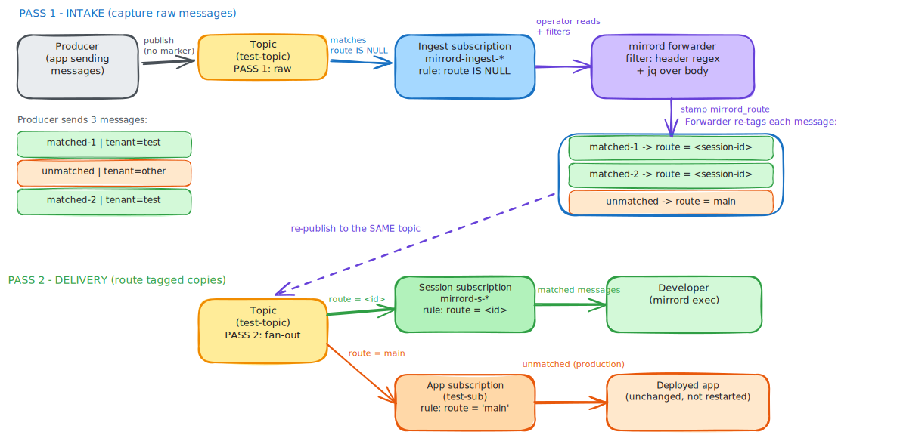

# Azure Service Bus

This page covers queue splitting for [Azure Service Bus](https://azure.microsoft.com/en-us/products/service-bus). For the general concepts and the message filter reference shared by all queue services, see the [Queue Splitting overview](../queue-splitting.md).


Queue splitting for Azure Service Bus requires mirrord operator `3.170.0` or later and mirrord CLI `3.221.0` or later.


## How It Works

Azure Service Bus supports two messaging models - **Queues** (point-to-point) and **Topics/Subscriptions** (pub/sub). Queue splitting works with both, but each uses a different routing mechanism.

**Queue model** When the first mirrord splitting session starts, two temporary queues are created (one for the target deployed in the cluster, one for the user's local application), and the mirrord operator routes messages according to the [user's filter](azure-service-bus.md#setting-a-filter). Routing is based on the AMQP application properties set on each message. If a second user then starts a session on the same queue, a third temporary queue is created for their local application, and the operator includes the new queue and filter in the routing logic.

**Topic/Subscription model** Here the operator splits the topic using native Service Bus subscription rules, without creating a temporary topic and without restarting the deployed application (so it works with frameworks like MassTransit that choose their own topic names). The operator adds a temporary subscription on the original topic to capture incoming messages, reads them, evaluates the [user's filter](azure-service-bus.md#setting-a-filter), and re-publishes each message to the same topic with a routing marker. Native subscription rules then deliver each copy to the right place: messages matching a user's filter go to a temporary per-session subscription that their local application reads, while everything else goes to the deployed application's own subscription, which is left untouched. When re-publishing, the operator preserves the message body, application properties, and the standard system fields (message id, correlation id, subject, content type, and so on). Each additional user who starts a session on the same topic gets their own per-session subscription and filter.

In both models, if the filters defined by two users both match some message, one of the users will receive the message at random.

The diagram below shows the two-pass routing used by the Topic/Subscription model: the operator first reads raw messages from a temporary ingest subscription, stamps a routing marker, and re-publishes each copy to the same topic, where native subscription rules deliver it to the matching session subscription or to the deployed application.



## Enabling Azure Service Bus Splitting in Your Cluster



### Enable Azure Service Bus splitting in the Helm chart

Enable the `operator.azureServiceBusSplitting` setting in the [mirrord-operator Helm chart](https://github.com/metalbear-co/charts/blob/main/mirrord-operator/values.yaml).



### Authenticate the mirrord operator

The mirrord operator needs to connect to your Azure Service Bus namespace to consume and re-route messages. You have three options for authentication:

### Option A: Workload Identity / Managed Identity (recommended for AKS)

If your AKS cluster has Workload Identity enabled, the operator can authenticate automatically without storing any keys. Assign the **Azure Service Bus Data Owner** role (or a custom role with Send, Listen, and Manage rights) to the operator's managed identity on the Service Bus namespace.

### Option B: Connection string (SAS key)

The simplest approach for quick setup. Obtain a connection string from your Service Bus namespace in the Azure portal. The key needs **Manage**, **Send**, and **Listen** claims on the namespace.

### Option C: Service Principal with client secret

Register an Azure AD application, create a client secret, and assign it the **Azure Service Bus Data Owner** role on the Service Bus namespace. You'll provide the `tenant_id`, `client_id`, and `client_secret` as properties.



### Create a MirrordPropertyList

As part of operator installation with `operator.azureServiceBusSplitting` enabled, the `MirrordPropertyList` custom resource type is available in your cluster. Create one with your Service Bus connection details.



Only the fully qualified namespace is needed. The operator uses `DefaultAzureCredential` which automatically picks up Workload Identity, Managed Identity, or other environment-based Azure credentials:

```yaml
apiVersion: mirrord.metalbear.co/v1
kind: MirrordPropertyList
metadata:
  name: servicebus-config
  namespace: meme
spec:
  properties:
    - name: fully_qualified_namespace
      value: myns.servicebus.windows.net
```



Store your connection string in a Kubernetes Secret and reference it:

```yaml
apiVersion: v1
kind: Secret
metadata:
  name: servicebus-credentials
  namespace: meme
type: Opaque
stringData:
  connection-string: "Endpoint=sb://myns.servicebus.windows.net/;SharedAccessKeyName=RootManageSharedAccessKey;SharedAccessKey=<your-key>"

---
apiVersion: mirrord.metalbear.co/v1
kind: MirrordPropertyList
metadata:
  name: servicebus-config
  namespace: meme
spec:
  properties:
    - name: connection_string
      valueFrom:
        secretKeyRef:
          name: servicebus-credentials
          key: connection-string
```



Store the client secret in a Kubernetes Secret and provide all four properties:

```yaml
apiVersion: v1
kind: Secret
metadata:
  name: servicebus-sp-credentials
  namespace: meme
type: Opaque
stringData:
  client-secret: "<your-client-secret>"

---
apiVersion: mirrord.metalbear.co/v1
kind: MirrordPropertyList
metadata:
  name: servicebus-config
  namespace: meme
spec:
  properties:
    - name: fully_qualified_namespace
      value: myns.servicebus.windows.net
    - name: tenant_id
      value: "<your-tenant-id>"
    - name: client_id
      value: "<your-client-id>"
    - name: client_secret
      valueFrom:
        secretKeyRef:
          name: servicebus-sp-credentials
          key: client-secret
```



### Property Reference

| Property                    |                Description               |                          Required                         |
| --------------------------- | :--------------------------------------: | :-------------------------------------------------------: |
| `connection_string`         | Full connection string including SAS key | One of `connection_string` or `fully_qualified_namespace` |
| `fully_qualified_namespace` |  FQNS like `myns.servicebus.windows.net` | One of `connection_string` or `fully_qualified_namespace` |
| `tenant_id`                 |      Azure AD tenant (directory) ID      |                Only with service principal                |
| `client_id`                 |         Azure AD app (client) ID         |                Only with service principal                |
| `client_secret`             |        Azure AD app client secret        |                Only with service principal                |



### Create a MirrordSplitConfig

Create a `MirrordSplitConfig` resource for the target workload. Azure Service Bus uses `kind: azureServiceBus` in queue entries and supports both the Queue model and the Topic/Subscription model.

### Queue model (point-to-point)

```yaml
apiVersion: queues.mirrord.metalbear.co/v1
kind: MirrordSplitConfig
metadata:
  name: meme-app-split
  namespace: meme
spec:
  targetRef:
    apiVersion: apps/v1
    kind: Deployment
    name: meme-app
  clientConfigs:
    azureServiceBus: servicebus-config
  queues:
    - id: orders-queue
      kind: azureServiceBus
      appConfig:
        queue:
          - env: SERVICE_BUS_QUEUE_NAME
```

### Topic/Subscription model (pub/sub)

```yaml
apiVersion: queues.mirrord.metalbear.co/v1
kind: MirrordSplitConfig
metadata:
  name: meme-app-split
  namespace: meme
spec:
  targetRef:
    apiVersion: apps/v1
    kind: Deployment
    name: meme-app
  clientConfigs:
    azureServiceBus: servicebus-config
  queues:
    - id: events-topic
      kind: azureServiceBus
      appConfig:
        topic:
          - env: SERVICE_BUS_TOPIC_NAME
        subscription:
          - env: SERVICE_BUS_SUBSCRIPTION_NAME
```

The `clientConfigs.azureServiceBus` field points to the `MirrordPropertyList` you created in the previous step. You can override it per-queue using the `clientConfig` field on individual queue entries.

### When the topic name is not in an environment variable

Some frameworks (most commonly [MassTransit](https://masstransit.io/)) derive the topic name from the message type, so it never appears in an environment variable. The operator does not change the topic name anyway, it only needs to know it, so just give the name in `fallback`:

```yaml
queues:
  - id: events-topic
    kind: azureServiceBus
    appConfig:
      topic:
        # `fallback` is the topic name. The `env` next to it is just a
        # placeholder - the operator ignores it, does NOT need to exist.
        - env: TOPIC
          fallback: "MyApp.Events~OrderSubmitted"
      subscription:
        - env: SERVICE_BUS_SUBSCRIPTION_NAME
```

The subscription is different: its env var **is** read and rewritten to point your local process at its own session subscription, so `subscription.env` must be the real variable your app uses. In MassTransit you can set the subscription name explicitly (for example via `SubscriptionEndpoint`) and expose it through that variable.

### AppConfig reference fields

Each item in `queue`, `topic`, or `subscription` is an `AppConfigRef` that describes how to find the resource name in the workload's environment:

| Field           |                                                                                                                                                  Description                                                                                                                                                  |          Required         |
| --------------- | :-----------------------------------------------------------------------------------------------------------------------------------------------------------------------------------------------------------------------------------------------------------------------------------------------------------: | :-----------------------: |
| `env`           |                                                                                                                                        Exact environment variable name                                                                                                                                        | One of `env` or `envLike` |
| `envLike`       |                                                                                                                           Regex pattern matching multiple environment variable names                                                                                                                          | One of `env` or `envLike` |
| `fallback`      | Value to use when the `env` variable is not present in the pod. Useful for topics whose name is fixed but not exposed via an environment variable (see [When the topic name is not in an environment variable](azure-service-bus.md#when-the-topic-name-is-not-in-an-environment-variable)). Only with `env`. |             No            |
| `valueSelector` |                                                                                                                JSON selector to extract value(s) from the variable content (e.g. `.key`, `.[]`)                                                                                                               |             No            |
| `valuePattern`  |                                                           Regex that captures the resource name embedded in a larger value (a URL, path, or connection string). See [Preserving the value format](azure-service-bus.md#preserving-the-value-format).                                                          |             No            |
| `containers`    |                                                                                                                      Limit resolution to specific containers. Defaults to all containers.                                                                                                                     |             No            |

Example with multiple options:

```yaml
queues:
  - id: orders-queue
    kind: azureServiceBus
    appConfig:
      queue:
        - env: SERVICE_BUS_QUEUE_NAME
          fallback: orders
          containers:
            - main
        - envLike: "^SB_QUEUE_.*"
```

### Preserving the value format

By default the operator treats the whole environment variable value as the resource name and replaces it with a temporary one. When the application reads the name as part of a larger string - a URL, a resource path, or a connection string - replacing the whole value would break it. You can use `valuePattern` to solve this: it is a regex whose capture group marks the part of the value that is the resource name. The operator swaps only that captured part for the temporary name and keeps everything around it unchanged.

The capture group is picked in this order: a group named `value`, otherwise the first unnamed group.

For example, an application that reads a Service Bus connection string with the entity in `EntityPath`:

```yaml
queues:
  - id: orders-queue
    kind: azureServiceBus
    appConfig:
      queue:
        - env: SERVICE_BUS_CONNECTION_STRING
          valuePattern: "EntityPath=(?P<value>[^;]+)"
```

With `SERVICE_BUS_CONNECTION_STRING=Endpoint=sb://my-namespace.servicebus.windows.net/;SharedAccessKeyName=RootManageSharedAccessKey;SharedAccessKey=...;EntityPath=orders`, the operator captures `orders`, creates a temporary queue, and rewrites only the `EntityPath` to the temporary name, so the application still gets a full connection string.

### Per-queue client configuration

To use a different `MirrordPropertyList` for a specific queue entry (instead of the default from `clientConfigs.azureServiceBus`), set the `clientConfig` field:

```yaml
queues:
  - id: orders-queue
    kind: azureServiceBus
    clientConfig: orders-servicebus-config
    appConfig:
      queue:
        - env: SERVICE_BUS_QUEUE_NAME
```

### Wildcard queue ID

You can use `*` as a queue ID in the mirrord config to apply a filter to all queues defined in the `MirrordSplitConfig`:

```json
{
  "feature": {
    "split_queues": {
      "*": {
        "queue_type": "AzureServiceBus",
        "message_filter": {
          "baggage": ".*mirrord-session=alice.*"
        }
      }
    }
  }
}
```

This resolves to all queue IDs from the `MirrordSplitConfig`. If you also have explicit per-queue filters, they take precedence over the wildcard.


The mirrord operator can only read the consumer's environment variables if they are either:

1. defined directly in the workload's pod template, with the value defined in `value` or in `valueFrom` via config map reference; or
2. loaded from config maps using `envFrom`.




### Additional options

The `MirrordSplitConfig` supports several optional fields that control restart behavior, temporary resource naming, and drain timing.

### Restart policy

Controls how the workload is restarted when patched for queue splitting:

```yaml
spec:
  restart:
    strategy: standard
    timeout: 120
    waitForPods: all
```

| Field         |                              Description                              |         Default         |
| ------------- | :-------------------------------------------------------------------: | :---------------------: |
| `strategy`    |                      `standard` or `isolatePods`                      | Global operator setting |
| `timeout`     |         Seconds to wait for pods to become ready after restart        |            60           |
| `waitForPods` | Number of patched pods required before sessions may start, or `"all"` |            1            |

### Drain timeout

After all splitting sessions end, the operator will wait for the fallback subscription to drain before deleting temporary resources. Two settings control how long it waits:

| Setting                                         | Unit    | Scope      | Effect                                                                         |
| ----------------------------------------------- | ------- | ---------- | ------------------------------------------------------------------------------ |
| `spec.drainTimeout` on the `MirrordSplitConfig` | seconds | One config | Caps the drain wait for that split. Always wins over the cluster-wide default. |

Whichever value applies is then interpreted as:

| Value        | Behavior                                                                                    |
| ------------ | ------------------------------------------------------------------------------------------- |
| unset (both) | Drain indefinitely - temporary resources are kept until the fallback subscription is empty. |
| `0`          | Skip draining; delete temporary resources immediately. Unread messages may be lost.         |
| `N`          | Wait up to `N` for the fallback subscription to drain, then delete temporary resources.     |

### Temporary resource name template

You can customize the naming format of temporary queues/topics created by the operator:

```yaml
spec:
  tmpNameTemplate: "mirrord-tmp-{{RANDOM}}{{FALLBACK}}{{ORIGINAL}}"
```

The template must contain all three placeholders:

* `{{RANDOM}}` - random alphabetic characters for uniqueness.
* `{{FALLBACK}}` - resolves to `-main-` for the fallback queue or `-` for user queues.
* `{{ORIGINAL}}` - name of the original queue/topic being split.

Azure Service Bus resource names can be up to 260 characters. If the rendered name exceeds this limit, the original portion is truncated with a hash suffix.



## Setting a filter

For the full filter reference (`queue_type`, `message_filter`, `jq_filter`), see the [overview](../queue-splitting.md#setting-a-filter-for-a-mirrord-run). Azure Service Bus uses `queue_type: AzureServiceBus`.

Filtering on an AMQP application property:

```json
{
  "operator": true,
  "target": "deployment/meme-app",
  "feature": {
    "split_queues": {
      "orders-queue": {
        "queue_type": "AzureServiceBus",
        "message_filter": {
          "tenant": "^alice$"
        }
      }
    }
  }
}
```

In the example above, the local application will receive messages from the Azure Service Bus queue described under ID `orders-queue` in the `MirrordSplitConfig`, but only messages whose AMQP application property `tenant` has the exact value `alice`.

You can also use `jq_filter` to match on message body content:

```json
{
  "operator": true,
  "target": "deployment/meme-app",
  "feature": {
    "split_queues": {
      "orders-queue": {
        "queue_type": "AzureServiceBus",
        "jq_filter": ".body | fromjson | .priority == \"high\""
      }
    }
  }
}
```

This routes only messages whose JSON body contains `"priority": "high"` to the local application.

Both `message_filter` and `jq_filter` can be combined - a message must match both to be routed to the local application.

## Troubleshooting Azure Service Bus splitting

If you are having issues with Azure Service Bus splitting, start with these general steps:

1.  Make sure a `MirrordSplitConfig` exists for the target workload and that it has queue entries with `kind: azureServiceBus`:

    ```shell
    kubectl get mirrordsplitconfigs.queues.mirrord.metalbear.co -n <target-namespace> -o yaml
    ```
2. Make sure the queue IDs in your mirrord configuration match the IDs defined in the `MirrordSplitConfig`.
3.  Make sure the `MirrordPropertyList` referenced by `clientConfigs.azureServiceBus` (or by individual queue entries) exists and contains the correct connection details:

    ```shell
    kubectl get mirrordpropertylists.mirrord.metalbear.co -n <target-namespace> -o yaml
    ```
4.  Get the operator logs:

    ```shell
    kubectl logs -n mirrord -l app==mirrord-operator --tail -1 > /tmp/mirrord-operator-$(date +"%Y-%m-%d_%H-%M-%S").log
    ```

    For more detailed logs, set the log level for the queue splitting module:

    ```shell
    helm upgrade mirrord-operator --reuse-values --set operator.logLevel "mirrord=info,operator=info,operator_queue_splitting::azure_service_bus=trace" metalbear/mirrord-operator
    ```

### Messages are not reaching the local application

Check that:

* The producer is setting AMQP application properties on messages. The operator routes based on these properties when `message_filter` is used.
* Your `message_filter` regex patterns match the actual property values. Property values are compared as plain strings.
* If using `jq_filter`, verify the message body is valid JSON and the jq expression returns `true` for your test messages.

### Authentication errors in operator logs

* **Connection string auth**: verify the connection string is correct and the SAS key has Manage, Send, and Listen claims.
* **Workload Identity / Managed Identity**: verify the managed identity has the **Azure Service Bus Data Owner** role on the namespace. Check that AKS Workload Identity is properly configured and the operator's service account has the correct annotations.
* **Service Principal**: verify that `tenant_id`, `client_id`, and `client_secret` are all present in the `MirrordPropertyList` and that the app registration has the correct role assignment.

### Temporary queues are not being cleaned up

After all splitting sessions end, the operator deletes temporary queues. If they linger, check that the operator has `Manage` rights on the Service Bus namespace and that the operator pod is running. You can also set `drainTimeout` in the `MirrordSplitConfig` to control how long fallback queues are kept alive after sessions end.
