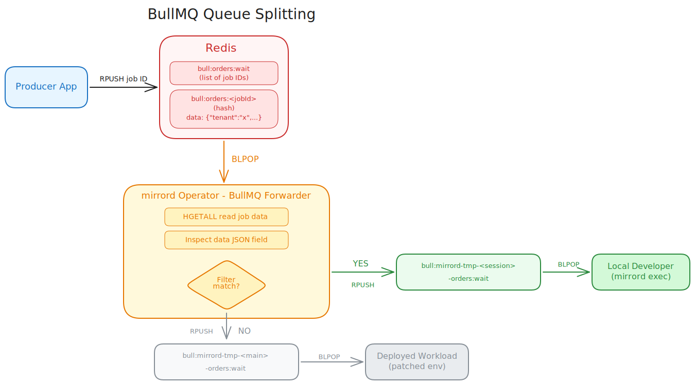

This page covers queue splitting for [BullMQ](https://bullmq.io/), a Redis-backed persistent job queue. For the general concepts and the message filter reference shared by all queue services, see the [Queue Splitting overview](../queue-splitting.md).

The word "queue" on this page refers to a BullMQ queue (backed by Redis lists, hashes, and sorted sets under the `bull:<queue>:*` key prefix).


Queue splitting for BullMQ requires mirrord operator `3.175.0` or later and mirrord CLI `3.223.0` or later.


### How It Works



BullMQ stores jobs as Redis data structures: a wait list (`bull:<queue>:wait`), per-job hashes (`bull:<queue>:<jobId>`), and an ID counter (`bull:<queue>:id`). The mirrord operator's BullMQ forwarder dequeues jobs from the original wait list using `BLPOP`, inspects the job's `data` field (which must be valid JSON), and re-enqueues each job to the appropriate temporary queue based on the users' filters.

When the first mirrord BullMQ splitting session starts, the operator creates a temporary "main" queue for the deployed workload and patches the workload's queue-name environment variable to read from it. The forwarder then begins dequeuing from the original queue: jobs whose JSON data matches the user's filter are re-enqueued to a temporary per-session queue that the local application reads, and everything else is re-enqueued to the main queue.

If a second user starts a session on the same queue, the operator creates another per-session queue and adds the second user's filter to the routing logic. If the filters defined by two users both match some job, one of the users will receive the job at random.

When a session ends, the operator deletes the per-session queue's Redis keys. When all sessions end, the operator restores the workload to read from the original queue and deletes the main queue's Redis keys.

### Enabling BullMQ Splitting in Your Cluster




#### Enable BullMQ splitting in the Helm chart

Enable the `operator.bullmqSplitting` setting in the [mirrord-operator Helm chart](https://github.com/metalbear-co/charts/blob/main/mirrord-operator/values.yaml).




#### Create a MirrordPropertyList

The operator needs to connect to your Redis instance to dequeue and re-enqueue jobs. Define the connection in a `MirrordPropertyList` ([`CustomResource`](https://kubernetes.io/docs/concepts/extend-kubernetes/api-extension/custom-resources/)) in the same namespace as the target workload (and the `MirrordSplitConfig`).

```yaml
apiVersion: mirrord.metalbear.co/v1
kind: MirrordPropertyList
metadata:
  name: bullmq-config
  namespace: workers
spec:
  properties:
    - name: url
      value: redis://redis.redis-ns.svc.cluster.local:6379
```

Supported properties:

| Property | Description | Required | Default |
| -------- | :---------: | :------: | :-----: |
| `url` | Full Redis URL, e.g. `redis://host:6379/0`. Used as-is when present. | One of `url` or `host` | |
| `host` | Redis hostname, used when `url` is absent. | One of `url` or `host` | |
| `port` | Redis port, used with `host`. | No | `6379` |
| `password` | Password for authentication. | No | |
| `tls` | Set to `"true"` to connect over TLS (`rediss://`). | No | `false` |
| `db` | Database index. | No | `0` |




#### Create a MirrordSplitConfig

On operator installation with `operator.bullmqSplitting` enabled, a new [`CustomResource`](https://kubernetes.io/docs/concepts/extend-kubernetes/api-extension/custom-resources/) type is defined in your cluster - `MirrordSplitConfig`. Users with permissions to get CRDs can verify its existence with `kubectl get crd mirrordsplitconfigs.queues.mirrord.metalbear.co`.

Create a `MirrordSplitConfig` for the target workload. BullMQ uses `kind: bullMq` in queue entries.

```yaml
apiVersion: queues.mirrord.metalbear.co/v1
kind: MirrordSplitConfig
metadata:
  name: worker-split
  namespace: workers
spec:
  targetRef:
    apiVersion: apps/v1
    kind: Deployment
    name: order-worker
  clientConfigs:
    bullMq: bullmq-config
  queues:
    - id: orders
      kind: bullMq
      appConfig:
        queue:
          - env: BULLMQ_QUEUE
```

The `MirrordSplitConfig` above says that:
1. It targets the deployment `order-worker` in namespace `workers`.
2. The Redis connection comes from the `bullmq-config` `MirrordPropertyList`.
3. The deployment consumes one BullMQ queue, whose name is in environment variable `BULLMQ_QUEUE`.
4. The queue can be referenced in a mirrord config under ID `orders`.

##### Link the config to the deployed consumer

The `MirrordSplitConfig` is a namespaced resource. The target workload reference is specified with `spec.targetRef`:
* `apiVersion` - API version of the Kubernetes workload (e.g. `apps/v1`).
* `kind` - type of the workload. Supported: `Deployment`, `StatefulSet`, `Rollout`.
* `name` - name of the workload.

##### Describe consumed queues

Each entry in the `spec.queues` list describes a BullMQ queue consumed by the workload:

* `id` - arbitrary queue ID that developers [reference](#setting-a-filter) from their mirrord config.
* `kind` - must be `bullMq`.
* `clientConfig` (optional) - name of a `MirrordPropertyList` with the Redis connection. Can also be set once for all BullMQ queues with `spec.clientConfigs.bullMq`.
* `queueConfig` (optional) - name of a `MirrordPropertyList` with forwarder tuning. Supported properties:
  * `dequeue_timeout` - how long `BLPOP` waits before retrying, in seconds (default: `5`).
  * `jq_time_limit` - max milliseconds for jq filter evaluation per job (default: `200`).
* `appConfig.queue` - the BullMQ queue name. Uses the same structure as other queue services (`env`, `envLike`, `fallback`, `valueSelector`, `valuePattern`, `containers`).


The mirrord operator can only read consumer's environment variables if they are either:
1. defined directly in the workload's pod template, with the value defined in `value` or in `valueFrom` via config map reference; or
2. loaded from config maps using `envFrom`.





### Drain timeout

After the last session against a target ends, the operator keeps the split's temporary resources alive for the drain timeout so a new session can reuse them, then tears them down. It does not wait for unread jobs to be consumed first.

| Setting | Unit | Scope | Effect |
| ------- | ---- | ----- | ------ |
| `spec.drainTimeout` on the `MirrordSplitConfig` | seconds | One split | Wins over the cluster-wide default. |

| `drainTimeout` | Behavior |
| -------------- | -------- |
| unset (both) | Tear down as soon as the last session ends (same as `0`). |
| `0` | Tear down immediately. Unread jobs may be lost. |
| `N` | Keep resources for up to `N` seconds, then tear down. |

### Setting a filter

For the full filter reference (`queue_type`, `message_filter`, `jq_filter`), see the [overview](../queue-splitting.md#setting-a-filter-for-a-mirrord-run). BullMQ uses `queue_type: BullMQ`.

BullMQ jobs carry their payload in a `data` field stored as a JSON string in the job hash. Filters match against the parsed JSON value of this `data` field. `message_filter` matches regexes against top-level JSON fields; `jq_filter` runs against the full parsed JSON.

Filtering on a top-level JSON field:

```json
{
  "operator": true,
  "target": "deployment/order-worker/container/worker",
  "feature": {
    "split_queues": {
      "orders": {
        "queue_type": "BullMQ",
        "message_filter": {
          "tenant": "^test$"
        }
      }
    }
  }
}
```

In the example above, the local application will receive only jobs whose `data` JSON has a top-level `tenant` field equal to `test`.

Filtering on the payload with `jq_filter`:

```json
{
  "operator": true,
  "target": "deployment/order-worker/container/worker",
  "feature": {
    "split_queues": {
      "orders": {
        "queue_type": "BullMQ",
        "jq_filter": ".priority == \"high\""
      }
    }
  }
}
```

In the example above, the local application will receive only jobs whose `data` JSON contains `"priority": "high"`.


Jobs whose `data` field is not valid JSON never match attribute or jq filters, so they are routed to the deployed (cluster) application.

