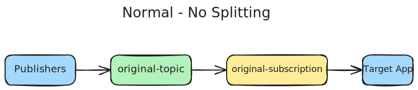
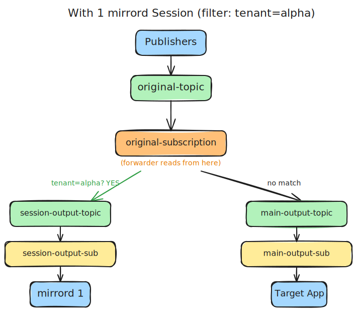
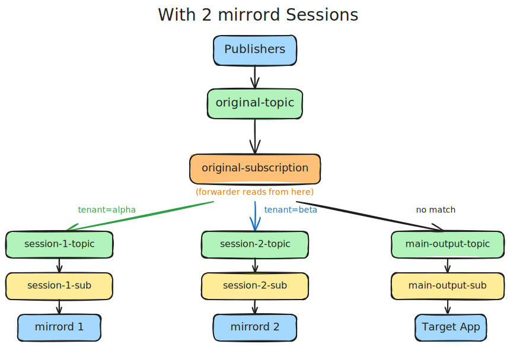
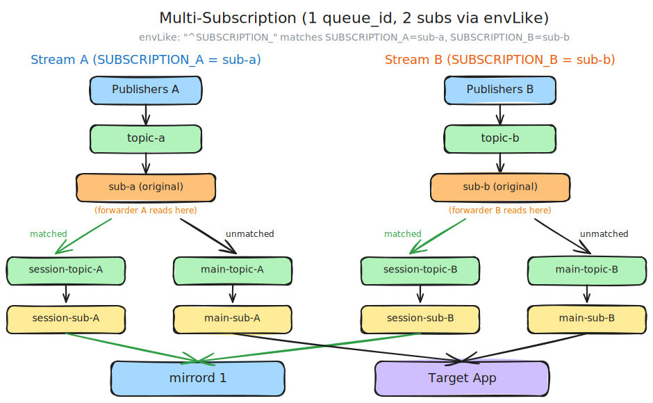

# Google Cloud Pub/Sub

This page covers queue splitting for [Google Cloud Pub/Sub](https://cloud.google.com/pubsub). For the general concepts and the message filter reference shared by all queue services, see the [Queue Splitting overview](../queue-splitting.md).

The word "queue" on this page refers to a Pub/Sub subscription.


Queue splitting for Google Cloud Pub/Sub requires mirrord operator `3.170.0` or later and mirrord CLI `3.221.0` or later.


## How It Works

First, we have a consumer app reading messages from a Google Cloud Pub/Sub subscription.



When the first mirrord Pub/Sub splitting session starts, the operator creates temporary topics and subscriptions (one set for the target deployed in the cluster, one for the user's local application), and routes messages according to the [user's filter](gcp-pubsub.md#setting-a-filter).



If a second user then starts a mirrord Pub/Sub splitting session on the same subscription, an additional temporary topic and subscription are created for the second user's local application. The operator includes the new subscription and the second user's filter in the routing logic.



If the filters defined by the two users both match some message, one of the users will receive the message at random.

The target workload's subscription environment variable is patched to read from a temporary subscription, while the operator drains the original subscription and forwards messages through temporary topics.

## Enabling GCP Pub/Sub Splitting in Your Cluster



#### Enable GCP Pub/Sub splitting in the Helm chart

Enable the `operator.gcpPubsubSplitting` setting in the [mirrord-operator Helm chart](https://github.com/metalbear-co/charts/blob/main/mirrord-operator/values.yaml).



#### Authenticate the mirrord operator

The mirrord operator needs access to the Google Cloud Pub/Sub API to create and manage temporary topics and subscriptions.

In all cases you must create a `MirrordPropertyList` that tells the operator which GCP project to use. The credentials themselves come from one of the two options below.

##### Option A: Workload Identity (recommended)

[Workload Identity](https://cloud.google.com/kubernetes-engine/docs/how-to/workload-identity) binds a Kubernetes service account to a Google Cloud IAM service account. The Kubernetes service account must carry the `iam.gke.io/gcp-service-account` annotation pointing at the GCP service account email.

When the chart creates the operator's service account (`sa.create`, on by default), set the email with the `sa.gcpSa` value and the chart adds the annotation for you:

```yaml
sa:
  gcpSa: mirrord-operator@my-project.iam.gserviceaccount.com
```

If you bring your own service account (`sa.create: false`), add the annotation to it directly:

```yaml
apiVersion: v1
kind: ServiceAccount
metadata:
  name: mirrord-operator
  namespace: mirrord
  annotations:
    iam.gke.io/gcp-service-account: mirrord-operator@my-project.iam.gserviceaccount.com
```

Then create a `MirrordPropertyList` with only the `project_id`. With no `credentials_json`, the operator authenticates using Application Default Credentials, which is what Workload Identity provides:

```yaml
apiVersion: mirrord.metalbear.co/v1
kind: MirrordPropertyList
metadata:
  name: gcp-pubsub-config
  namespace: events
spec:
  properties:
    - name: project_id
      value: my-gcp-project
```

##### Option B: Service account JSON key

If you are not using Workload Identity, provide a service account JSON key in the `MirrordPropertyList`. Store the key in a Kubernetes Secret, then reference it:

```yaml
apiVersion: mirrord.metalbear.co/v1
kind: MirrordPropertyList
metadata:
  name: gcp-pubsub-config
  namespace: events
spec:
  properties:
    - name: project_id
      value: my-gcp-project
    - name: credentials_json
      valueFrom:
        secretKeyRef:
          name: gcp-sa-key
          key: credentials.json
```

Whichever option you choose, the operator needs to know which property list to use for each queue. It resolves the name in this order:

1. `spec.queues[].clientConfig` on an individual queue entry in the `MirrordSplitConfig`.
2. `spec.clientConfigs.googlePubSub` on the `MirrordSplitConfig`, used as the default for all Pub/Sub queues.
3. If neither is set, the operator looks for a `MirrordPropertyList` named `default` in the target's namespace.

So either name your property list `default`, or point to it explicitly. For example, to share one property list across all Pub/Sub queues:

```yaml
spec:
  clientConfigs:
    googlePubSub: gcp-pubsub-config
```

Whichever method you choose, the IAM service account needs the following Pub/Sub permissions:

| Pub/Sub Permission                 | Needed for original resources | Needed for temporary resources |
| ---------------------------------- | :---------------------------: | :----------------------------: |
| `pubsub.subscriptions.consume`     |               ✓               |                                |
| `pubsub.subscriptions.get`         |               ✓               |                                |
| `pubsub.topics.attachSubscription` |                               |                ✓               |
| `pubsub.topics.create`             |                               |                ✓               |
| `pubsub.topics.delete`             |                               |                ✓               |
| `pubsub.topics.publish`            |                               |                ✓               |
| `pubsub.subscriptions.create`      |                               |                ✓               |
| `pubsub.subscriptions.delete`      |                               |                ✓               |

A good starting point is to assign the `roles/pubsub.editor` role to the operator's service account, scoped to the relevant project.



#### Authorize deployed consumers

In order to be targeted with Pub/Sub splitting, a deployed consumer must be able to read from the temporary subscriptions created by mirrord. If the consumer's IAM permissions are scoped to specific subscription names, you will need to extend them to cover subscriptions with the `mirrord-tmp-` prefix. This prefix is customizable via the `spec.tmpNameTemplate` field in your `MirrordSplitConfig` resource.



#### Provide application context

On operator installation with `operator.gcpPubsubSplitting` enabled, a new [`CustomResource`](https://kubernetes.io/docs/concepts/extend-kubernetes/api-extension/custom-resources/) type is defined in your cluster - `MirrordSplitConfig`. Users with permissions to get CRDs can verify its existence with `kubectl get crd mirrordsplitconfigs.queues.mirrord.metalbear.co`.

Before you can run sessions with Pub/Sub splitting, you must create a `MirrordSplitConfig` for the desired target. This tells the operator which subscriptions to split and how the application discovers their names.

See an example `MirrordSplitConfig` defined for a deployment `event-processor` living in namespace `events`:

```yaml
apiVersion: queues.mirrord.metalbear.co/v1
kind: MirrordSplitConfig
metadata:
  name: event-processor-split
  namespace: events
spec:
  targetRef:
    apiVersion: apps/v1
    kind: Deployment
    name: event-processor
  # Optional. Controls the prefix of temporary resource names.
  # The value below is the default; only set this if you need to customize it differently.
  tmpNameTemplate: "mirrord-tmp-{{RANDOM}}{{FALLBACK}}{{ORIGINAL}}"
  queues:
    - id: user-events
      kind: googlePubSub
      appConfig:
        subscription:
          - env: PUBSUB_SUBSCRIPTION
            containers:
              - consumer
        projectId:
          - env: GCP_PROJECT_ID
            containers:
              - consumer
```

The `MirrordSplitConfig` above says that:

1. It targets the deployment `event-processor` in namespace `events`.
2. Temporary resources will be named with the `mirrord-tmp-` prefix (this is the default, shown here for clarity). You can change this prefix to scope IAM permissions.
3. The deployment consumes one Pub/Sub subscription, whose name is in environment variable `PUBSUB_SUBSCRIPTION` in container `consumer`.
4. The GCP project ID is in environment variable `GCP_PROJECT_ID` in container `consumer`.
5. The subscription can be referenced in a mirrord config under ID `user-events`.

##### Link the config to the deployed consumer

The `MirrordSplitConfig` is a namespaced resource. The target workload reference is specified with `spec.targetRef`:

* `apiVersion` - API version of the Kubernetes workload (e.g. `apps/v1`).
* `kind` - type of the workload. Supported: `Deployment`, `StatefulSet`, `Rollout`.
* `name` - name of the workload.

##### Describe consumed subscriptions

Each entry in the `spec.queues` list describes one or more Pub/Sub subscriptions consumed by the workload:

* `id` - arbitrary queue ID that developers reference from their mirrord config.
* `kind` - must be `googlePubSub`.
* `appConfig.subscription` - how the application discovers the subscription name. Each entry can use:
  * `env` - exact environment variable name containing the subscription ID.
  * `envLike` - regex matching environment variable names.
  * `fallback` - fallback subscription name if the variable is not found.
  * `valueSelector` - a jq expression to extract the subscription name from the variable's value. Useful when the env var contains JSON or a compound string rather than a plain name.
  * `valuePattern` - a regex used when the subscription name is embedded in a larger string such as a Go CDK URL (`gcppubsub://projects/my-project/subscriptions/my-subscription`) or a resource path. See [Preserving the value format](gcp-pubsub.md#preserving-the-value-format) below.
  * `containers` - limit to specific containers (optional, defaults to all).
* `appConfig.projectId` - how the application discovers the GCP project ID. Uses the same structure as `subscription`.
* `clientConfig` (optional) - name of a `MirrordPropertyList` containing GCP-specific connection properties. Can also be set at the top level in `spec.clientConfigs.googlePubSub`. If neither is set, the operator looks for a `MirrordPropertyList` named `default` in the target's namespace.
* `queueConfig` (optional) - name of a `MirrordPropertyList` with additional configuration for temporary resources.

##### Matching multiple subscriptions with `envLike`

When a single queue ID uses `envLike` to match several environment variables, each matched subscription is split independently under that one ID. A filter on the queue ID then applies to every matched subscription. The diagram below shows one queue ID whose `envLike` matches two subscription variables, each getting its own session and main resources.



##### Subscriptions in multiple GCP projects

Each queue's project is resolved from its own `appConfig.projectId`, so different queues can live in different projects. If all projects share one identity (e.g. Workload Identity with cross-project access), one `MirrordPropertyList` is enough - just give each queue its own `projectId`:

```yaml
queues:
  - id: queue-a
    kind: googlePubSub
    appConfig:
      subscription:
        - env: QUEUE_A_SUBSCRIPTION
      projectId:
        - env: QUEUE_A_PROJECT
  - id: queue-b
    kind: googlePubSub
    appConfig:
      subscription:
        - env: QUEUE_B_SUBSCRIPTION
      projectId:
        - env: QUEUE_B_PROJECT
```

If each project needs different credentials, create one `MirrordPropertyList` per project and point to it per queue with `clientConfig`:

```yaml
queues:
  - id: queue-a
    kind: googlePubSub
    clientConfig: gcp-project-a-config
    appConfig:
      subscription:
        - env: QUEUE_A_SUBSCRIPTION
  - id: queue-b
    kind: googlePubSub
    clientConfig: gcp-project-b-config
    appConfig:
      subscription:
        - env: QUEUE_B_SUBSCRIPTION
```

With Workload Identity, make sure the operator's identity has Pub/Sub permissions in every project it needs to reach.


The mirrord operator can only read consumer's environment variables if they are either:

1. defined directly in the workload's pod template, with the value defined in `value` or in `valueFrom` via config map reference; or
2. loaded from config maps using `envFrom`.




## Configuring temporary subscriptions

By default the temporary subscriptions mirrord creates are deep copies of the source subscription, so they inherit its settings - including its acknowledgement deadline, message retention, and expiration. You can override these per queue by pointing its `queueConfig` at a `MirrordPropertyList`:

```yaml
apiVersion: mirrord.metalbear.co/v1
kind: MirrordPropertyList
metadata:
  name: user-events-queue-config
  namespace: events
spec:
  properties:
    - name: ack_deadline_seconds
      value: "120"
    - name: message_retention_seconds
      value: "3600"
    - name: expiration_seconds
      value: "never"
```

Reference it from the queue entry in the `MirrordSplitConfig`:

```yaml
queues:
  - id: user-events
    kind: googlePubSub
    queueConfig: user-events-queue-config
    appConfig:
      subscription:
        - env: PUBSUB_SUBSCRIPTION
```

Each key is optional, and any key you leave out keeps the value copied from the source subscription. All of them apply to the temporary subscriptions created for this queue. An invalid value for a key is ignored (a warning is logged) and that setting falls back to the source subscription's value, so a typo never fails the session.

All three values are forwarded to GCP, which enforces its own allowed ranges (see the [`Subscription` reference](https://cloud.google.com/pubsub/docs/reference/rest/v1/projects.subscriptions#Subscription) for the current limits). A value GCP considers out of range is rejected by GCP when the temporary subscription is created.

* `ack_deadline_seconds` (integer seconds) - the acknowledgement deadline. Raising it gives your local application more time to handle a message before Pub/Sub considers it unacknowledged and redelivers it, which is useful when you pause on a breakpoint while debugging.
* `message_retention_seconds` (integer seconds) - how long unacknowledged messages are kept, so a backlog is not dropped while you debug.
* `expiration_seconds` (integer seconds, or `never`) - how long the temporary subscription survives without activity before Pub/Sub deletes it. Use `never` to keep it for the whole session, which prevents the subscription from being garbage-collected while the deployed consumer is paused.

## Preserving the value format

By default the operator treats the whole environment variable value as the resource name and replaces it with a temporary one. When the application reads the name as part of a larger string - a URL, a resource path, or a connection string - replacing the whole value would break it. You can use `valuePattern` to solve this: it is a regex whose capture group marks the part of the value that is the resource name. The operator swaps only that captured part for the temporary name and keeps everything around it unchanged.

The capture group is picked in this order: a group named `value`, otherwise the first unnamed group.

For example, an application that reads a Go CDK Pub/Sub URL:

```yaml
queues:
  - id: user-events
    kind: googlePubSub
    appConfig:
      subscription:
        - env: PUBSUB_SUBSCRIPTION
          valuePattern: "subscriptions/(?P<value>[^/?]+)"
```

With `PUBSUB_SUBSCRIPTION=gcppubsub://projects/my-project/subscriptions/orders`, the operator captures `orders`, creates a temporary subscription, and rewrites the variable to `gcppubsub://projects/my-project/subscriptions/<temporary-name>`, so the application still gets a full URL.

## Drain timeout

After the last splitting session against a target ends, the operator keeps the split's temporary subscription alive for a while so fallback messages can still be delivered before it tears it down. Two settings control how long it waits:

| Setting                                         | Unit    | Scope      | Effect                                                                         |
| ----------------------------------------------- | ------- | ---------- | ------------------------------------------------------------------------------ |
| `spec.drainTimeout` on the `MirrordSplitConfig` | seconds | One config | Caps the drain wait for that split. Always wins over the cluster-wide default. |

Whichever value applies is then interpreted as:

| Value        | Behavior                                                                                      |
| ------------ | --------------------------------------------------------------------------------------------- |
| unset (both) | Drain indefinitely - the temporary subscription is kept until fallback messages are drained.  |
| `0`          | Skip draining; delete the temporary subscription immediately. Undrained messages may be lost. |
| `N`          | Wait up to `N` to drain, then delete the temporary subscription.                              |

## Setting a filter

For the full filter reference (`queue_type`, `message_filter`, `jq_filter`), see the [overview](../queue-splitting.md#setting-a-filter-for-a-mirrord-run). GCP Pub/Sub uses `queue_type: GCPPubSub`.

Filtering on a Pub/Sub message attribute:

```json
{
  "operator": true,
  "target": "deployment/event-processor/container/consumer",
  "feature": {
    "split_queues": {
      "user-events": {
        "queue_type": "GCPPubSub",
        "message_filter": {
          "env": "^dev$"
        }
      }
    }
  }
}
```

In the example above, the local application will receive a subset of messages from the Pub/Sub subscription described in the `MirrordSplitConfig` under ID `user-events`. All received messages will have a Pub/Sub attribute `env` with the value `dev`.

Filtering on the message body with `jq_filter`:

```json
{
  "operator": true,
  "target": "deployment/event-processor/container/consumer",
  "feature": {
    "split_queues": {
      "user-events": {
        "queue_type": "GCPPubSub",
        "jq_filter": ".data | @base64d | fromjson | .user_id == \"test-user\""
      }
    }
  }
}
```

In the example above, the local application will receive messages from the Pub/Sub subscription `user-events` only when the message body (base64-decoded) is valid JSON and contains `"user_id": "test-user"`.

Using the `*` wildcard to apply one filter to all subscriptions in the `MirrordSplitConfig`:

```json
{
  "operator": true,
  "target": "deployment/event-processor/container/consumer",
  "feature": {
    "split_queues": {
      "*": {
        "queue_type": "GCPPubSub",
        "message_filter": {
          "env": "^dev$"
        }
      }
    }
  }
}
```

In the example above, the local application will receive a subset of messages from **all** Pub/Sub subscriptions described in the target's `MirrordSplitConfig`. All received messages will have a Pub/Sub attribute `env` with the value `dev`. `*` resolves to all queues defined in the `MirrordSplitConfig` for the target workload. If no `MirrordSplitConfig` exists, the wildcard is silently ignored.
