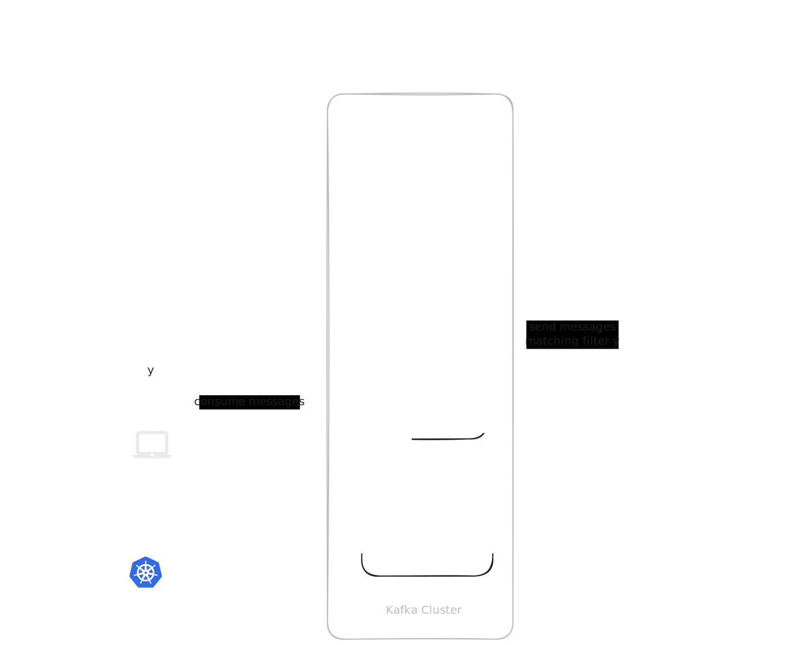

This page covers queue splitting for [Kafka](https://kafka.apache.org/). For the general concepts and the message filter reference shared by all queue services, see the [Queue Splitting overview](../queue-splitting.md).

The word "queue" on this page refers to a Kafka topic.


Queue splitting via `MirrordSplitConfig` requires mirrord operator `3.170.0` or later and mirrord CLI `3.221.0` or later.



**⚠️ Deprecated CRD**

`MirrordKafkaTopicsConsumer` + `MirrordKafkaClientConfig` are deprecated and replaced by `MirrordSplitConfig`. Existing resources continue to work for backward compatibility, but we recommend migrating to `MirrordSplitConfig`. See [Migrating to MirrordSplitConfig](migrating-to-mirrordsplitconfig.md#kafka).

The older `operator.idleKafkaSplitTtlMillis` Helm value (`OPERATOR_KAFKA_SPLITTING_TTL`) only affects legacy `MirrordKafkaTopicsConsumer` objects; with `MirrordSplitConfig`, use [`spec.drainTimeout`](kafka.md#configuring-workload-restart) instead.


## How It Works

First, we have a consumer app reading messages from a Kafka queue:


When the first mirrord Kafka splitting session starts, two temporary queues are created (one for the target deployed in the cluster, one for the user's local application), and the mirrord operator routes messages according to the [user's filter](kafka.md#setting-a-filter):


If a second user then starts a mirrord Kafka splitting session on the same queue, a third temporary queue is created (for the second user's local application). The mirrord operator includes the new queue and the second user's filter in the routing logic.



If the filters defined by the two users both match some message, one of the users will receive the message at random.

## Enabling Kafka Splitting in Your Cluster



**Enable Kafka splitting in the Helm chart**

Enable the `operator.kafkaSplitting` setting in the [mirrord-operator Helm chart](https://github.com/metalbear-co/charts/blob/main/mirrord-operator/values.yaml).



**Configure the operator's Kafka client**

The mirrord operator needs to be able to perform some operations on the Kafka cluster. The connection settings live in a `MirrordPropertyList` ([`CustomResource`](https://kubernetes.io/docs/concepts/extend-kubernetes/api-extension/custom-resources/)), which you reference from the `MirrordSplitConfig` (see the next step).

The `MirrordPropertyList` must live in the **same namespace as the target workload** (and the `MirrordSplitConfig`). Each property is a Kafka client property; the operator passes them straight to the underlying Kafka client. A few operator-specific keys (prefixed with `mirrord.`) are consumed by the operator and not forwarded to the client.

```yaml
apiVersion: mirrord.metalbear.co/v1
kind: MirrordPropertyList
metadata:
  name: kafka-connection
  namespace: meme
spec:
  properties:
    - name: bootstrap.servers
      value: kafka.default.svc.cluster.local:9092
    - name: security.protocol
      value: PLAINTEXT
```

The full list of available Kafka client properties can be found [here](https://github.com/confluentinc/librdkafka/blob/master/CONFIGURATION.md).

The operator recognizes these `mirrord.`-prefixed keys:

* `mirrord.client_implementation` - the Kafka client backend, `librdkafka` (default) or `java`. Use `java` for Kafka Streams consumers (see below).
* `mirrord.auth.kind` - extra authentication mechanism. The only supported value is `MSK_IAM` (see [MSK IAM authentication](kafka.md#aws-msk-iam-authentication)).
* `mirrord.auth.aws_region` - the AWS region, required when `mirrord.auth.kind` is `MSK_IAM`.


The Kafka consumer group used by the operator's own client is managed by mirrord, so a `group.id` property is not needed here.



If no `MirrordPropertyList` with the referenced name exists in the target's namespace, the operator falls back to a legacy `MirrordKafkaClientConfig` of the same name in the operator's namespace. This keeps older setups working untouched. See [Migrating to MirrordSplitConfig](migrating-to-mirrordsplitconfig.md#kafka).




**Authorize deployed consumers**

In order to be targeted with Kafka splitting, a deployed consumer must be able to use the temporary queues created by mirrord. E.g. if the consumer application describes the queue or reads messages from it — it must be able to do the same on a temporary queue. This might require extra actions on your side to adjust the authorization, for example based on queue name prefix. See [customizing temporary queue names](kafka.md#customizing-temporary-kafka-queue-names) for more info.



**Provide application context**

On operator installation with `operator.kafkaSplitting` enabled, a new [`CustomResource`](https://kubernetes.io/docs/concepts/extend-kubernetes/api-extension/custom-resources/) type is defined in your cluster - `MirrordSplitConfig`. Users with permissions to get CRDs can verify its existence with `kubectl get crd mirrordsplitconfigs.queues.mirrord.metalbear.co`. Before you can run sessions with Kafka splitting, you must create a `MirrordSplitConfig` for the desired target. This tells the operator which queues to split and how the application discovers their names.

See an example `MirrordSplitConfig` for a meme app that consumes messages from a Kafka queue:

```yaml
apiVersion: queues.mirrord.metalbear.co/v1
kind: MirrordSplitConfig
metadata:
  name: meme-app-split
  namespace: meme
spec:
  targetRef:
    apiVersion: apps/v1
    kind: Deployment
    name: meme-app
  queues:
    - id: views-topic
      kind: kafka
      clientConfig: kafka-connection
      appConfig:
        topic:
          - env: KAFKA_TOPIC_NAME
            fallback: views-topic # optional, used when the variable is absent
            containers:
              - consumer
        groupId:
          - env: KAFKA_GROUP_ID
            containers:
              - consumer
```

The `MirrordSplitConfig` above says that:

1. It targets the deployment `meme-app` in namespace `meme`.
2. The deployment consumes one queue. Its name is read from environment variable `KAFKA_TOPIC_NAME` in container `consumer`. If the variable is absent, the fallback value `views-topic` is used instead. The Kafka consumer group id is read from environment variable `KAFKA_GROUP_ID` in container `consumer`.
3. The Kafka queue can be referenced in a mirrord config under ID `views-topic`.
4. The Kafka client connection comes from the `kafka-connection` `MirrordPropertyList`.

**Link the config to the deployed consumer**

The `MirrordSplitConfig` is a namespaced resource, so it can only reference a consumer deployed in the same namespace. The target workload reference is specified with `spec.targetRef`:

* `apiVersion` - API version of the Kubernetes workload (e.g. `apps/v1`, or `argoproj.io/v1alpha1` for rollouts).
* `kind` - type of the workload. The operator supports Kafka splitting on deployments, stateful sets, and Argo rollouts.
* `name` - name of the workload.

**Describe consumed queues**

Each entry in the `spec.queues` list describes one or more Kafka queues consumed by the workload:

* `id` - arbitrary queue ID that developers [reference](kafka.md#setting-a-filter) from their mirrord config.
* `kind` - must be `kafka`.
* `clientConfig` - name of the `MirrordPropertyList` with the Kafka client connection (from the previous step). Can also be set once for all Kafka queues with `spec.clientConfigs.kafka`.
* `appConfig.topic` - how the application discovers the topic name. Each entry can use:
  * `env` - exact environment variable name containing the topic name.
  * `envLike` - regex matching environment variable names.
  * `fallback` - fallback topic name if the variable is absent (only valid with `env`). The env var is still rewritten to point at the temporary topic.
  * `valueSelector` - a jq expression to extract the topic name from the variable's value. Useful when the env var holds JSON rather than a plain name.
  * `valuePattern` - a regex used when the topic name is embedded in a larger string. The capture group (named `value`, otherwise the first group) marks the part that is the name; only that part is swapped for the temporary topic and the surrounding text is kept as-is.
  * `containers` - limit to specific containers (optional, defaults to all non-infra containers).
*   One of the following must be set:

    * `appConfig.groupId` - how the application discovers the consumer Kafka group id. Use for standard Kafka consumers. The operator's forwarder joins this group, and the consumer's environment is left untouched.
    * `appConfig.appId` - how the application discovers the Kafka Streams application id. Use for Kafka Streams consumers. The operator patches this variable to a fresh application id. Kafka Streams requires the Java client (`mirrord.client_implementation: java`).

    Both use the same structure as `appConfig.topic`.


The mirrord operator can only read consumer's environment variables if they are either:

1. defined directly in the workload's pod template, with the value defined in `value` or in `valueFrom` via config map reference; or
2. loaded from config maps using `envFrom`.




## Additional Options

### Customizing Temporary Kafka Queue Names

To serve Kafka splitting sessions, the mirrord operator creates temporary queues in the Kafka cluster. The default format for their names is as follows:

* `mirrord-tmp-1234567890-fallback-topic-original-topic` - for the fallback queue (unfiltered messages, consumed by the deployed workload).
* `mirrord-tmp-0987654321-original-topic` - for the user queues (filtered messages, consumed by local applications running with mirrord).

Note that the random characters will be unique for each temporary queue created by the operator.

You can adjust the format of the created queue names to suit your needs (RBAC, security, policies, etc.), using the `OPERATOR_KAFKA_SPLITTING_TOPIC_FORMAT` environment variable of the mirrord operator, or the `operator.kafkaSplittingTopicFormat` helm chart value. The default value is:

`mirrord-tmp-{{RANDOM}}{{FALLBACK}}{{ORIGINAL_TOPIC}}`

The provided format must contain the three variables: `{{RANDOM}}`, `{{FALLBACK}}` and `{{ORIGINAL_TOPIC}}`.

* `{{RANDOM}}` will resolve to random characters.
* `{{FALLBACK}}` will resolve either to `-fallback-` or `-` literal.
* `{{ORIGINAL_TOPIC}}` will resolve to the name of the original topic that is being split.

### Configuring Workload Restart

To inject the names of the temporary queues into the consumer workload, the operator always requires the workload to be restarted. Depending on cluster conditions, and the workload itself, this might take some time.

`MirrordSplitConfig` lets you tune this with two optional fields:

```yaml
spec:
  restart:
    timeout: 120
  drainTimeout: 300
```

* `spec.restart.timeout` - how long the operator waits for a new pod to become ready after the workload restart is triggered (in seconds, defaults to 60). This silences timeout errors when the workload pods take a long time to start.
* `spec.drainTimeout` - how long the workload stays patched after its last Kafka splitting session ends (in seconds). While patched, a new session can reuse the split without another restart, and the workload can finish reading the temporary topic.

Two settings control the drain timeout:

| Setting                                          | Unit         | Scope         | Effect                                                 |
| ------------------------------------------------ | ------------ | ------------- | ------------------------------------------------------ |
| `spec.drainTimeout` on the `MirrordSplitConfig`  | seconds      | One split     | Wins over the cluster-wide default.                    |
| `operator.kafkaSplittingDrainTimeout` Helm value | milliseconds | Whole cluster | Default, used only when a config omits `drainTimeout`. |

| `drainTimeout` | Behavior                                                                                                         |
| -------------- | ---------------------------------------------------------------------------------------------------------------- |
| unset (both)   | Unpatch as soon as the last session ends (same as `0`). Messages not yet read from the temporary topic are lost. |
| `0`            | Unpatch immediately. Messages not yet read from the temporary topic are lost.                                    |
| `N`            | Stay patched for up to `N` seconds so a new session can reuse the split, then unpatch.                           |

### AWS MSK IAM authentication

For [Amazon Managed Streaming for Apache Kafka](https://aws.amazon.com/msk/) with IAM/OAUTHBEARER authentication, set the operator keys on the `MirrordPropertyList`:

```yaml
apiVersion: mirrord.metalbear.co/v1
kind: MirrordPropertyList
metadata:
  name: kafka-connection
  namespace: meme
spec:
  properties:
    - name: bootstrap.servers
      value: b-1.mycluster.kafka.eu-south-1.amazonaws.com:9098
    - name: mirrord.auth.kind
      value: MSK_IAM
    - name: mirrord.auth.aws_region
      value: eu-south-1
```

When `mirrord.auth.kind` is `MSK_IAM`, the operator automatically adds `sasl.mechanism=OAUTHBEARER` and `security.protocol=SASL_SSL`.

To produce the authentication tokens, the operator uses the default credentials provider chain. The easiest way to provide the credentials is with IAM role assumption. For that, an IAM role with an appropriate policy has to be assigned to the operator's service account. Please follow [AWS's documentation on how to do that](https://docs.aws.amazon.com/eks/latest/userguide/associate-service-account-role.html). Note that the operator's service account can be annotated with the IAM role's ARN with the `sa.roleArn` setting in the [mirrord-operator Helm chart](https://github.com/metalbear-co/charts/blob/main/mirrord-operator/values.yaml).

## Setting a filter

For the full filter reference (`queue_type`, `message_filter`, `jq_filter`), see the [overview](../queue-splitting.md#setting-a-filter-for-a-mirrord-run). Kafka uses `queue_type: Kafka` and supports `message_filter` on Kafka headers.

```json
{
  "operator": true,
  "target": "deployment/meme-app/container/consumer",
  "feature": {
    "split_queues": {
      "views-topic": {
        "queue_type": "Kafka",
        "message_filter": {
          "baggage": ".*mirrord-session=alice.*"
        }
      }
    }
  }
}
```

In the example above, the local application will receive a subset of messages from the Kafka queue with ID `views-topic`. All received messages will have a Kafka header `baggage` containing `mirrord-session=alice`.

## FAQ

### How do I authenticate the operator's Kafka client with an SSL certificate?

Set the PEM contents as Kafka client properties on the `MirrordPropertyList`:

```yaml
apiVersion: mirrord.metalbear.co/v1
kind: MirrordPropertyList
metadata:
  name: kafka-connection
  namespace: meme
spec:
  properties:
    - name: bootstrap.servers
      value: kafka.default.svc.cluster.local:9093
    - name: security.protocol
      value: SSL
    # Contents of the PEM file with client certificate.
    - name: ssl.certificate.pem
      value: "..."
    # Contents of the PEM file with client private key.
    - name: ssl.key.pem
      value: "..."
    # Contents of the PEM file with CA.
    - name: ssl.ca.pem
      value: "..."
    # Password for the client private key (if password protected).
    - name: ssl.key.password
      value: "..."
```

To avoid putting secrets directly in the resource, store them in a Kubernetes [`Secret`](https://kubernetes.io/docs/concepts/configuration/secret/) and reference them with `valueFrom`:

```yaml
apiVersion: mirrord.metalbear.co/v1
kind: MirrordPropertyList
metadata:
  name: kafka-connection
  namespace: meme
spec:
  properties:
    - name: bootstrap.servers
      value: kafka.default.svc.cluster.local:9093
    - name: security.protocol
      value: SSL
    - name: ssl.certificate.pem
      valueFrom:
        secretKeyRef:
          name: mirrord-kafka-ssl
          key: ssl.certificate.pem
    - name: ssl.key.pem
      valueFrom:
        secretKeyRef:
          name: mirrord-kafka-ssl
          key: ssl.key.pem
    - name: ssl.ca.pem
      valueFrom:
        secretKeyRef:
          name: mirrord-kafka-ssl
          key: ssl.ca.pem
```


By default, the mirrord operator has read access only to the secrets in the operator's namespace. The `MirrordPropertyList` itself lives in the target's namespace.


### How do I authenticate the operator's Kafka client with a Java KeyStore?

The mirrord operator does not support direct use of JKS files. In order to use JKS files with Kafka splitting, first extract all necessary certificates and key to PEM files. You can do it like this:

```sh
# Convert keystore.jks to PKCS12 format.
keytool -importkeystore \
  -srckeystore keystore.jks \
  -srcstoretype JKS \
  -destkeystore keystore.p12 \
  -deststoretype PKCS12

# Extract client certificate PEM from the converted keystore
openssl pkcs12 -in keystore.p12 -clcerts -nokeys -out client-cert.pem

# Extract client private key PEM from the converted keystore.
openssl pkcs12 -in keystore.p12 -nocerts -nodes -out client-key.pem

# Convert truststore.jks to PKCS12 format.
keytool -importkeystore \
  -srckeystore truststore.jks \
  -srcstoretype JKS \
  -destkeystore truststore.p12 \
  -deststoretype PKCS12

# Extract CA PEM from the converted truststore.
openssl pkcs12 -in truststore.p12 -nokeys -out ca-cert.pem
```

Then, follow the guide for [authenticating with an SSL certificate](kafka.md#how-do-i-authenticate-the-operators-kafka-client-with-an-ssl-certificate).
