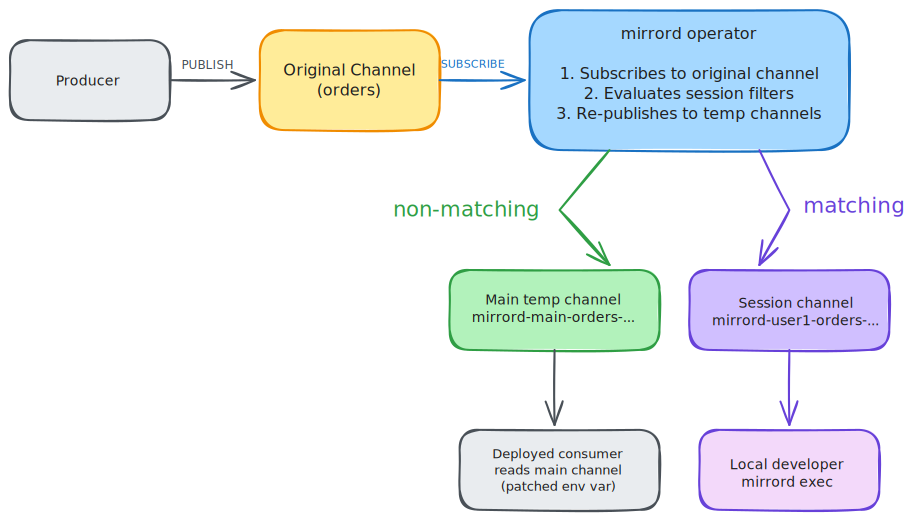

This page covers queue splitting for [Redis Pub/Sub](https://redis.io/docs/latest/develop/interact/pubsub/). For the general concepts and the message filter reference shared by all queue services, see the [Queue Splitting overview](../queue-splitting.md).

The word "queue" on this page refers to a Redis Pub/Sub channel.


Queue splitting for Redis Pub/Sub requires mirrord operator `3.170.0` or later and mirrord CLI `3.221.0` or later.


### How It Works

The mirrord operator subscribes to the same Redis channel(s) the deployed workload uses, then re-publishes each incoming message to temporary channels based on the users' filters.

When the first mirrord Redis Pub/Sub splitting session starts, the operator creates a temporary "main" channel for the deployed workload and patches the workload's channel environment variable to read from it. The operator then subscribes to the original channel (using the same `SUBSCRIBE`, `PSUBSCRIBE`, or `SSUBSCRIBE` command the application uses) and forwards messages: messages that match the user's filter are published to a temporary per-session channel that the local application reads, and everything else is published to the main channel.

If a second user starts a session on the same channel, the operator creates another per-session channel and adds the second user's filter to the routing logic. If the filters defined by two users both match some message, one of the users will receive the message at random.

Because Redis Pub/Sub channels are created implicitly when a message is published, the operator only manages temporary channel names - there are no extra Redis objects to clean up. When all sessions end, the operator restores the workload to read from the original channel.



### Enabling Redis Pub/Sub Splitting in Your Cluster




#### Enable Redis Pub/Sub splitting in the Helm chart

Enable the `operator.redisPubsubSplitting` setting in the [mirrord-operator Helm chart](https://github.com/metalbear-co/charts/blob/main/mirrord-operator/values.yaml).




#### Create a MirrordPropertyList

The operator needs to connect to your Redis instance to subscribe to and re-publish messages. Define the connection in a `MirrordPropertyList` ([`CustomResource`](https://kubernetes.io/docs/concepts/extend-kubernetes/api-extension/custom-resources/)) in the same namespace as the target workload (and the `MirrordSplitConfig`).

```yaml
apiVersion: mirrord.metalbear.co/v1
kind: MirrordPropertyList
metadata:
  name: redis-config
  namespace: events
spec:
  properties:
    - name: url
      value: redis://redis.redis-ns.svc.cluster.local:6379
```

Supported properties:

| Property | Description | Required | Default |
| -------- | :---------: | :------: | :-----: |
| `url` | Full Redis URL, e.g. `redis://host:6379/0`. Used as-is when present. | One of `url` or `host` | |
| `host` | Redis hostname, used when `url` is absent. | One of `url` or `host` | |
| `port` | Redis port, used with `host`. | No | `6379` |
| `password` | Password for authentication. | No | |
| `tls` | Set to `"true"` to connect over TLS (`rediss://`). | No | `false` |
| `db` | Database index. | No | `0` |




#### Create a MirrordSplitConfig

On operator installation with `operator.redisPubsubSplitting` enabled, a new [`CustomResource`](https://kubernetes.io/docs/concepts/extend-kubernetes/api-extension/custom-resources/) type is defined in your cluster - `MirrordSplitConfig`. Users with permissions to get CRDs can verify its existence with `kubectl get crd mirrordsplitconfigs.queues.mirrord.metalbear.co`.

Create a `MirrordSplitConfig` for the target workload. Redis Pub/Sub uses `kind: redisPubSub` in queue entries.

```yaml
apiVersion: queues.mirrord.metalbear.co/v1
kind: MirrordSplitConfig
metadata:
  name: redis-consumer-split
  namespace: events
spec:
  targetRef:
    apiVersion: apps/v1
    kind: Deployment
    name: redis-consumer
  clientConfigs:
    redisPubSub: redis-config
  queues:
    - id: notifications
      kind: redisPubSub
      appConfig:
        channel:
          - env: REDIS_CHANNEL
```

The `MirrordSplitConfig` above says that:
1. It targets the deployment `redis-consumer` in namespace `events`.
2. The Redis connection comes from the `redis-config` `MirrordPropertyList`.
3. The deployment consumes one Redis channel, whose name is in environment variable `REDIS_CHANNEL`.
4. The channel can be referenced in a mirrord config under ID `notifications`.

##### Link the config to the deployed consumer

The `MirrordSplitConfig` is a namespaced resource. The target workload reference is specified with `spec.targetRef`:
* `apiVersion` - API version of the Kubernetes workload (e.g. `apps/v1`).
* `kind` - type of the workload. Supported: `Deployment`, `StatefulSet`, `Rollout`.
* `name` - name of the workload.

##### Describe consumed channels

Each entry in the `spec.queues` list describes a Redis channel consumed by the workload:

* `id` - arbitrary queue ID that developers [reference](#setting-a-filter) from their mirrord config.
* `kind` - must be `redisPubSub`.
* `clientConfig` (optional) - name of a `MirrordPropertyList` with the Redis connection. Can also be set once for all Redis queues with `spec.clientConfigs.redisPubSub`.
* Exactly one of the following describes how the application subscribes. Each uses the same structure as other queue services (`env`, `envLike`, `fallback`, `valueSelector`, `valuePattern`, `containers`):
  * `appConfig.channel` - exact channel, matching a `SUBSCRIBE`.
  * `appConfig.channelPattern` - glob pattern, matching a `PSUBSCRIBE`.
  * `appConfig.shardChannel` - sharded channel, matching a `SSUBSCRIBE` (Redis 7+).


The mirrord operator can only read consumer's environment variables if they are either:
1. defined directly in the workload's pod template, with the value defined in `value` or in `valueFrom` via config map reference; or
2. loaded from config maps using `envFrom`.





### Drain timeout

After the last session against a target ends, the operator keeps the split's temporary resources alive for the drain timeout so a new session can reuse them, then tears them down. It does not wait for unread messages to be consumed first.

| Setting | Unit | Scope | Effect |
| ------- | ---- | ----- | ------ |
| `spec.drainTimeout` on the `MirrordSplitConfig` | seconds | One split | Wins over the cluster-wide default. |
| `operator.redisPubsubSplittingDrainTimeout` Helm value | milliseconds | Whole cluster | Default, used only when a config omits `drainTimeout`. |

| `drainTimeout` | Behavior |
| -------------- | -------- |
| unset (both) | Tear down as soon as the last session ends (same as `0`). |
| `0` | Tear down immediately. Unread messages may be lost. |
| `N` | Keep resources for up to `N` seconds, then tear down. |

### Setting a filter

For the full filter reference (`queue_type`, `message_filter`, `jq_filter`), see the [overview](../queue-splitting.md#setting-a-filter-for-a-mirrord-run). Redis Pub/Sub uses `queue_type: RedisPubSub`.

Redis Pub/Sub messages have no headers or attributes, so filters match against the **message payload**, which must be valid JSON. `message_filter` matches regexes against top-level JSON fields; `jq_filter` runs against the parsed JSON payload.

Filtering on a top-level JSON field:

```json
{
  "operator": true,
  "target": "deployment/redis-consumer/container/consumer",
  "feature": {
    "split_queues": {
      "notifications": {
        "queue_type": "RedisPubSub",
        "message_filter": {
          "tenant": "^test$"
        }
      }
    }
  }
}
```

In the example above, the local application will receive only messages whose JSON payload has a top-level `tenant` field equal to `test`.

Filtering on the payload with `jq_filter`:

```json
{
  "operator": true,
  "target": "deployment/redis-consumer/container/consumer",
  "feature": {
    "split_queues": {
      "notifications": {
        "queue_type": "RedisPubSub",
        "jq_filter": ".priority == \"high\""
      }
    }
  }
}
```

In the example above, the local application will receive only messages whose JSON payload contains `"priority": "high"`.


Non-JSON payloads never match attribute or jq filters, so they are routed to the deployed (cluster) application.

