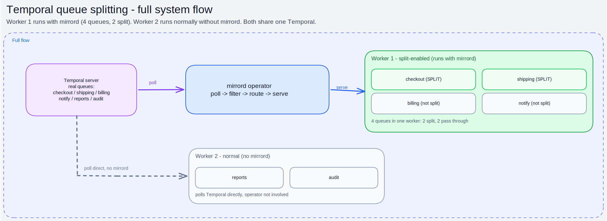
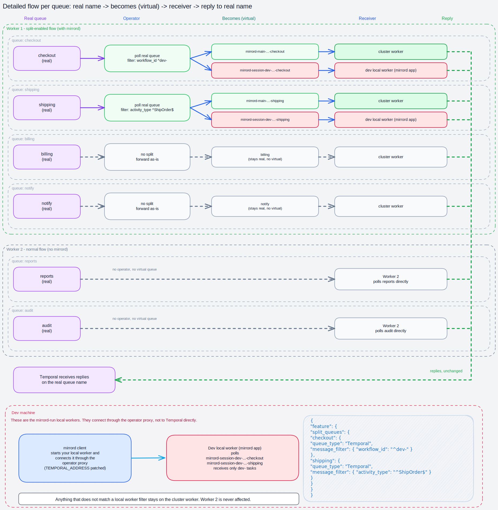

This page covers queue splitting for [Temporal](https://temporal.io). For the general concepts and the message filter reference shared by all queue services, see the [Queue Splitting overview](../queue-splitting.md).

The word "queue" on this page refers to a Temporal task queue.


Queue splitting for Temporal requires mirrord operator `3.170.0` or later and mirrord CLI `3.221.0` or later.


#### How It Works

Temporal has no native way to "split" a task queue, so the mirrord operator does it with a small gRPC proxy and a set of virtual task queues.



When a Temporal splitting session starts, the operator starts polling the real task queue itself, buffering the tasks it receives in memory. It then patches the deployed worker to poll a **main virtual task queue** instead of the real one, and to talk to an operator-hosted Temporal proxy instead of the real Temporal frontend. The proxy serves polls for the virtual queues from the buffered tasks, while forwarding everything else (task completions, heartbeats, and so on) to the real frontend unchanged.

Each user who starts a session gets their own **session virtual task queue**. The operator evaluates the user's filter against each task and routes matching tasks to that user's session queue; everything else goes to the main virtual queue that the deployed worker reads. If a session ends with tasks still buffered for it, those tasks overflow back to the main queue so they are not lost.

If two users' filters both match the same task, only one of them gets it: the task goes to whichever of those sessions started most recently.



#### Enabling Temporal Splitting in Your Cluster



**Enable Temporal splitting in the Helm chart**

Enable the `operator.temporalSplitting` setting in the [mirrord-operator Helm chart](https://github.com/metalbear-co/charts/blob/main/mirrord-operator/values.yaml).

When enabled, the operator runs a Temporal proxy that deployed workers connect to. Its port defaults to `7233` and can be changed with the `operator.temporalProxy.port` helm value.



**Create a MirrordPropertyList**

The operator needs to connect to your Temporal frontend to poll the real task queue. Define the connection in a `MirrordPropertyList` ([`CustomResource`](https://kubernetes.io/docs/concepts/extend-kubernetes/api-extension/custom-resources/)) in the same namespace as the target workload (and the `MirrordSplitConfig`).

```yaml
apiVersion: mirrord.metalbear.co/v1
kind: MirrordPropertyList
metadata:
  name: temporal-config
  namespace: workflows
spec:
  properties:
    - name: address
      value: temporal-frontend.temporal.svc.cluster.local:7233
    - name: namespace
      value: default
```

Supported properties:

| Property        |                                                       Description                                                       | Required | Default |
| --------------- | :---------------------------------------------------------------------------------------------------------------------: | :------: | :-----: |
| `address`       | Temporal frontend address (`host:port` or a full URL). A bare `host:port` gets its scheme from the `tls` setting.       |     ✓    |         |
| `namespace`     |                                          Temporal namespace the operator polls.                                         |     ✓    |         |
| `tls`           |          Set to `"true"` to connect over TLS. Implied when any of the `tls*` properties below are set.                  |    No    | `false` |
| `apiKey`        |                                                 Temporal Cloud API key.                                                 |    No    |         |
| `tlsCaCert`     |      PEM CA bundle used to verify the frontend's certificate when it is not signed by a publicly trusted root.          |    No    |         |
| `tlsClientCert` |             PEM client certificate presented to a frontend that requires mutual TLS. Requires `tlsClientKey`.           |    No    |         |
| `tlsClientKey`  |                     PEM private key for `tlsClientCert`. Requires `tlsClientCert`.                                      |    No    |         |
| `tlsServerName` |  Overrides the domain name the frontend's certificate is verified against, when the dial address does not match it.     |    No    |         |

**TLS and mutual TLS**

A frontend behind regular TLS only needs `tls: "true"`. For example, Temporal Cloud with an API key — its certificate is signed by a publicly trusted CA, so nothing else is required:

```yaml
spec:
  properties:
    - name: address
      value: my-namespace.a1b2c.tmprl.cloud:7233
    - name: namespace
      value: my-namespace.a1b2c
    - name: tls
      value: "true"
    - name: apiKey
      valueFrom:
        secretKeyRef:
          name: temporal-cloud-api-key
          key: apiKey
```

If the frontend's certificate is signed by a private CA instead (common for self-hosted clusters), also set `tlsCaCert` to a PEM CA bundle that can verify it.

If the frontend requires **mutual TLS** (the client must present a certificate, as with Temporal Cloud's mTLS authentication or an mTLS-protected self-hosted cluster), the operator needs its own certificate: set `tlsClientCert` to the client certificate and `tlsClientKey` to that certificate's private key — the two always go together. Keep certificate material in a Kubernetes `Secret` and reference it with `secretKeyRef` rather than inlining it:

```yaml
spec:
  properties:
    - name: address
      value: temporal-frontend.mycompany.internal:7233
    - name: namespace
      value: production
    - name: tlsCaCert
      valueFrom:
        secretKeyRef:
          name: temporal-client-tls
          key: ca.crt
    - name: tlsClientCert
      valueFrom:
        secretKeyRef:
          name: temporal-client-tls
          key: tls.crt
    - name: tlsClientKey
      valueFrom:
        secretKeyRef:
          name: temporal-client-tls
          key: tls.key
```

Setting any `tls*` property implies `tls: "true"`, and setting only one of `tlsClientCert`/`tlsClientKey` fails with an error when the split starts. The operator reads the connection settings when a split starts, so rotated certificates are picked up by the next split, not by ones already running.


TLS applies to the connection between the **operator** and the Temporal frontend. Deployed workers patched into a split connect to the operator's in-cluster Temporal proxy over plaintext gRPC.




**Create a MirrordSplitConfig**

On operator installation with `operator.temporalSplitting` enabled, a new [`CustomResource`](https://kubernetes.io/docs/concepts/extend-kubernetes/api-extension/custom-resources/) type is defined in your cluster - `MirrordSplitConfig`. Users with permissions to get CRDs can verify its existence with `kubectl get crd mirrordsplitconfigs.queues.mirrord.metalbear.co`.

Create a `MirrordSplitConfig` for the target worker. Temporal uses `kind: temporal` in queue entries.

```yaml
apiVersion: queues.mirrord.metalbear.co/v1
kind: MirrordSplitConfig
metadata:
  name: temporal-worker-split
  namespace: workflows
spec:
  targetRef:
    apiVersion: apps/v1
    kind: Deployment
    name: temporal-worker
  clientConfigs:
    temporal: temporal-config
  queues:
    - id: orders-task-queue
      kind: temporal
      appConfig:
        taskQueue:
          - env: TEMPORAL_TASK_QUEUE
        temporalAddress:
          - env: TEMPORAL_ADDRESS
        temporalNamespace:
          - env: TEMPORAL_NAMESPACE
```

The `MirrordSplitConfig` above says that:

1. It targets the deployment `temporal-worker` in namespace `workflows`.
2. The Temporal connection comes from the `temporal-config` `MirrordPropertyList`.
3. The worker reads its task queue name from environment variable `TEMPORAL_TASK_QUEUE`.
4. The operator patches `TEMPORAL_ADDRESS` so the worker connects to the operator's Temporal proxy, and reads the Temporal namespace from `TEMPORAL_NAMESPACE`.
5. The task queue can be referenced in a mirrord config under ID `orders-task-queue`.

**Link the config to the deployed worker**

The `MirrordSplitConfig` is a namespaced resource. The target workload reference is specified with `spec.targetRef`:

* `apiVersion` - API version of the Kubernetes workload (e.g. `apps/v1`).
* `kind` - type of the workload. Supported: `Deployment`, `StatefulSet`, `Rollout`.
* `name` - name of the workload.

**Describe consumed task queues**

Each entry in the `spec.queues` list describes a Temporal task queue consumed by the worker. Each `appConfig` field uses the same structure as other queue services (`env`, `envLike`, `fallback`, `valueSelector`, `valuePattern`, `containers`):

* `id` - arbitrary queue ID that developers [reference](temporal.md#setting-a-filter) from their mirrord config.
* `kind` - must be `temporal`.
* `clientConfig` (optional) - name of a `MirrordPropertyList` with the Temporal connection. Can also be set once for all Temporal queues with `spec.clientConfigs.temporal`.
* `appConfig.taskQueue` (required) - how the worker discovers the task queue name. The operator patches this to a virtual task queue name.
* `appConfig.temporalAddress` (optional) - the environment variable holding the Temporal frontend address. The operator patches it so the worker connects to the operator's proxy instead of the real frontend.
* `appConfig.temporalNamespace` (optional) - the environment variable holding the Temporal namespace.
* `queueConfig` (optional) - name of a `MirrordPropertyList` with per-queue settings (see below).

**Per-queue options**

Temporal-specific options live in a `MirrordPropertyList` referenced by the queue's `queueConfig`:

* `max_buffered_tasks` - the maximum number of tasks the operator buffers per virtual task queue. When the limit is reached, a session queue overflows to the main queue. Set to a positive integer to cap buffering; omit it (or set `0`) for unlimited buffering.

```yaml
apiVersion: mirrord.metalbear.co/v1
kind: MirrordPropertyList
metadata:
  name: temporal-queue-settings
  namespace: workflows
spec:
  properties:
    - name: max_buffered_tasks
      value: "1000"
```


The mirrord operator can only read consumer's environment variables if they are either:

1. defined directly in the workload's pod template, with the value defined in `value` or in `valueFrom` via config map reference; or
2. loaded from config maps using `envFrom`.




#### Drain timeout

After the last session against a target ends, the operator keeps the split's temporary resources alive for the drain timeout so a new session can reuse them, then tears them down. It does not wait for in-flight work to finish first.

| Setting                                         | Unit    | Scope     | Effect                              |
| ----------------------------------------------- | ------- | --------- | ----------------------------------- |
| `spec.drainTimeout` on the `MirrordSplitConfig` | seconds | One split | Wins over the cluster-wide default. |

| `drainTimeout` | Behavior                                                  |
| -------------- | --------------------------------------------------------- |
| unset (both)   | Tear down as soon as the last session ends (same as `0`). |
| `0`            | Tear down immediately. In-flight work may be lost.        |
| `N`            | Keep resources for up to `N` seconds, then tear down.     |

#### Setting a filter

For the full filter reference (`queue_type`, `message_filter`, `jq_filter`), see the [overview](../queue-splitting.md#setting-a-filter-for-a-mirrord-run). Temporal uses `queue_type: Temporal`.

`message_filter` matches regexes against task metadata. The supported keys are:

* `workflow_id` - the workflow ID.
* `workflow_type` - the workflow type name.
* `activity_type` - the activity type name.
* `header.<name>` - a Temporal header value (e.g. `header.x-user`).
* any other key - matched against a [search attribute](https://docs.temporal.io/visibility#search-attribute) of that name.

Filtering on the workflow ID:

```json
{
  "operator": true,
  "target": "deployment/temporal-worker",
  "feature": {
    "split_queues": {
      "orders-task-queue": {
        "queue_type": "Temporal",
        "message_filter": {
          "workflow_id": "^test-local-"
        }
      }
    }
  }
}
```

In the example above, the local worker will receive only tasks whose workflow ID starts with `test-local-`.

Filtering on a Temporal header:

```json
{
  "operator": true,
  "target": "deployment/temporal-worker",
  "feature": {
    "split_queues": {
      "orders-task-queue": {
        "queue_type": "Temporal",
        "message_filter": {
          "header.x-user": "^alice$"
        }
      }
    }
  }
}
```

**Filtering with jq**

`jq_filter` runs against a JSON document the operator builds for each task. Every document has a `task_type` field, set to either `"activity"` or `"workflow"`.

* **Activity tasks** include: `workflow_namespace`, `workflow_id`, `run_id`, `workflow_type`, `activity_type`, `activity_id`, `attempt`, `header`, and `input` (an array of decoded payloads).
* **Workflow tasks** include: `workflow_id`, `run_id`, `workflow_type`, `attempt`, `task_queue`, `cron_schedule`, `identity`, `first_execution_run_id`, `header`, `search_attributes`, `memo`, and `input`.

```json
{
  "operator": true,
  "target": "deployment/temporal-worker",
  "feature": {
    "split_queues": {
      "orders-task-queue": {
        "queue_type": "Temporal",
        "jq_filter": "(.input[0] | startswith(\"test-jq-\"))"
      }
    }
  }
}
```

In the example above, the local worker will receive only tasks whose first input argument starts with `test-jq-`.
