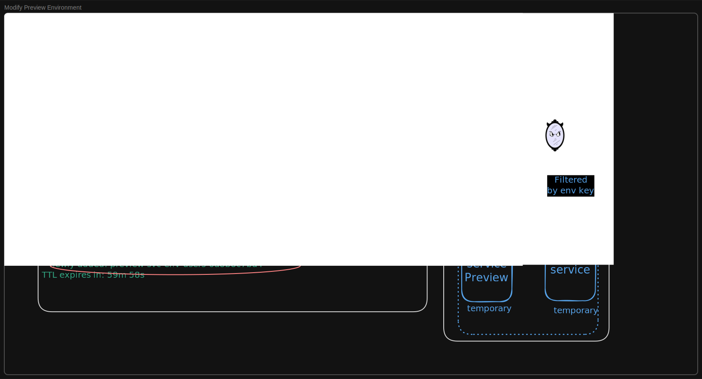

# Preview Environments

Preview Environments let teams collaborate, validate, and review new code using real traffic, without affecting live services.

A Preview Environment runs **only the new or changed services** in isolated pods inside your Kubernetes cluster. All other dependencies (for example, databases, queues, and upstream services) continue to run in the main cluster, such as staging, and are accessed via mirrord.

Because Preview Environments are not tied to a developer's local process, they are well suited for:

* Product managers exploring new features before they're merged
* QA engineers testing changes against realistic traffic and dependencies
* Engineers collaborating on a feature in progress or requesting async feedback

This enables realistic validation workflows without cloning an entire environment and without blocking on a single mirrord session. This model becomes even more valuable as [AI coding agents](../using-mirrord-with-ai/) begin shipping features and fixes autonomously. Instead of reviewing Git diffs alone, teams can let an AI agent deploy its changes into a preview environment automatically. The result is the service modified by the agent running in the cluster in isolation, while still connecting to its real dependencies inside the cluster. This allows teams to observe the code running, test end-to-end workflows, and validate behavior before anything is merged.


This feature is available to users on the Enterprise pricing plan.


#### Prerequisites

* **Operator 3.142.0 or later** — the feature was introduced in this version.
* **CLI 3.189.0 or later** — the `mirrord preview` subcommand was introduced in this version.
*   **Helm flag** — `operator.previewEnv` must be set to `true` in your Helm values (defaults to `false`):

    ```yaml
    operator:
      # Has to be set to `true` in order to use the preview environments feature.
      previewEnv: true
    ```

### What Is a Preview Environment?

Today, mirrord sessions are tightly coupled to a developer's local process. When that process stops, the testing environment disappears. Preview Environments solve this by allowing you to spin up isolated, temporary pods in the cluster that:

* Run **user-provided container images**
* Match the **configuration and traffic behavior** of an existing mirrord target
* Receive **filtered or duplicated staging traffic** using an environment key
* Stay alive for a **fixed TTL**, independent of any local machine or process

***

#### Environment Key

Each Preview Environment is identified by an **environment key**. The key is used to:

* Scope HTTP and queue traffic filtering
* Scope database branches
* Associate multiple preview pods into a single environment
* Share access to the same environment with other developers

If no key is provided, mirrord generates one automatically

***

### Starting a Preview Environment

Create a new Preview Environment using a mirrord configuration file and a container image:

```bash
mirrord preview start -f <mirrord.json> -i <image> -k <key>
```

Example output:

```
  ✓ mirrord preview start
    ✓ configuration loaded
    ✓ connected to operator
    ✓ preview session resource created
    ✓ preview pod is ready
  info:
    * key: <key>
    * namespace: <namespace>
    * session: preview-session-<target>-<id>
    * preview URL: https://<slug>.<shareDomain>
```

* If `-k` is omitted, mirrord generates a new key and prints it in the output.
* The image must be pullable from inside the cluster. The preview pod is a copy of the target's pod spec with the image swapped, so it pulls with the same credentials as the target — use a registry and repository the target already pulls from, otherwise the preview fails with `ErrImagePull`.
* The `preview URL` line only appears when [sharing via a link](#sharing-a-preview-via-a-link) is configured.

***

#### Managing Preview Environments

1. **Status:** Check the current state of Preview Environments, including which environments are active, which preview pods they contain, and how long they will remain available.

```bash
mirrord preview status
```

2. **Stop:** Manually remove a Preview Environment and its associated preview pods when it is no longer needed.

```bash
mirrord preview stop --key <environment-key>
```

3. **Replace:** Re-run `mirrord preview start` with the same key and target using `--force` (for example, after changing the image):

```bash
mirrord preview start -f <mirrord.json> -i <image> -k <key> --force
```

#### GitHub Action

We also provide the [`metalbear-co/mirrord-preview` GitHub Action](https://github.com/metalbear-co/mirrord-preview) for managing preview environments from your GitHub Actions pipeline. This can be used to, for example, automatically start a preview environment when a PR is opened and stop it when the PR is closed.

```yaml
name: Preview Environment
on:
  pull_request:
    types: [opened, synchronize, reopened, closed]

jobs:
  preview-start:
    if: github.event.action != 'closed'
    runs-on: ubuntu-latest
    steps:
      - uses: actions/checkout@v4
      # ... configure kubeconfig for your cluster ...
      - uses: metalbear-co/mirrord-preview@main
        with:
          action: start
          target: deployment/my-app
          namespace: staging
          image: myrepo/myapp:${{ github.sha }}
          filter: 'baggage: mirrord-session={{ key }}'
          key: pr-${{ github.event.repository.name }}-${{ github.event.pull_request.number }}

  preview-stop:
    if: github.event.action == 'closed'
    runs-on: ubuntu-latest
    steps:
      # ... configure kubeconfig for your cluster ...
      - uses: metalbear-co/mirrord-preview@main
        with:
          action: stop
          key: pr-${{ github.event.repository.name }}-${{ github.event.pull_request.number }}
```

Each PR gets an isolated preview keyed by its number. The `{{ key }}` template in the filter is replaced by mirrord with the session key at runtime, routing only matching traffic to the preview pod. When the PR is closed, the session is stopped and the preview pod is cleaned up. For the full list of inputs and configuration options, see the [action documentation](https://github.com/metalbear-co/mirrord-preview).

### Sharing a Preview via a Link

By default, opening a Preview Environment as a recipient requires the mirrord browser extension, which injects the `baggage: mirrord-session=<key>` header the operator routes on. That works for developers, but it's a non-starter for sharing a preview with a non-technical stakeholder.

`mirrord-share-ingress` moves that header injection off the client and onto a server-side component, so a plain HTTPS link works on its own with nothing to install on the recipient's side. Each shareable preview is reachable at its own host, `<slug>.<shareDomain>`, printed by `mirrord preview start` as the `preview URL`.

The `slug` mirrors the preview's key with a random suffix (for example `pr-myrepo-a1b2c3`), so the link is recognizable but unguessable. When the session's TTL expires the host stops resolving, and the link falls through to a "preview not found" page that redirects to your app domain.


Only previews using the default key-derived traffic filter get a share host. A preview that sets a custom HTTP filter is not served and no share host is minted for it.


#### How it works

`mirrord-share-ingress` runs as its own Deployment and Service. It watches Preview Environments and, on each request, matches the request host to a live preview, injects `baggage: mirrord-session=<key>`, and forwards to that preview's target Service in-cluster. The operator's filtered steal at the target then routes the request to the preview pod, exactly as the browser extension's header would.

TLS and the public-facing ingress are owned by your platform team. You put an Ingress (or equivalent gateway) in front of the share-ingress Service that terminates TLS with a wildcard `*.<shareDomain>` certificate, preserves the `Host` header, and routes to the Service. Access control to the link is your responsibility as part of configuring that ingress.

#### Setup

1.  Configure the operator with the domain share hosts are minted under. This must match the `shareDomain` you give the share-ingress chart:

    ```yaml
    operator:
      previewEnv: true
      shareIngress:
        # Minted hosts look like <slug>.<shareDomain>. Enter without "*.".
        shareDomain: preview.example.com
    ```

2.  Install the `mirrord-share-ingress` chart. Install it **before** the first preview, since your ingress, DNS, and certificate point at its Service:

    ```bash
    helm install mirrord-share-ingress metalbear/mirrord-operator-share-ingress \
      --set shareIngress.shareDomain=preview.example.com \
      --set shareIngress.appDomain=example.com
    ```

    `appDomain` is where visitors land when a share link no longer resolves.

3.  Point a wildcard DNS record `*.preview.example.com` at your ingress, and create an Ingress with a wildcard certificate that routes to the share-ingress Service. A reference manifest (NGINX Ingress preserves the `Host` header by default):

    ```yaml
    apiVersion: networking.k8s.io/v1
    kind: Ingress
    metadata:
      name: mirrord-share-ingress
      namespace: mirrord
    spec:
      ingressClassName: nginx
      tls:
        - hosts:
            - "*.preview.example.com"
          secretName: share-ingress-tls
      rules:
        - host: "*.preview.example.com"
          http:
            paths:
              - path: /
                pathType: Prefix
                backend:
                  service:
                    name: mirrord-share-ingress
                    port:
                      number: 80
    ```

4.  Create the wildcard TLS secret the Ingress references, unless cert-manager (or your platform) already issues it:

    ```bash
    kubectl create secret tls share-ingress-tls \
      --cert=wildcard.crt --key=wildcard.key -n mirrord
    ```

### Auto Scaling Idle Mode

Preview Environments can scale down to **zero pods while they receive no traffic**, then scale back up automatically when matching traffic arrives - without dropping that traffic. This makes long-lived
previews (for example, one per open PR) essentially free until someone actually uses them.

Enable it in the mirrord configuration:

```json
{
  "feature": {
    "preview": {
      "idle": {
        "start_idle": true,
        "sleep_after_secs": 300,
        "wake_timeout_secs": 90
      }
    }
  }
}
```

* `start_idle` - create the Preview Environment with zero pods. The first matching request or
  queue message starts the preview pods. `mirrord preview start` returns success as soon as the environment
  is ready to receive traffic, without waiting for a pod to run.
* `sleep_after_secs` - scale the preview pods to zero after this many seconds without traffic
  (minimum 30). When unset, the environment never idles automatically.
* `wake_timeout_secs` - how long an incoming request is held while the pods boot, before it is
  failed instead (default 90).

#### How waking works

An idle Preview Environment keeps listening: the traffic interception on the target and any
queue splits stay active while the preview pods are gone. When a request carrying the
environment's filter arrives, it is **held** while the pods boot and answered by the preview
once ready - the caller just sees a slower first response. Queue messages don't need holding at
all: they wait in the environment's split queue/topic until the preview consumes them, so
nothing is lost either way.

While idle, `mirrord preview status` shows the environment as `idle (waiting for traffic)`,
and the session's TTL keeps counting. Idle mode requires a wake source - incoming traffic
enabled or queues split - since otherwise nothing could ever wake the environment.

Cluster administrators can cap how much traffic a waking environment may hold with the
`operator.preview.idleHoldBufferMessages` and `operator.preview.idleHoldBufferBytes` Helm
chart values (defaults: 512 protocol messages, 8 MiB of payload).

***

### Preview Environment Workflow




***

### Details

#### Readiness

Pods created by Preview Environments will never be in the "Ready" state, this is intentional. mirrord inserts a [`readinessGate`](https://kubernetes.io/docs/concepts/workloads/pods/pod-lifecycle/#pod-readiness-gate) in the created pod that will never evaluate to `"True"` to prevent the target's `Service` from routing traffic to it, since that requires the pod to be ready. This allows the preview pod to copy all the labels/annotations present in the target's pod spec without worrying about the `Service`'s selector(s).

#### Resources

Preview Environments consist of a Deployment, to manage and maintain the underlying pods, and a [Headless Service](https://kubernetes.io/docs/concepts/services-networking/service/#headless-services), to route traffic to the dynamic set of pods. Because the Service doesn't have a Cluster IP, exhaustion of IP addresses when deploying a large number of Preview Environments is not a concern.

#### Interaction with `mirrord exec`

If you start a local `mirrord exec` session against the same target and with the same Environment Key as an active Preview Environment, the local session takes precedence.

In that case, mirrord temporarily pauses the conflicting Preview Environment so the local session can receive the matching traffic. When the local session ends, the Preview Environment is resumed automatically.
