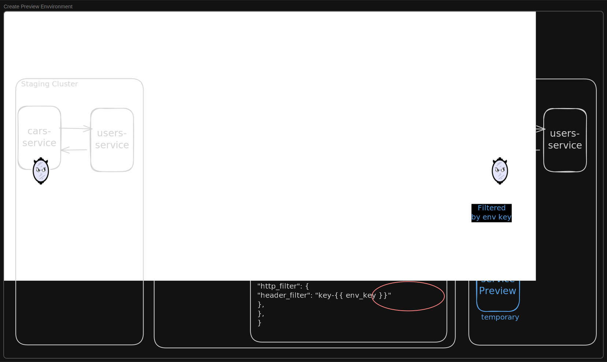


Preview Environments are now available!


Preview Environments let teams collaborate, validate, and review new code using real traffic, without affecting live services.

A Preview Environment runs **only the new or changed services** in isolated pods inside your Kubernetes cluster. All other dependencies (for example, databases, queues, and upstream services) continue to run in the main cluster, such as staging, and are accessed via mirrord.

Because Preview Environments are not tied to a developer's local process, they are well suited for:

- Product managers exploring new features before they're merged
- QA engineers testing changes against realistic traffic and dependencies
- Engineers collaborating on a feature in progress or requesting async feedback

This enables realistic validation workflows without cloning an entire environment and without blocking on a single mirrord session. This model becomes even more valuable as [AI coding agents](../using-mirrord-with-ai/README.md) begin shipping features and fixes autonomously. Instead of reviewing Git diffs alone, teams can let an AI agent deploy its changes into a preview environment automatically. The result is the service modified by the agent running in the cluster in isolation, while still connecting to its real dependencies inside the cluster. This allows teams to observe the code running, test end-to-end workflows, and validate behavior before anything is merged.


Preview Environments are available to users on the **Enterprise** pricing plan.


# What Is a Preview Environment?

Today, mirrord sessions are tightly coupled to a developer's local process. When that process stops, the testing environment disappears.
Preview Environments solve this by allowing you to spin up isolated, temporary pods in the cluster that:

- Run **user-provided container images**
- Match the **configuration and traffic behavior** of an existing mirrord target
- Receive **filtered or duplicated staging traffic** using an environment key
- Stay alive for a **fixed TTL**, independent of any local machine or process

---

## Environment Key

Each Preview Environment is identified by an **environment key**. The key is used to:

- Scope HTTP and queue traffic filtering
- Scope database branches
- Associate multiple preview pods into a single environment
- Share access to the same environment with other developers

If no key is provided, mirrord generates one automatically

---

## Starting a Preview Environment

Create a new Preview Environment using a mirrord configuration file and a container image:
```bash
mirrord preview start -f <mirrord.json> -i <image> -k <key>
```
Example output:
```
  ✓ mirrord preview start
    ✓ configuration loaded
    ✓ connected to operator
    ✓ preview session resource created
    ✓ preview pod is ready
  info:
    * key: <key>
    * namespace: <namespace>
    * pod: preview-session-<target>-<id>
```

- If `-k` is omitted, mirrord generates a new key and prints it in the output.

### Targetless Mode

If no target is defined in the mirrord configuration, Preview Environments run in **targetless mode**.

In this mode, mirrord creates a fresh, isolated pod that still participates in traffic filtering via the environment key, without mirroring an existing workload.

---

### Managing Preview Environments

1. **Status:** Check the current state of Preview Environments, including which environments are active, which preview pods they contain, and how long they will remain available.
```bash
mirrord preview status
```
2. **Stop:** Manually remove a Preview Environment and its associated preview pods when it is no longer needed.
```bash
mirrord preview stop --key <environment-key>
```

### GitHub Action
We also provide the [`metalbear-co/mirrord-preview` GitHub Action](https://github.com/metalbear-co/mirrord-preview) for managing preview environments from your GitHub Actions pipeline.
This can be used to, for example, automatically start a preview environment when a PR is opened and stop it when the PR is closed.

```yaml
name: Preview Environment
on:
  pull_request:
    types: [opened, synchronize, reopened, closed]

jobs:
  preview-start:
    if: github.event.action != 'closed'
    runs-on: ubuntu-latest
    steps:
      - uses: actions/checkout@v4
      # ... configure kubeconfig for your cluster ...
      - uses: metalbear-co/mirrord-preview@main
        with:
          action: start
          target: deployment/my-app
          namespace: staging
          image: myrepo/myapp:${{ github.sha }}
          filter: 'baggage: mirrord-session={{ key }}'
          key: pr-${{ github.event.pull_request.number }}

  preview-stop:
    if: github.event.action == 'closed'
    runs-on: ubuntu-latest
    steps:
      # ... configure kubeconfig for your cluster ...
      - uses: metalbear-co/mirrord-preview@main
        with:
          action: stop
          key: pr-${{ github.event.pull_request.number }}
```

Each PR gets an isolated preview keyed by its number. The `{{ key }}` template in the filter is replaced by mirrord with the session key at runtime, routing only matching traffic to the preview pod. When the PR is closed, the session is stopped and the preview pod is cleaned up.
For the full list of inputs and configuration options, see the [action documentation](https://github.com/metalbear-co/mirrord-preview).

## Preview Environment Workflow




