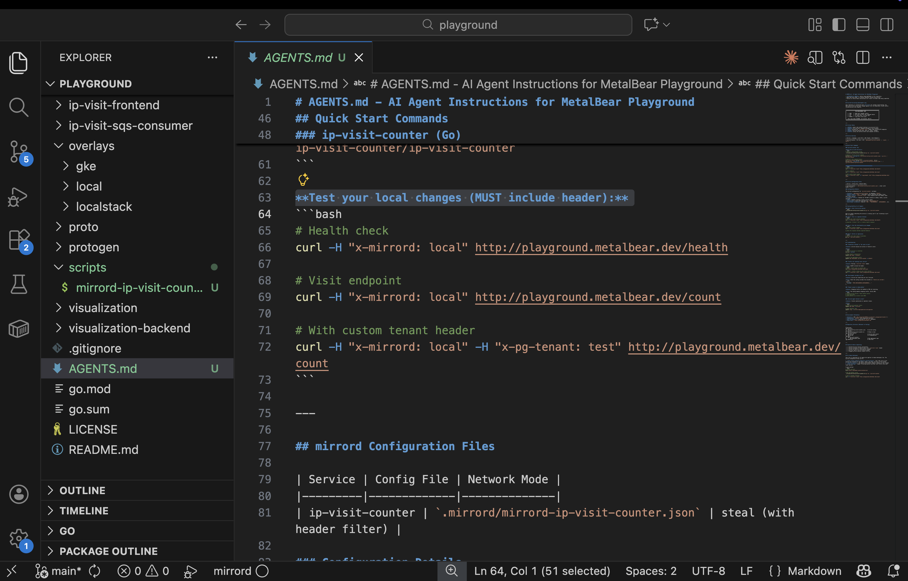
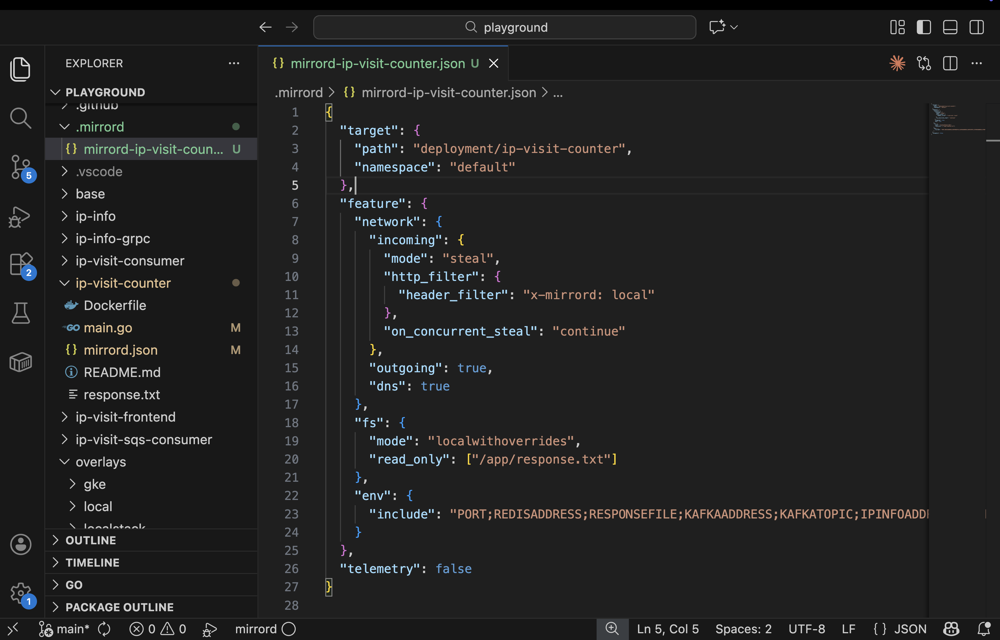
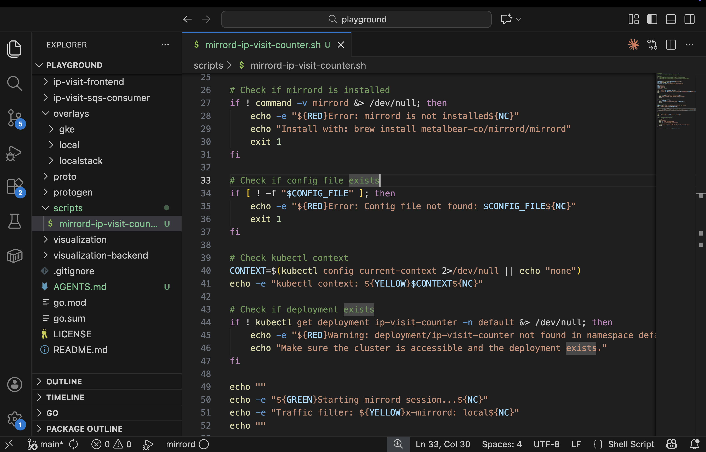

The goal is to help you create an `AGENTS.md` file that lives in your repository and tells AI agents something like: “*Hey, when testing code changes, use mirrord first, not CI/CD.*” Now the challenge is that writing this file manually is tedious. You need to figure out mirrord configs for each service, create helper scripts, write clear instructions and validate that everything works.


`AGENTS.md` file example: [https://agents.md/](https://agents.md/)


- [Environment Setup](using-mirrord-with-ai/the-meta-prompt#environment-Setup)
- [The Meta-Prompt](using-mirrord-with-ai/the-meta-prompt#the-meta-prompt)
- [Exploring the Generated Files](using-mirrord-with-ai/the-meta-prompt#exploring-the-generated-files)
- [Testing the Setup](using-mirrord-with-ai/the-meta-prompt#testing-the-setup)
- [Try It Yourself](using-mirrord-with-ai/the-meta-prompt#try-it-yourself)
- [Team Benefits](using-mirrord-with-ai/the-meta-prompt#team-benefits)
- [Wrapping Up](using-mirrord-with-ai/the-meta-prompt#wrapping-up)

# Environment Setup

For this demo, we’ll use the [the MetalBear playground repository](https://github.com/metalbear-co/playground). - It's a simple IP visit counter application written in Go, with a Redis dependency, which makes it ideal for demonstrating how this works.

The architecture looks like this:


### Here’s what you’ll need to get started:

- Access to a Kubernetes cluster, such as a staging environment
- kubectl configured and ready
- mirrord installed locally
- For this guide, we use Claude Code v2.0.76 as the AI assistant. In the Try it yourself section, we’ll cover other assistants that can be used with the same workflow.

You can follow along using any cluster you already have access to, whether it’s staging or development. The important part is that you’re testing against a real environment.

# The Meta-Prompt

Here’s where it gets interesting. Instead of manually creating all the configuration files, we gave an AI agent a comprehensive prompt that told it exactly what to generate.

We navigated to the repository root, opened Claude Code, and pasted in the following prompt:

```
Generate AGENTS.md with mirrord integration for this repository.

Discovery Phase:
1. Scan repository structure to identify services (main.go, app.py, server.js, etc.)
2. Detect programming languages and frameworks
3. Look for Kubernetes manifests or conventions to understand deployment structure
4. Identify potential Kubernetes targets for each service (do NOT assume correctness)
5. Present discovered services and suspected targets in a table, including:
   - Any existing mirrord configuration files (show path and target)
   - Confidence level for each suspected target

STOP — Ask ONE question at a time. WAIT for my answer before continuing.

Question 1:
"Which services should be configured for AI-driven testing?"
Show the discovered services and WAIT FOR MY ANSWER.
If a service has existing config, note: "(has config - will ask to keep/replace)"

For each selected service, ask the following questions ONE AT A TIME.
WAIT for my answer before proceeding to the next question.

Question 2:
"For service <name>: What Kubernetes target should be used?"

Based on discovery, here are possible targets for this service:
- <candidate target 1> (target type, namespace, confidence)
- <candidate target 2> (target type, namespace, confidence)

Please select one of the above OR provide a different target.

Provide:
- Target type: deployment or pod
- Target name
- Namespace

DO NOT assume a default.
WAIT FOR MY ANSWER.

Question 3:
"For service <name>: How should testing success be verified when running with mirrord?"

Choose one:
- HTTP behavior (I will provide details such as domains/paths..)
- Logs (I will provide success message)
- Side effects (I will describe what to check)
- No automated verification

WAIT FOR MY ANSWER.

Question 4 (if needed, based on verification method):
Ask for verification coordinates only if required.
- Domains, paths, and headers may be supplied by me
- OR explicitly marked as environment variables
- Do NOT guess or hard-code remote URLs
WAIT FOR MY ANSWER.

Question 5:
"For service <name>: Which mirrord network mode should be used?"
- steal (intercept traffic)
- mirror (observe traffic)
WAIT FOR MY ANSWER.

Question 6:
"For service <name>: Any special requirements?"
- Filesystem access
- Environment variables
- Traffic filtering
WAIT FOR MY ANSWER.

IMPORTANT:
- Ask ONE question at a time
- WAIT for my answer before continuing
- DO NOT assume defaults
- DO NOT generate files yet

Generation Phase (ONLY after all required answers are provided):
For each configured service, generate:

1. `.mirrord/mirrord-<service>.json`
   - Use the confirmed target type, target name, and namespace
   - Configure the selected network mode
   - Apply traffic filtering ONLY if I explicitly provided it
   - Use only fields supported by the installed mirrord version
   - Avoid embedding secrets or sensitive values
   
2. `scripts/mirrord-<service>.sh` helper script
   - Perform pre-flight checks (mirrord installed, kubectl access, target exists)
   - Execute mirrord safely
   - Do NOT echo sensitive values to output
   - Include a --stop flag to kill running mirrord session

3. `AGENTS.md`
   - Start with a prominent ATTENTION block
   - Use strong imperative language (MUST / NEVER / ALWAYS)
   - Define mirrord as the required testing runtime
   - Describe verification behavior, not guessed URLs or credentials
   - Reference helper scripts instead of inline commands where possible
   - Include a service overview table
   - Add a troubleshooting section

Validation:
- Verify mirrord is installed (`mirrord --version`)
- Check kubectl access (`kubectl config current-context`)
- Validate each configured target exists in the specified namespace
- Ensure helper scripts are executable

Report Back:
- Services discovered
- Services selected for configuration
- Confirmed target and namespace per service
- Verification method per service
- Files created (paths only)
- Any remaining manual inputs or values requiring review
```

**When we ran the prompt, Claude:**
1. Discovered the services by scanning for entry points like `main.go` and `app.py`
2. Matched them to Kubernetes deployments using `kubectl get deployments`
3. Generated mirrord configurations, helper scripts, and `AGENTS.md`
4. Validated that everything worked before presenting the results
Let's see it in action: 
**add first video**


### What Claude Generated

You saw Claude scan the repository and identify all the services. From there, we selected the ip-visit-counter service to configure.
Claude generated three files:
1. `AGENTS.md`
Instructions that tell AI agents how to use mirrord when testing the service.
2. `mirrord/mirrord-ip-visit-counter.json`
The mirrord configuration, including which Kubernetes deployment to connect to and how traffic should be handled.
3. `scripts/mirrord-ip-visit-counter.sh`
A helper script that wraps the mirrord command with pre-flight checks, such as verifying that mirrord is installed, kubectl is working, and the deployment exists.
This is the command Claude runs when you say “test the service.” `AGENTS.md` references this script directly, so the agent knows to use it automatically.

# Exploring the Generated Files

Let’s take a closer look at what the meta-prompt actually generated.
### 1. The `AGENTS.md`

The AI instructions start with a prominent attention block:


Notice the wording: “NEVER”, “ALWAYS”, “MUST”. This is intentional. AI agents respond far more reliably to imperative instructions than to phrasing like “you might want to consider”.

The file also includes exact testing commands with a required header:



This detail is critical. When you later tell Claude to test the service, it automatically includes this header because `AGENTS.md` explicitly requires it.

### 2. The `mirrord-ip-visit-counter.json` config

This JSON file tells mirrord how to connect to the cluster:



The configuration targets the `ip-visit-counter` deployment in the default namespace, filters traffic using the `x-mirrord: local` header, and enables outgoing network access so your local code can reach services running in the cluster.

### 3. The helper script

The helper script wraps the mirrord command and handles all the pre-flight checks:
- Verifies that mirrord is installed
- Confirms kubectl can reach the cluster
- Checks that the deployment exists
- Prints the active traffic filter
- Runs the full mirrord command



This is the script Claude runs when you say “test the service”. Because AGENTS.md references it explicitly, the agent knows to use it automatically.

Now let’s see if it actually works. **to add 1st video link**


# Testing the Setup

Next, we asked Claude to test the service. The key detail is that we explicitly told it to read `AGENTS.md` first.
```
Read AGENTS.md and test the ip-visit-counter service. Send 3 requests.
```
Watch running in action **add 2nd video link**

**Here’s what happened:**
1. Claude read `AGENTS.md` and understood it should use mirrord
2. It ran the helper script automatically
3. It sent three test requests to `playground.metalbear.dev`, the cluster URL
4. mirrord routed those requests to the local service
5. The counter incremented as expected: 1 → 2 → 3

Now for the interesting part. We made a code change and had Claude test it immediately.

```
Read AGENTS.md. Change the ip-visit-counter response to include a "message": "Welcome!" field and a "date" field with the current date. Then test the changes by sending 2 requests to the /count endpoint and show me the responses.
```

Watch modifiying in action **add 3rd video**

**This is what happened next:**
1. Claude modified the code to add the message and date fields
2. It restarted the service with mirrord, reconnecting to the cluster
3. It sent two requests to the cluster URL, which mirrord routed to the local service
4. It showed the updated responses with the new fields

Without mirrord, this would follow the usual development loop: build a Docker image, push it to a registry, wait for Kubernetes to roll out the deployment, and only then test the change. If something breaks, you repeat the entire process.
With mirrord, you skip all of that and test changes directly against the live cluster in seconds.

# Try It Yourself

Now it’s your turn to try this with your own repository.
Copy the meta-prompt from [earlier in this guide](using-mirrord-with-ai/the-meta-prompt#the-meta-prompt) and paste it into Claude Code, or your AI assistant of choice, at the repository root. 

The assistant will discover your services, match them to Kubernetes deployments, and generate everything you need.
We tested this workflow with **Claude Code v2.0.76, Cursor v2.3.35, GitHub Copilot CLI v0.0.382, and Gemini CLI v0.24.0.** All of them followed the same interactive, step-by-step process. 
If you’re using a different assistant, you may need to run the discovery and generation steps as separate prompts.

**Test it immediately.** Don’t just generate the files and move on. Actually run the test. For example, ask: “*Read AGENTS.md and test the [service-name] service*”, and watch it work end to end.

**Make a small code change.** This is where you’ll feel the difference. Modify something, test it with mirrord, and see the fast feedback loop in action.
Start with one service in one repository. Once you see how fast the iteration cycle becomes, you’ll want this everywhere.


**A safety note**

When working with AI agents and live Kubernetes environments:
- Keep your AI assistant in edit or approval mode so you can review changes before they run
- Never target production clusters. Use staging or development environments only
- Start with one service at a time until you’re comfortable with the workflow



# Team Benefits 

Once you commit `AGENTS.md` to your repository, every team member using an AI coding assistant automatically benefits. When a new developer joins, they clone the repo, start using Claude or Cursor, and immediately see guidance to use mirrord for testing. No additional training is required.

**For teams that want consistency:** If your organization already has an internal AI assistant with a knowledge base, you can add the reference guide to your existing knowledge base. Then any developer can just ask "*generate AGENTS.md with mirrord*" and get a complete setup in seconds. Every repo gets configured the same way, following your team's best practices.

**Keeping it updated:** As your services evolve, just re-run the generation prompt. Added a new service? You'll get new configs, scripts, and a new section in AGENTS.md. Renamed a deployment? The targets in your mirrord configs update automatically.

**Customization:** The generated `AGENTS.md` is a starting point. Add sections about your testing conventions, links to internal docs, or instructions for specific scenarios. Need to filter traffic by headers or adjust file system modes? Just edit the JSON configs directly.

**Enforcement:** For teams that want to enforce this workflow, consider adding a pre-commit hook that reminds developers to test with mirrord before pushing.

# Wrapping Up

We started with the [self-correcting AI article](https://metalbear.com/blog/self-correcting-ai/) to show what’s possible: AI agents that test their own changes against a real environment in seconds and iterate rapidly. Now you have the tools to bring that workflow into your own repository.

With the meta-prompt approach, you don’t manually write configuration files. The AI discovers your services, generates validated mirrord configs, and creates an `AGENTS.md` file that teaches future AI agents exactly how to test.

The result is a development workflow where AI writes code, tests it instantly with mirrord, finds bugs, fixes them, and tests again, all without waiting on CI/CD. Iteration cycles drop from minutes to seconds.

Start by trying it with the [playground repo](https://github.com/metalbear-co/playground), then apply it to your own projects. Once you experience the fast feedback loop, it fundamentally changes how you work with AI coding assistants.
