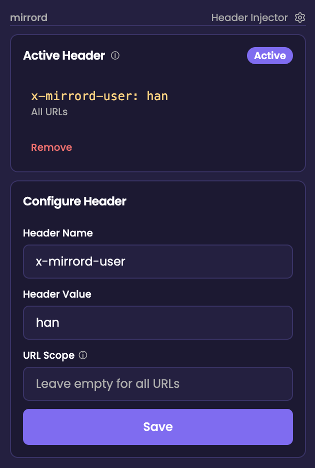
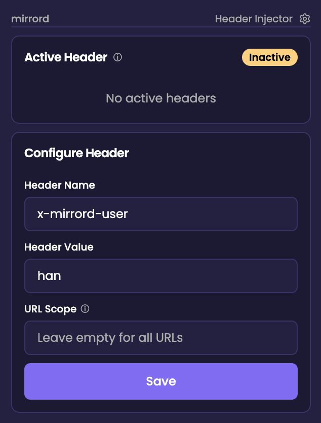

The mirrord Browser Extension injects custom HTTP headers into your browser requests. It can be used as a standalone tool for anyone who needs header injection, or together with mirrord CLI sessions for automatic configuration. Depending on the URL scope, it can inject into all requests or only those matching specific URL patterns.

## Prerequisites

1. Google Chrome installed.
2. [mirrord Browser Extension for Chrome](https://chromewebstore.google.com/detail/mirrord/bijejadnnfgjkfdocgocklekjhnhkhkf) installed.

For use with mirrord CLI sessions, you also need:

3. Header propagation set up in your app.
4. A valid HTTP header filter defined in your `mirrord.json` under `feature.network.incoming.http_filter.header_filter` with `mode` set to `steal`.
5. Browser extension config enabled in your `mirrord.json`.
   **Note:** This feature is experimental.
   ```json
   {
     "feature": {
       "network": {
         "incoming": {
           "mode": "steal",
           "http_filter": {
             "header_filter": "X-My-Header: my-header-value"
           }
         }
       }
     },
     "experimental": {
       "browser_extension_config": true
     }
   }
   ```

## Using mirrord Browser Extension

The extension can be used standalone or together with mirrord CLI.

**Standalone:**

Open the extension popup, configure the header name, value, and URL scope, and click Save. The extension will start injecting the header into matching browser requests. No `mirrord.json` or CLI session is required.

**With mirrord CLI session:**
1. Run `mirrord exec` with the configured `mirrord.json`, mirrord will then:
   - Print the configuration URL to the screen.
   - Open the URL automatically in a Chrome tab.
2. The extension injects the active session's header into browser requests (based on URL scope).
3. You can check the current header and status in the extension popup by clicking the Chrome extension icon at any time.
4. To stop header injection, click the extension icon and remove the header from the popup.

## Extension Popup

The extension popup lets you see which header is currently being injected into your browser requests and adjust it when needed, without restarting your mirrord session.

### Current Header Status


- Header name and value currently being injected
- URL scope (which URLs the header applies to)
- An **Active** or **Inactive** indicator on the extension icon

### Edit Header Configuration


Allows you to edit the header configuration directly from the popup:
- **Header Name**: The HTTP header name to inject (e.g., `X-My-Header`)
- **Header Value**: The value to set for the header and will be added to outgoing requests
- **URL Scope**: Restrict header injection to specific URL patterns (see [Limiting injection scope by URL](#limiting-injection-scope-by-url) below)
- **Save**: Applies your changes immediately and updates the active header
- **Reset to Default**: Restores the header configuration from the `mirrord.json` file associated with the currently active session, when available.

### Full Popup View

| Active | Inactive |
|--------|----------|
|  |  |

## Limiting injection scope by URL

By default, the extension injects the header into **all browser requests** when the URL scope is empty. You can restrict this to specific URLs using scope patterns:

- **All URLs**: Leave the scope empty or set to `*` to inject on every request.
- **Specific patterns**: Use URL patterns to limit injections, For example:
  - `https://api.example.com/*`: Inject only for requests to `api.example.com`
  - `https://*.example.com/*`: Inject for any subdomain of `example.com`

The scope uses Chrome's [match patterns](https://developer.chrome.com/docs/extensions/develop/concepts/match-patterns) syntax.

## Header Filter

The mirrord Browser Extension will automatically inject the `header_filter` defined in `mirrord.json`.
In case `header_filter` is configured with a regex pattern, you will be prompted in the browser to enter a header that matches it:
`Please enter a header that matches pattern $HEADER_PATTERN`

## More details

- If the mirrord Browser Extension is not installed prior to running `mirrord exec` with the configured `mirrord.json`, the URL will fail to open. Google Chrome will display an error page showing the URL is blocked.
- If the Browser Extension is enabled in `mirrord.json` but no HTTP header filter is configured, mirrord will not initiate the extension in Google Chrome and will display a warning in the terminal.
- The extension stores your default configuration from the CLI session. If you edit the header or scope in the popup, you can always use **Reset to Default** to revert to the original values.
