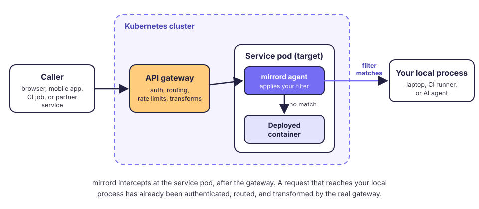

# Working with API Gateways

In many clusters, requests from outside the cluster do not go to a service directly. They go to an API gateway first, such as Kong, Envoy Gateway, Emissary, NGINX, Traefik, or a gateway your team built. The gateway authenticates each request and routes it to the right service. mirrord works with services behind a gateway, and in most cases the gateway needs no change.

## How Traffic Reaches Your Local Process

On this page, the *caller* is whatever sends the request to the gateway: a browser, a mobile app, a CI job, or a partner's service.



mirrord intercepts traffic at the [target](../../reference/targets.md) pod, after the gateway. A request that reaches your local process has already gone through the real gateway. Your local code receives the request as the deployed service would: authenticated, routed, and with every header that the gateway adds.

## Target the Service Behind the Gateway

Target the service that handles the route, not the gateway. To share the service with other developers, steal only the requests that carry your header:

```json
{
  "target": "deployment/orders",
  "feature": {
    "network": {
      "incoming": {
        "mode": "steal",
        "http_filter": {
          "header_filter": "^baggage: .*mirrord-session=local-dev-123.*"
        }
      }
    }
  }
}
```

Then send the request through the gateway, with the header:

```bash
curl -H "baggage: mirrord-session=local-dev-123" https://api.staging.example.com/orders
```

To send the request from a browser instead, use the [mirrord browser extension](debug-from-browser.md). It adds the header to the browser's requests.

Requests without the header go to the deployed service as usual. For all the filter options, see [Filtering Incoming Traffic](filter-incoming-traffic.md).

## Make Sure the Gateway Forwards the Header

The filter matches only if the header reaches the service. Most gateways forward request headers to the upstream service by default. Check these points if your filter does not match:

- **Use `baggage`.** It is a W3C standard header, and many gateways, service meshes, and tracing libraries keep it.
- **Do not use underscores in a custom header name.** NGINX, including ingress-nginx, drops headers that contain underscores by default (`underscores_in_headers off`). Some gateways, such as Kong, forward them, but hyphens work with all of them.
- **Check header allowlists and transforms.** If the gateway removes unknown headers, or a plugin rewrites them, add your header to the allowlist.
- **See which headers arrive.** Run [`mirrord dump`](inspect-live-traffic.md) on the target to see the real headers that reach the service. Without the mirrord operator, stop your own session on that target first, because two sessions cannot attach to the same pod.

A filter on `baggage` matches past the first service only if each service forwards the header to the next one. To have your AI agent set that up, use the [`mirrord-header-propagation`](https://github.com/metalbear-co/skills/tree/main/skills/mirrord-header-propagation) skill.

## When the Caller Cannot Set a Header

Some callers cannot add a header, for example a mobile app or a third-party webhook. Give the testers their own host or route on the gateway, and then use one of these options.

### Filter on the Test Route

If the test route is only for testers, filter on the route itself. No gateway change is needed.

- **A test path:** if the path reaches the service unchanged, use a [`path_filter`](filter-incoming-traffic.md).
- **A test host:** gateways usually send the original host to the service in the `X-Forwarded-Host` header. Both ingress-nginx and Kong do. Filter on that header:

```json
{
  "feature": {
    "network": {
      "incoming": {
        "mode": "steal",
        "http_filter": {
          "header_filter": "(?i)^x-forwarded-host: test\\.api\\.staging\\.example\\.com$"
        }
      }
    }
  }
}
```

### Have the Gateway Add the Header

A filter on the route works only at the first service. Have the gateway add the `baggage` header instead when the request must keep your filter as it goes on to other services, or when a [preview environment](../../use-cases/preview-environments.md) must receive it, because previews route on `baggage`:

- **Kong:** the `request-transformer` plugin, with `add.headers`.
- **NGINX:** `proxy_set_header` in the location block.
- **Envoy Gateway:** a `RequestHeaderModifier` filter with `add` on the HTTPRoute.
- **Emissary-ingress:** `add_request_headers` on the Mapping.
- **Envoy configured directly:** `request_headers_to_add` on the route.


Add the header only on a host or route that is used for testing. If you add it to a shared route, all traffic on that route matches your filter and goes to your local process.


Preview environments have the same problem when you share a preview with someone who does not have the browser extension, for example a product manager who reviews a change. For this case, mirrord can give each preview a plain HTTPS link: a separate component, `mirrord-share-ingress`, serves the link and adds the header on the server side. See [Sharing a Preview via a Link](../../use-cases/preview-environments.md#sharing-a-preview-via-a-link).

## Call Services Through the Gateway From Local Code

By default, mirrord sends outgoing traffic and DNS queries through the remote pod. Your local process can call the gateway's in-cluster Service address, in the form `<gateway-service>.<namespace>.svc.cluster.local`, or call the services behind it directly. The Service name depends on how the gateway was installed. To find it, run `kubectl get svc -n <gateway-namespace>`. See [Outgoing Traffic](../outgoing-traffic/README.md).

## Gateways That Send Encrypted Traffic to the Service

An HTTP filter needs to read the request. If the gateway sends HTTPS to the service (TLS passthrough or re-encryption), see [Stealing HTTPS Requests](steal-https.md).

## Preview Environments Behind a Gateway

By default, [preview environments](../../use-cases/preview-environments.md) route on the `baggage: mirrord-session=<key>` header. A preview can also use a custom filter. The same rule applies to either: the gateway must forward the header that the filter matches.

## Developing the Gateway Itself

If the gateway is a service that your team builds, for example with Spring Cloud Gateway or a custom Go or Node.js service, target its Deployment like any other service.
