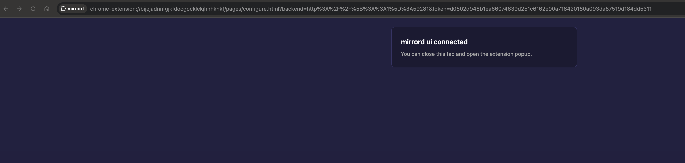
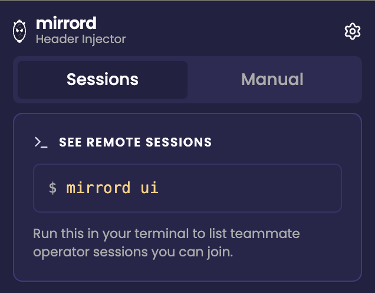

# Debugging from Browser

The mirrord browser extension injects HTTP headers into your browser's outgoing requests so that traffic which hits your cluster matches a mirrord HTTP filter and gets routed to your local process. With it, you can hit a staging URL in Chrome and have your local code answer, without changing any application code or configuring proxies.

There are two ways to use it:

* **With operator sessions.** Pick a teammate's running mirrord session (or one of your own) from the **Sessions** tab and click Join. The extension works out which header to inject from that session's HTTP filter and starts injecting on every browser request. This is the recommended path on a cluster running the [mirrord operator](../../managing-mirrord/operator.md).
* **Standalone (Override).** Configure a header name, value, and optional URL scope yourself on the **Override** tab. No CLI session required.

The extension opens as a **side panel** by default (click the mirrord icon in the Chrome toolbar). On browsers without side-panel support it falls back to a popup. It has two tabs, **Sessions** and **Override**, a theme toggle, and a settings gear.

### Prerequisites

1. Google Chrome.
2. The [mirrord browser extension](https://chromewebstore.google.com/detail/mirrord/bijejadnnfgjkfdocgocklekjhnhkhkf) installed.

For operator sessions, additionally:

3. A recent version of mirrord CLI (`3.198.0` or newer).
4. A kubeconfig pointing at a cluster running the [mirrord operator](../../managing-mirrord/operator.md). The operator must be a version that exposes session metadata (`3.157.1` or newer).

### Quick start with `mirrord ui`

Run the local UI in a terminal:

```bash
mirrord ui
```

It binds to localhost, prints some details, and opens the dashboard in your default browser:

```text
* New mirrord session monitor started
* Server PID:
 -> ...

* Web UI:
 -> http://127.0.0.1:59281/auth?token=...
* API token:
-> x-auth-token: ...

* mirrord session monitor ready!
  -> log file: ...
```

The dashboard page does an automatic handshake with the extension (over Chrome's `externally_connectable` mechanism) and hands it the server's address and a one-shot token. You should see this confirmation:



Close the tab and open the extension side panel from the Chrome toolbar. The **Sessions** tab now lists every operator session your kubeconfig can see, grouped by session key. Each card shows the target, owner, namespace, and age, with a **Join** button:


Pick a session and click **Join**. While you're joined, the extension injects the session's HTTP-filter-matching header into every request your browser makes.

For more on `mirrord ui` itself, see [Local UI](../local-ui.md).

### The Sessions tab

The Sessions tab is the operator-driven view. Beyond the session cards, it gives you:

* A **search box** (shown once there is at least one session) that matches across session key, namespace, owner, target kind and name, and container.
* A **Context** filter and a **Namespace** filter, shown when there is more than one kube context or namespace to choose from. The Context filter tags your current kubeconfig context as "current"; the Namespace filter defaults to "All". Filtering is client-side, so it's instant.
* Badges on each card: **PREVIEW** for a preview environment, and **Joined** for the session you're currently riding.

When you join a session, a live banner appears at the top of the tab.

#### The live session banner

The banner reflects the joined session's liveness with three states:

| State | What it means | Action |
| --- | --- | --- |
| **Session live** | The session is running and the extension is injecting. | **Leave** |
| **Waiting for session** | The session dropped but is within a 60-second grace window (for example while you restart a local `mirrord` run). Injection is held ready. | **Leave** |
| **Session ended** | The grace window expired without the session coming back. | **Dismiss** |

Liveness is keyed on the session key, not a single run's ID, so stopping and restarting a local `mirrord` session rides through the "Waiting for session" state instead of ending the join.

The banner also shows:

* The joined **session key** and its targets.
* A **URL scope** section where you can add and remove match-pattern chips to limit which sites the header is injected on (see [Limiting injection scope by URL](debug-from-browser.md#limiting-injection-scope-by-url)). Each chip has a remove button, and a **+ pattern** input adds more.
* A **header observed** activity meter, showing how many requests carried the injected header in the last 60 seconds, so you can confirm injection is actually happening.
* An **injecting** pill showing the exact `header: value` being applied, with a one-click copy.

### When the extension isn't configured yet

The Sessions tab guides you to a working state depending on what it detects:

* **Not configured.** If you haven't run `mirrord ui` yet, the tab shows a hint card with the `mirrord ui` command to run.



* **mirrord ui detected.** If `mirrord ui` is running on the default port but the extension doesn't have its token yet, the tab shows an **Open mirrord ui** button that opens the dashboard so the handshake can run.
* **Token rejected.** If `mirrord ui` restarted with a new token (or another process took its port), the tab explains what happened and lets you re-run `mirrord ui` to reconnect automatically, or paste the current token by hand.
* **Operator unavailable.** If the operator can't be reached, the tab shows "Showing local sessions only" with a link to install the operator.

### The Override tab

If you don't want to use `mirrord ui` (or the cluster doesn't run the operator), the **Override** tab lets you configure header injection directly.


* **Header Name** is the HTTP header to set (for example `x-mirrord-user`).
* **Header Value** is the value to set on the header for every matching outgoing request.
* **URL Scope** restricts injection to URLs matching a single pattern. Leave it empty to inject on every request. See [Limiting injection scope by URL](debug-from-browser.md#limiting-injection-scope-by-url).
* The **Active** toggle pauses injection without losing your configuration.
* **Save** applies changes immediately and updates the active rule.
* **Reset to Default** reverts to the configuration baked into the most recent CLI session, if any.

Saving on the Override tab replaces whatever rule the extension is currently injecting, including a rule from a Sessions-tab join. To switch back cleanly after a join, click **Leave** on the live banner first.

You can also share your Override configuration: the **Share** icon in the top bar copies a config link you can send to a teammate. Opening that link in a browser that has the extension applies the same header (joining a matching live session if one exists), so you can hand off a browser-debug setup without walking someone through the fields.

### Using it together with `mirrord exec`

The browser extension was originally driven by `mirrord exec` printing a configure URL on stdout, and that path still works. To opt in, declare it in your `mirrord.json`:

```json
{
  "feature": {
    "network": {
      "incoming": {
        "mode": "steal",
        "http_filter": {
          "header_filter": "^baggage: .*mirrord-session=browser-debug.*"
        }
      }
    }
  },
  "experimental": {
    "browser_extension_config": true
  }
}
```

When you run `mirrord exec` against this config, the CLI prints a `chrome-extension://...` URL and opens it. The extension's configure page reads the embedded backend and token and stores them. After that the extension behaves the same as in the `mirrord ui` flow.

You'll also want HTTP context propagation set up in your app so the header survives across service hops. Most tracing libraries already forward `baggage` or `tracestate` automatically; only add manual forwarding if your stack does not.

This experimental feature still requires the extension to be installed before you run `mirrord exec`. If it isn't, Chrome will block the configure URL and show an error page.

### Limiting injection scope by URL

By default, the extension injects on every browser request when the URL scope is empty. To restrict:

* **All URLs** by leaving the scope empty or setting it to `*`.
* **Specific patterns** using Chrome's [match patterns](https://developer.chrome.com/docs/extensions/develop/concepts/match-patterns) syntax. Examples:
  * `https://api.example.com/*` for only requests to `api.example.com`.
  * `https://*.example.com/*` for any subdomain of `example.com`.

On a joined session you can add several patterns as chips; on the Override tab the scope is a single pattern field. Restricting the scope is the right move when you only want one specific app to talk to your local process and want everything else to keep going to staging normally.

### Header filter regex

If your `header_filter` in `mirrord.json` is a strict regex, the extension auto-derives a header name and value that satisfies it (for example, `baggage: mirrord-session=browser-debug` from a regex matching that prefix). When the extension can't derive a unique value from your regex, it'll prompt you in the browser for a header that matches; paste in any header line your filter would accept.

### Settings

The gear icon in the top bar opens the extension's settings page. The only setting is a toggle for anonymous usage analytics. The `mirrord ui` backend address and token are set by the auto-configure handshake, not entered here.

### Verifying it works

Once joined or active, open Chrome DevTools, then Network, on a request that hits your cluster. Look for the injected header on the outgoing request. If it's there and the operator's HTTP filter matches, the request will be served by your local process; check your local logs to confirm. The **header observed** meter on the live banner is a quick confirmation that the header is going out.

### Tips

* The extension stores its configuration per browser profile in `chrome.storage.local`, so quitting the side panel, closing Chrome, and reopening keeps your join state. Closing `mirrord ui` doesn't wipe the join, it just means the extension can't refresh the session list. Re-run `mirrord ui` to get it back.
* Use **Reset to Default** on the Override tab to revert to whatever `mirrord exec` last pushed in.
* Saving on Override after a Sessions-tab join overwrites the joined rule. Use **Leave** on the live banner first if you want to switch cleanly.
* The `mirrord ui` server runs in the background on your machine. To stop it, run `mirrord ui stop`.

### What's next?

* [Local UI](../local-ui.md) is the full reference for `mirrord ui`.
* [Filtering Incoming Traffic](filter-incoming-traffic.md) covers the operator-side HTTP filter the extension's headers are matching against.
* [Managing Sessions](../../sharing-the-cluster/sessions.md) covers listing and stopping operator sessions from the CLI.
