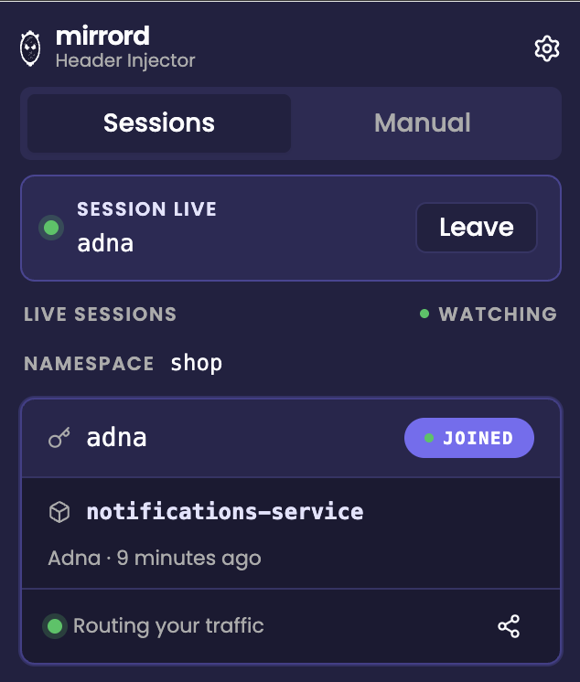
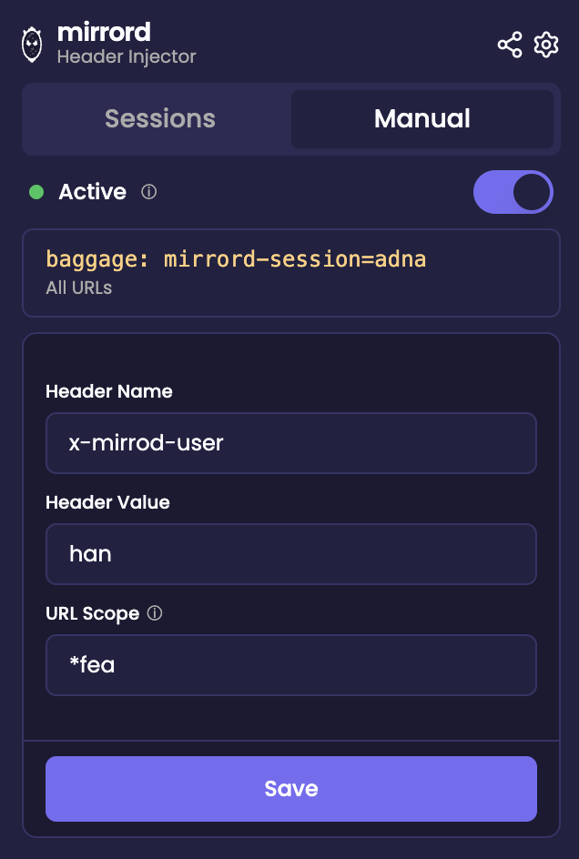

The mirrord browser extension injects HTTP headers into your browser's outgoing requests so that traffic which hits your cluster matches a mirrord HTTP filter and gets routed to your local process. With it, you can hit a staging URL in Chrome and have your local code answer, without changing any application code or configuring proxies.

There are two ways to use it:

- **With operator sessions.** Pick a teammate's running mirrord session (or one of your own) from the popup and click Join. The extension figures out which header to inject from that session's HTTP filter and starts injecting on every browser request. This is the recommended path on a cluster running the [mirrord operator](../../managing-mirrord/operator.md).
- **Standalone (Manual).** Configure a header name, value, and optional URL scope yourself. No CLI session required.

## Prerequisites

1. Google Chrome.
2. The [mirrord browser extension](https://chromewebstore.google.com/detail/mirrord/bijejadnnfgjkfdocgocklekjhnhkhkf) installed.

For operator sessions, additionally:

3. A recent mirrord CLI (the `ui` subcommand needs to exist).
4. A kubeconfig pointing at a cluster running the [mirrord operator](../../managing-mirrord/operator.md). The operator must be a version that exposes session metadata (3.157.1 or newer).

## Quick start with `mirrord ui`

Run the local UI daemon in a terminal:

```bash
mirrord ui
```

It binds to localhost, prints a URL, and opens it in your default browser:

```
  mirrord session monitor
    Web UI: http://[::1]:59281?token=...
```

The Web UI page does an automatic handshake with the extension (over Chrome's `externally_connectable` mechanism) and hands it the daemon's address and a one-shot token. You should see this confirmation:


Close the tab. Open the extension popup from the Chrome toolbar — the **Sessions** tab now lists every operator session your kubeconfig can see. Pick one and click **Join**:



While you're joined, the extension injects the session's HTTP-filter-matching header into every request your browser makes. The session live banner shows the joined session key; click **Leave** to stop.

For more on `mirrord ui` itself, see [Local UI](../local-ui.md).

## When the popup is empty

If you haven't run `mirrord ui` yet, the Sessions tab shows a hint card telling you what to do:


This is also what you'll see if `mirrord ui` was running but you closed it. Re-running brings the operator session list back.

## Standalone (Manual) mode

If you don't want to use `mirrord ui` (or the cluster doesn't run the operator), the **Manual** tab lets you configure header injection directly.



- **Header Name** — the HTTP header to set (e.g. `baggage`, `x-mirrord-user`).
- **Header Value** — the value to set on the header for every matching outgoing request.
- **URL Scope** — restrict injection to URLs matching this pattern. Empty means inject on every request. See [Limiting injection scope by URL](#limiting-injection-scope-by-url).
- **Active** toggle — pause injection without losing your configuration.
- **Save** — apply changes immediately and update the active rule.
- **Reset to Default** — revert to the configuration baked into the most recent CLI session, if any.

Saving on the Manual tab replaces whatever rule the extension is currently injecting, including a rule from a Sessions-tab join.

## Using it together with `mirrord exec`

The browser extension was originally driven by `mirrord exec` printing a configure URL on stdout, and that path still works. To opt in, declare it in your `mirrord.json`:

```json
{
  "feature": {
    "network": {
      "incoming": {
        "mode": "steal",
        "http_filter": {
          "header_filter": "^baggage: .*mirrord-session=browser-debug.*"
        }
      }
    }
  },
  "experimental": {
    "browser_extension_config": true
  }
}
```

When you run `mirrord exec` against this config, the CLI prints a `chrome-extension://...` URL and opens it. The extension's configure page reads the embedded backend and token and stores them. After that the popup behaves the same as in the `mirrord ui` flow.

You'll also want HTTP context propagation set up in your app so the header survives across service hops. Most tracing libraries already forward `baggage` or `tracestate` automatically; only add manual forwarding if your stack does not.

This experimental feature still requires the extension to be installed before you run `mirrord exec`. If it isn't, Chrome will block the configure URL and show an error page.

## Limiting injection scope by URL

By default, the extension injects on every browser request when the URL Scope field is empty. To restrict:

- **All URLs** — leave the scope empty or set it to `*`.
- **Specific patterns** — use Chrome's [match patterns](https://developer.chrome.com/docs/extensions/develop/concepts/match-patterns) syntax. Examples:
  - `https://api.example.com/*` — only requests to `api.example.com`.
  - `https://*.example.com/*` — any subdomain of `example.com`.

Restricting the scope is the right move when you only want one specific app to talk to your local process and want everything else to keep going to staging normally.

## Header filter regex

If your `header_filter` in `mirrord.json` is a strict regex, the extension auto-derives a header name and value that satisfies it (for example, `baggage: mirrord-session=browser-debug` from a regex matching that prefix). When the extension can't derive a unique value from your regex, it'll prompt you in the browser for a header that matches — paste in any header line your filter would accept.

## Verifying it works

Once joined or active, open Chrome DevTools → Network on a request that hits your cluster. Look for the injected header on the outgoing request. If it's there and the operator's HTTP filter matches, the request will be served by your local process; check your local logs to confirm.

## Tips

- The extension stores its configuration per browser profile in `chrome.storage.local`, so quitting the popup, closing Chrome, and reopening keeps your join state. Closing `mirrord ui` doesn't wipe the join — it just means the popup can't refresh the session list. Re-run `mirrord ui` to get it back.
- Use **Reset to Default** on the Manual tab to revert to whatever `mirrord exec` last pushed in.
- Saving on Manual after a Sessions-tab join overwrites the joined rule. Use **Leave** on the live banner first if you want to switch cleanly.

## What's next?

- [Local UI](../local-ui.md) — full reference for `mirrord ui`.
- [Filtering Incoming Traffic](filter-incoming-traffic.md) — the operator-side HTTP filter the extension's headers are matching against.
- [Managing Sessions](../../sharing-the-cluster/sessions.md) — listing and stopping operator sessions from the CLI.
