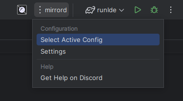

# IntelliJ Plugin

If you develop your application in one of the JetBrains' IDEs (e.g PyCharm, IntelliJ or GoLand), you can debug it with mirrord using our JetBrains Marketplace [plugin](https://plugins.jetbrains.com/plugin/19772-mirrord). Simply:

1. Download the plugin
2. Enable mirrord using the toolbar button (next to "mirrord" popup menu) 
3. Run or debug your application as you usually do

When you start a debugging session with mirrord enabled, you'll be prompted with a target selection dialog. This dialog will allow you to select the target in your Kubernetes cluster that you want to impersonate.

> **Note**: For some projects, the plugin might not be able to present the target selection dialog.
>
> When this happens, you'll see a warning notification and the execution will be cancelled. You can still use mirrord, but you'll have to specify the target in mirrord config.
>
> This is known to happen with Java projects using the IntelliJ build system.

The toolbar button enables/disables mirrord for all run and debug sessions.

mirrord's initial state on startup can be configured in the plugin settings (`Settings -> Tools -> mirrord -> Enable mirrord on startup`)

### Enabling/disabling mirrord for a specific run configuration

mirrord can be persistently enabled or disabled for a specific run configuration, regardless of the toolbar button state. This is controlled via the `MIRRORD_ACTIVE` environment variable in your run configuration.

To have mirrord always enabled for the given run configuration, set `MIRRORD_ACTIVE=1` in the run configuration's environment variables. To have mirrord always disabled, set `MIRRORD_ACTIVE=0`.

### Selecting session target

mirrord's target can be specified in two ways:

1. with the target selection dialog
   * The dialog will only appear if the mirrord config does not specify the target.
   * The dialog will initially show targets in the namespace specified in the mirrord config ([`.target.namespace`](https://app.gitbook.com/s/Z7vBpFMZTH8vUGJBGRZ4/options#target.namespace)). If the namespace is not specified, your Kubernetes user's default namespace will be used.
   * If you want to see targets in a different namespace, there is a dropdown to choose between namespaces.
2. in the mirrord config's [target section](https://app.gitbook.com/s/Z7vBpFMZTH8vUGJBGRZ4/options#target)

### Using the mirrord config

The plugin allows for using the [mirrord config](https://app.gitbook.com/s/Z7vBpFMZTH8vUGJBGRZ4/). For any run/debug session, the mirrord config to be used can be specified in multiple ways:

#### Active config

The toolbar dropdown menu allows for specifying a temporary mirrord config override. This config will be used for all run/debug sessions.

To specify the override, use `Select Active Config` action.

You will be prompted with a dialog where you can select a mirrord config from your project files. For the file to be present in the dialog, its path must contain `mirrord` and end with either `.json`, `.yaml` or `.toml`.

You can remove the override using the same action.

#### Config for run configuration

If no active config is specified, the plugin will try to read the config file path from the `MIRRORD_CONFIG_FILE` environment variable specified in the run configuration.

This path should be absolute.

#### Config from default path

If the config file path is not specified in the run configuration environment, the plugin will try to find a default config.

The default config is the lexicographically first file in `<PROJECT ROOT>/.mirrord` directory that ends with either `.json`, `.yaml` or `.toml`.

### Managing the mirrord binary

The plugin relies on the standard mirrord CLI binary.

By default, the plugin checks the latest release version and downloads the most up-to-date binary in the background. You can disable this behavior in the plugin settings (`Settings -> Tools -> mirrord -> Auto update mirrord binary`).

You can also pin the binary version in the plugin settings (`Settings -> Tools -> mirrord -> mirrord binary version`).

### WSL

The guide on how to use the plugin with remote development on WSL can be found [here](wsl.md#root-project-intellij).
