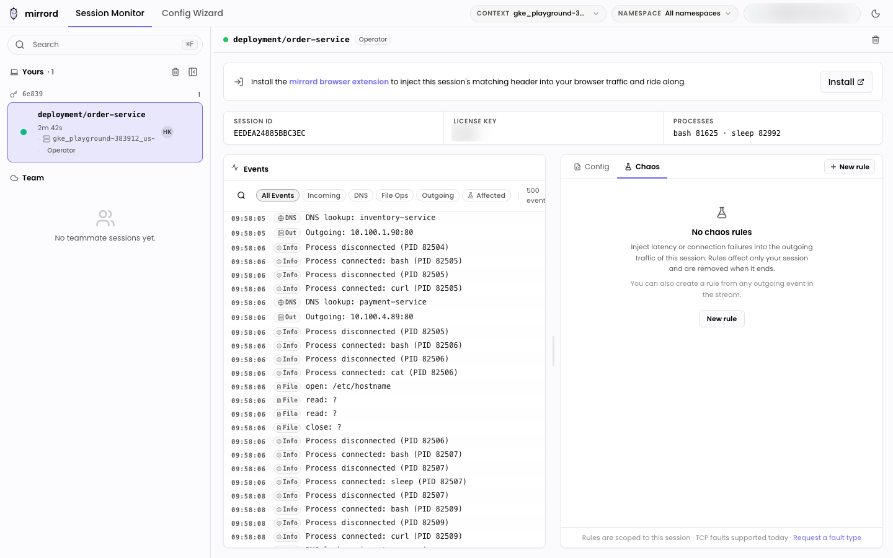
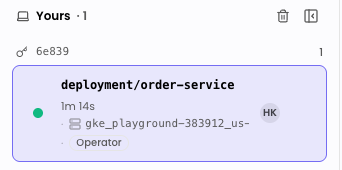
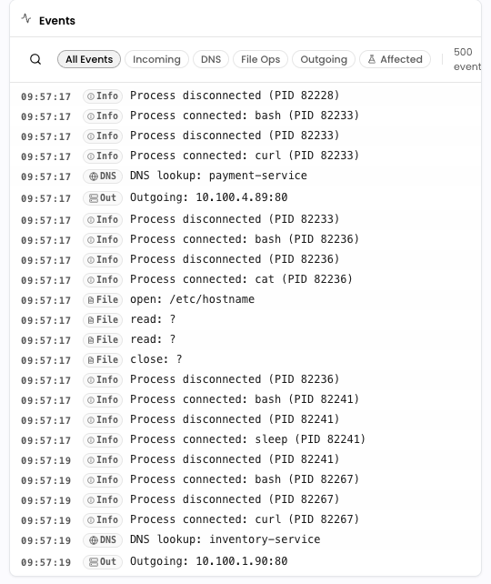
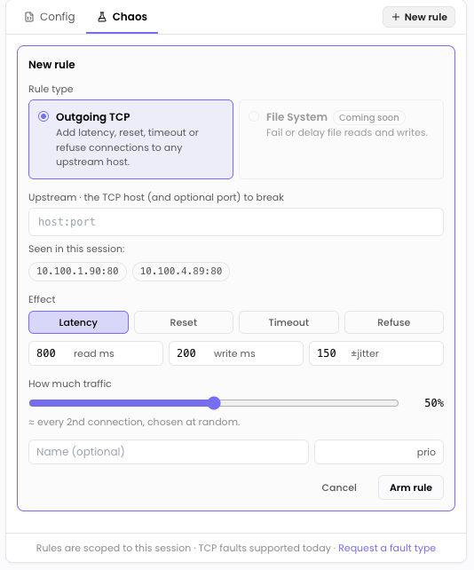

`mirrord ui` launches a small local web dashboard that watches every active mirrord session on your machine and, when you're connected to a mirrord operator, every operator session your kubeconfig can see across the cluster. It runs entirely on your laptop. Nothing in your cluster has to change to use it.

The dashboard has two tabs:

- **Session Monitor** (the default) watches your live sessions and shows a real-time event stream for each one.
- **Config Wizard** walks you through generating a `mirrord.json`. See [Onboarding Wizard](../getting-started/onboarding-wizard.md) for a full guide to that tab.

This page covers the Session Monitor. Both tabs stay loaded once opened, so switching between them keeps their state (a running event stream, an in-progress config) intact.

## What it shows

- **Local sessions** are each `mirrord exec` you have running locally, with its target, ports, processes, mode, and a live event stream (file operations, DNS, HTTP requests, outgoing connections).
- **Operator sessions** are a roll-up of every active mirrord session in your cluster, grouped by session key, with target, owner, namespace, and HTTP filter. This is useful for seeing what your teammates have running before you start your own session, and for picking a session to ride on from the [mirrord browser extension](incoming-traffic/debug-from-browser.md).

The dashboard updates live over a WebSocket as sessions start and end.

## Prerequisites

- A recent mirrord CLI (`3.198.0` or newer). The subcommand is available on macOS and Linux.
- A working kubeconfig pointing at a cluster running the [mirrord operator](../managing-mirrord/operator.md), if you want to see operator sessions. Without an operator, the dashboard still works for your own local sessions.

## Quick start

```bash
mirrord ui
```

The CLI starts an HTTP + WebSocket server bound to localhost, generates a one-shot auth token, prints some details, and opens the dashboard in your default browser.

```text
* New mirrord session monitor started
* Server PID:
 -> ...

* Web UI:
 -> http://127.0.0.1:59281/auth?token=...
* API token:
-> x-auth-token: ...

* mirrord session monitor ready!
  -> log file: ...
```

The token is required on every request, so there's no need to expose the dashboard beyond your machine. Each invocation generates a fresh token.

The server runs in the background on your machine. Its logs are written to a temporary file whose path is printed at startup. To stop the server, run:

```bash
mirrord ui stop
```

### Options and subcommands

`mirrord ui` on its own starts the server (in the background) and opens the browser. The following variants are available:

- `mirrord ui start` starts the background server explicitly. If one is already running, it prints the existing server's details and leaves it untouched.
- `mirrord ui stop` (alias `mirrord ui kill`) stops the running background server.

To pick a **different port** (default is `59281`):

```bash
mirrord ui --port 9000
```

To **skip opening the browser**:

```bash
mirrord ui --no-browser
```

To open using a **different browser**:

```bash
BROWSER="firefox" mirrord ui
```

To open straight on the Config Wizard tab, run [`mirrord wizard`](../getting-started/onboarding-wizard.md) instead. It is the same server, opened on the wizard route.

## Touring the Session Monitor

Everything below describes what you see once the dashboard is open on the Session Monitor tab.



_The sessions and event data shown throughout this page come from a demo cluster._

### The top bar

Along the top of the window you'll find, from left to right:

- The **mirrord** brand and the two tabs (**Session Monitor**, **Config Wizard**).
- A **Context** picker and a **Namespace** picker. These scope the operator (cluster) session list. The Context picker lists the contexts in your kubeconfig, tagging the active one as "current". The Namespace picker defaults to "All namespaces" and lets you type to filter, or type a namespace that isn't listed to use it anyway (handy when listing namespaces is blocked by RBAC). Your local sessions are always shown regardless of these pickers, they only scope the cluster view.
- An **account chip** showing a connection status dot (green when connected to the operator, red when not), your Kubernetes username, and a menu. Open the menu for "Running as" and a **Settings** entry.
- A **theme toggle** (light / dark). The three-way System / Light / Dark choice lives in Settings.


The Context and Namespace pickers and the account chip only appear on the Session Monitor tab.


### The session list

The left sidebar lists sessions in two sections. It has a search box at the top (press `Cmd/Ctrl + F` to focus it) and can be resized or collapsed.



- **Yours** holds your own sessions: your local `mirrord exec` runs plus any operator sessions you own. Local sessions are grouped by session key. Each row shows a status dot, the target, uptime, and the context / namespace it belongs to, with a trash icon on hover to stop that session. When you have local sessions, a **Stop all sessions** button at the top of the section ends them all after a confirmation.
- **Team** holds every operator session in the selected context and namespace, grouped by session key. Each row shows the owner, the target (or "targetless"), the namespace, and when it was created. Preview environments are flagged with a badge.

If the operator isn't reachable, the Team section shows an inline prompt ("Showing only your sessions", with a **Connect operator** link) instead of the cluster list. Your local sessions keep working.

### Session details

Selecting a session opens its detail panel on the right.

For a **local session**, the panel header shows the target and whether the session is running through the operator ("Operator") or directly ("Direct"). Below it, a metadata strip lists the session ID, license key (if any), port(s), mode, and process(es) with their PIDs. The body splits into the live **Events** stream (see below) and a side pane with **Config** and **Chaos** tabs. The Config tab shows the session's resolved configuration as JSON with a copy button.

For an **operator session**, the panel is read-only. It shows the target, owner, namespace, session key, container (if any), the HTTP filter, any locked ports, and any queue splits.

### The event stream

The Events widget is a live log of what your local session is doing, fed over a server-sent event stream and capped at the most recent 500 events. Each row has a timestamp, a type badge, and a one-line summary:

- **File** operations (for example `open: /etc/config`).
- **DNS** lookups.
- **Incoming** HTTP requests (method, host, path).
- **Outgoing** connections (host:port).
- **Info** events such as a process connecting or disconnecting.



Use the filter chips (**All Events**, **Incoming**, **DNS**, **File Ops**, **Outgoing**) to narrow the stream, or the search box to match on the summary text. The count on the right shows how many events are in view, and a trash button clears the log. Rows that carry structured data are clickable and open a dialog with the raw JSON, so you can inspect a single request or file operation in full. Auto-scroll pauses while your cursor is over the log.

### Injecting chaos

The **Chaos** tab in a local session's side pane lets you inject faults (latency, resets, timeouts, refused connections) into that session's outgoing TCP traffic. Rules are scoped to your session only and are removed when the session ends. You can also start a rule directly from any outgoing event in the stream. See [Chaos Testing](../use-cases/chaos-testing.md) for the full guide.



### Connecting the operator

If you don't have the operator installed, the monitor still works for your own local sessions and offers a **Connect operator** flow. It walks you through signing up, installing the operator on your cluster with Helm, and verifying the connection. Once the operator is detected, the Team section fills in with your teammates' sessions.

### Settings

Open **Settings** from the account menu to set the theme (System / Light / Dark) and to toggle anonymous usage analytics. These preferences are stored in your browser and are not sent anywhere.

## Config Wizard

The **Config Wizard** tab (also reachable directly with `mirrord wizard`) generates a `mirrord.json` for you by walking through target selection, network configuration, and export. It's covered in full in [Onboarding Wizard](../getting-started/onboarding-wizard.md).

## Authentication

The token is high-entropy and is bound to the running `mirrord ui` process. The first request you make with `?token=...` (via the `/auth` route the CLI opens) sets an `HttpOnly` `mirrord_token` cookie scoped to that origin, so subsequent requests don't need to keep the query parameter. When sending requests directly to the server, you can also set the token in the `x-auth-token` header.

Stopping the server with `mirrord ui stop` invalidates the token; the next run mints a new one.

## Browser extension auto-configure

If you have the [mirrord browser extension](incoming-traffic/debug-from-browser.md) installed, opening the dashboard automatically tells the extension which `mirrord ui` server to talk to and hands it the session token. No copy/paste, no settings page. From there the extension's Sessions tab shows the same operator sessions you see in the monitor, with a one-click join.

## Troubleshooting

- **"Failed to bind"** means another process is on the chosen port. Pass `--port <other>`.
- **Empty operator sessions list** means your kubeconfig context isn't pointing at a cluster with the mirrord operator installed, or your user doesn't have permission to read `MirrordOperator.status`. The local sessions panel still works.
- **"Couldn't list namespaces"** in the Namespace picker means listing namespaces is blocked by RBAC. Type the namespace you want to use directly.
- **Dashboard says "unauthorized"** means the token in the URL didn't match. Re-open the URL the CLI printed; don't reuse a URL from a previous run.
- **"Another session monitor is already running"** means the server is already up. If it isn't behaving as expected, stop it with `mirrord ui stop` (or kill its process by PID) and start it again.

## What's next?

- Use the [browser extension](incoming-traffic/debug-from-browser.md) to inject a header that matches an operator session's HTTP filter and route browser traffic to the corresponding local process.
- Read [Managing Sessions](../sharing-the-cluster/sessions.md) for the operator-side view of the same sessions and how to forcibly stop one.
- Try [Chaos Testing](../use-cases/chaos-testing.md) to break outgoing traffic from a session and watch your app handle it.
