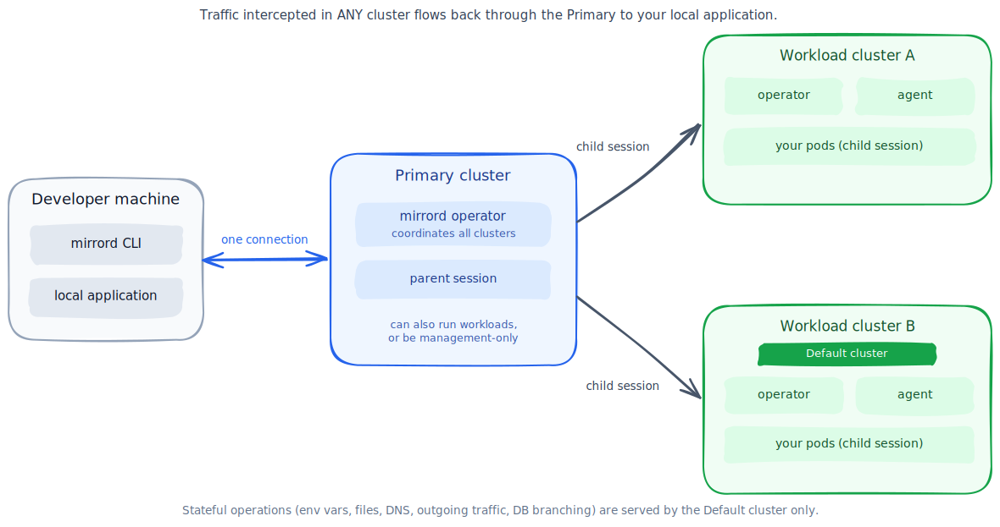
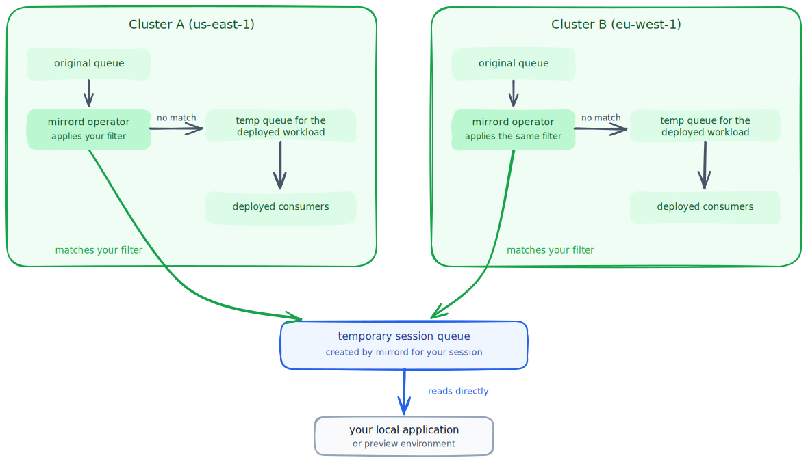

# Seamless Multi-Cluster Development

Multi-cluster mirrord lets developers intercept traffic from pods running in multiple Kubernetes clusters at the same time, without switching kube contexts or managing multiple sessions. You run `mirrord exec` exactly like before, and the operator handles everything behind the scenes.

**When is this useful?**

1.  **Multi-region traffic testing**

    Your service receives traffic from multiple regions such as `us-east-1` and `eu-west-1`. You want to validate your local changes against live traffic from all regions simultaneously, without running separate mirrord sessions per cluster.
2.  **Centralized access**

    Your organization requires developers to connect through a management cluster, with no direct access to workload clusters. You need mirrord to coordinate traffic interception across the workload clusters that share the same target, while operating from the approved entry point.
3.  **Shared environments with multiple clusters**

    Your staging environment spans multiple clusters. You want mirrord to intercept traffic across all of them in a single session.

***

## How It Works

In single-cluster mirrord, the CLI connects to one operator, which creates one agent that intercepts traffic. In multi-cluster, a **Primary** cluster coordinates sessions across multiple **Workload** clusters.

The developer connects to the Primary cluster. The Primary operator creates child sessions on each workload cluster. Each workload cluster's operator spawns an agent locally. Traffic from all clusters flows back to the developer's local application through a single connection.

From the developer's perspective, nothing changes. The same `mirrord exec` command, the same configuration file, the same workflow. The operator decides whether to use single-cluster or multi-cluster mode based on its installation configuration.

***

## Understanding Cluster Roles

Each cluster in a multi-cluster setup takes on one or more roles. A cluster can have multiple roles at the same time (e.g. Primary + Workload + Default).

| Role         | What it does                                                                                       | How many    |
| ------------ | -------------------------------------------------------------------------------------------------- | ----------- |
| **Primary**  | Entry point for developers. Orchestrates sessions across all other clusters.                       | Exactly one |
| **Workload** | Runs application pods. Agents intercept traffic here.                                              | One or more |
| **Default**  | Handles stateful operations like (env vars, files, DNS, outgoing connections, DB branching etc..). | Exactly one |

### Primary Cluster

The Primary cluster is the developer's entry point. When you run `mirrord exec`, your CLI talks to the Primary cluster's operator. The Primary then orchestrates sessions across all other clusters.

The Primary cluster can also run workloads (it can be both a coordinator and a workload cluster), or it can be configured as management-only if it has no application pods.

### Workload Clusters

Workload clusters are where your application pods run. Each workload cluster has its own mirrord operator that spawns agents and handles traffic interception locally, just like single-cluster mirrord.

### Default Cluster

Some operations need to return consistent data such as environment variables, file reads, outgoing connections, and database branching. These are called "stateful operations." The Default cluster is the one cluster designated to handle all of them.

When your app reads `DATABASE_URL` for example, the request goes to the Default cluster only. You get one answer, not different answers from different clusters. Traffic operations (mirror/steal) still go to all workload clusters.

The default cluster is chosen in the settings of the operator on the primary cluster. Any workload cluster can be set to be the default cluster, including the primary cluster, if it's also a workload cluster.

### Management-Only Mode

If the Primary cluster only orchestrates and doesn't run application workloads, set it to management-only mode (`managementOnly: true`). In this case, you must designate a different cluster as the Default, since stateful operations can't run on a cluster with no application pods.

***

## How Operations Are Routed

During a session, the Primary operator routes each operation based on its type. Operations that need one consistent answer go to the Default cluster; operations that depend on where traffic lands go to every workload cluster.

| Operation                                        | Routed to                                                             |
| ------------------------------------------------ | --------------------------------------------------------------------- |
| Incoming traffic (mirror / steal)                | **All** workload clusters                                              |
| Environment variables                            | Default cluster only                                                   |
| File operations                                  | Default cluster only                                                   |
| DNS resolution                                   | Default cluster only                                                   |
| Outgoing traffic (TCP / UDP)                     | Default cluster only                                                   |
| [Database branching](#database-branching-in-multi-cluster) | Default cluster only (the branch is created once)           |
| [Queue splitting](#queue-splitting-in-multi-cluster) | **All** workload clusters — each filters messages locally         |

Responses from all clusters are merged into the single connection back to your local application, so wherever a request or message lands, it reaches your local process the same way.

***

## Access Control

In multi-cluster mode, users only need access to the operator API on the **Primary cluster**. The Primary operator connects to downstream clusters using its own credentials, so users don't need any RBAC on downstream clusters. The per-target permission check does not apply in multi-cluster — if a user can reach the Primary operator, they can target workloads on any connected cluster.

To restrict what users can do per target, use [MirrordPolicy](../sharing-the-cluster/policies.md) resources on each cluster.


Access to the Primary operator API grants the ability to target workloads across all connected clusters. Use `MirrordPolicy` to limit operations per target.


***

## Session Lifecycle

When the developer runs `mirrord exec`, the CLI connects to the Primary cluster and creates a single parent session. The Primary operator then creates child sessions on each workload cluster. From the perspective of each Workload cluster, each child session behaves exactly like a regular single-cluster session: the operator resolves the target, spawns an agent, and handles the traffic interception.

Once all child sessions are ready, the CLI establishes a unified WebSocket connection to the Primary cluster. Messages are routed automatically based on the type of operation (see [How Operations Are Routed](#how-operations-are-routed)).

***

## Database Branching in Multi-Cluster

[Database branching](../sharing-the-cluster/db-branching.md) in multi-cluster mode behaves the same from the developer’s perspective, but may execute on a different cluster internally. The developer connects to the Primary cluster, but the branch is created on the Default cluster.

If the Primary cluster is not the Default cluster, a synchronization controller (`DbBranchSyncController`) runs on the Primary. It mirrors branch resources to the Default cluster and syncs the branch status back to the Primary. The CLI waits for the branch to be ready, then passes the branch name via connection parameters when creating the session, same flow as single-cluster.

If the Primary cluster is also the Default cluster, no synchronization is required. The branching controllers operate locally on the Primary, and the flow is identical to single-cluster behavior.

***

## Queue Splitting in Multi-Cluster

[Queue splitting](../sharing-the-cluster/queue-splitting.md) works in multi-cluster mode for **every supported queue service** — Amazon SQS, Kafka, RabbitMQ, Google Cloud Pub/Sub, Azure Service Bus, Redis Pub/Sub, Temporal, and BullMQ. A single session can even split several queue services at once, across all clusters. See the [Feature Support Matrix](../reference/feature-matrix.md) for maturity levels.

The flow is the same as single-cluster, applied in every cluster:

1. **One config, synced everywhere.** You create your `MirrordSplitConfig` (and any `MirrordPropertyList` client configs) on the **Primary cluster** only. The operator automatically syncs them to all Workload clusters.
2. **One filter, applied everywhere.** When you start a session with [`feature.split_queues`](../sharing-the-cluster/queue-splitting.md#setting-a-filter), the Primary pushes your message filter to every child session, so every cluster applies the exact same filter.
3. **Messages are filtered where they land.** In each cluster, that cluster's operator splits the queue locally, just like single-cluster: the deployed workload is patched to read from a temporary queue, and the operator evaluates your filter on every incoming message.
4. **Matches go to your session, the rest flows on.** Messages that match your filter are routed to the temporary session queue that your local application (or preview environment) reads from. Everything that doesn't match keeps flowing to the deployed consumers, untouched.

The key property: **messages never travel cluster-to-cluster to reach you**. Wherever a message lands, that cluster's operator catches it and routes it to your session.


Create your `MirrordSplitConfig` resources on the **Primary cluster**. The operator automatically syncs them to all Workload clusters — you don't need to create them on each cluster manually.



Each Workload cluster needs its own credentials for the queue service (for example, AWS credentials with SQS permissions). This is independent of the multi-cluster authentication method — even if a cluster connects via bearer token, its operator still needs queue-service credentials to create temporary queues.


To monitor active splits across all clusters, run `mirrord queues status -A` (or `kubectl get queuesplits -A`) against the Primary cluster — it [aggregates the view from every connected cluster](../sharing-the-cluster/queue-splitting/status.md#multi-cluster).

### Per-Service Details

Most services behave identically everywhere, with small differences in where temporary resources are created:

* **[Amazon SQS](../sharing-the-cluster/queue-splitting/sqs.md)** — each Workload cluster creates its own temporary queues and patches the target workload locally. Session queue names are shared between clusters so matched messages from every cluster reach your session.
* **[GCP Pub/Sub](../sharing-the-cluster/queue-splitting/gcp-pubsub.md)** — each Workload cluster creates its own fallback topic and subscription (what the deployed workload reads from). The per-session topic and subscription are created once on the Default cluster, and their names are shared with the other clusters for reuse.

***

## Limitations

* [Targetless mode](targetless.md) is not supported in multi-cluster sessions — a target is required so the operator can resolve it on each Workload cluster.
* Multi-cluster sessions only start when connecting to the Primary cluster. Connecting directly to a downstream cluster starts a regular single-cluster session there.
* The per-target RBAC check does not apply — see [Access Control](#access-control) and use [MirrordPolicy](../sharing-the-cluster/policies.md) to restrict operations per target.

***

## What's Next?

To set up multi-cluster, see the [Multi-Cluster Setup](multi-cluster-setup.md) guide, which covers authentication methods, Helm configuration, and RBAC.


[multi-cluster-setup.md](multi-cluster-setup.md)


For which features are supported in multi-cluster mode and at what maturity level, see the [Feature Support Matrix](../reference/feature-matrix.md).
