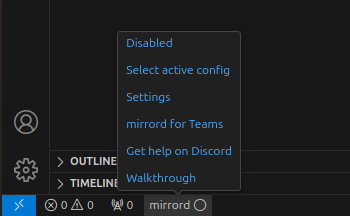

# VSCode Extension

If you develop your application in Visual Studio Code, you can debug it with mirrord using our Visual Studio Marketplace [extension](https://marketplace.visualstudio.com/items?itemName=MetalBear.mirrord). Simply:

1. Download the extension
2. Enable mirrord using the "mirrord" button on the bottom toolbar 


3. Run or debug your application as you usually do

When you start a debugging session with mirrord enabled, you'll be prompted with a target selection quick pick. This quick pick will allow you to select the target in your Kubernetes cluster that you want to impersonate.

The toolbar button enables/disables mirrord for all run and debug sessions.

mirrord's initial state on startup can be configured in the VSCode settings:

```json
{
    "mirrord.enabledByDefault": true
}
```

### Enabling/disabling mirrord for a specific launch configuration

mirrord can be persistently enabled or disabled for a specific launch configuration, regardless of the toolbar button state. This is controlled via the `MIRRORD_ACTIVE` environment variable in your launch configuration. The value `"1"` keeps mirrord always enabled, while the value `"0"` disables it.

```json
{
  "env": {
    // mirrord always enabled
    "MIRRORD_ACTIVE": "1"

    // mirrord always disabled
    // "MIRRORD_ACTIVE": "0"
  }
}
```

### Selecting session target

mirrord's target can be specified in two ways:

1. with the target selection quick pick
   * The quick pick will only appear if the mirrord config does not specify the target.
   * The quick pick will initially show targets in the namespace specified in the mirrord config ([`.target.namespace`](https://app.gitbook.com/s/Z7vBpFMZTH8vUGJBGRZ4/options#target.namespace)). If the namespace is not specified, your Kubernetes user's default namespace will be used.
   * If you want to see targets in a different namespace, there is an option to "Select Another Namespace".
2. in the mirrord config's [target section](https://app.gitbook.com/s/Z7vBpFMZTH8vUGJBGRZ4/options#target)

### Using the mirrord config

The extension allows for using the [mirrord config](https://app.gitbook.com/s/Z7vBpFMZTH8vUGJBGRZ4/). For any run/debug session, the mirrord config to be used can be specified in multiple ways:

#### Active config

The toolbar dropdown menu allows for specifying a temporary mirrord config override. This config will be used for all run/debug sessions.

To specify the override, use `Select active config` action.



You will be prompted with a quick pick where you can select a mirrord config from your project files. For the file to be present in the dialog, it must either be located in a directory which name ends with `.mirrord`, or have a name that ends with `mirrord`. Accepted config file extensions are: `json`, `toml`, `yml` and `yaml`.

You can remove the override using the same action.

#### Config for launch configuration

If no active config is specified, the extension will try to read the config file path from the `MIRRORD_CONFIG_FILE` environment variable specified in the launch configuration.

This path should be absolute.

#### Config from default path

If the config file path is not specified in the launch configuration environment, the plugin will try to find a default config.

The default config is the lexicographically first file in `<PROJECT ROOT>/.mirrord` directory that ends with `mirrord`. Accepted config file extensions are: `json`, `toml`, `yml` and `yaml`.

### Managing the mirrord binary

The extension relies on the standard mirrord CLI binary.

By default, the extension checks the latest release version and downloads the most up-to-date binary in the background. You can disable this behavior in the VSCode settings:

```json
{
  "mirrord.autoUpdate": false
}
```

You can also pin the binary version with:

```json
{
  "mirrord.autoUpdate": "3.128.0"
}
```

To use a specific mirrord binary from your filesystem:

```json
{
  "mirrord.binaryPath": "/path/to/local/mirrord/binary"
}
```

### WSL

The guide on how to use the extension with remote development on WSL can be found [here](wsl.md#using-mirrord-in-vs-code).
