# How to Debug a Go Microservice

In this guide, we’ll cover how to debug a Golang microservice running in a Kubernetes environment using mirrord. You’ll learn how to set up and use mirrord with the Goland IDE and the command line.

---

***Tip:*** You can use [mirrord](https://metalbear.com/mirrord/) to debug, test, and troubleshoot your applications locally with Kubernetes context, without needing to build or deploy each time.

---

## Common debugging techniques for microservices in Go

It can be cumbersome to debug microservices on Kubernetes. The lack of a debugging workflow for applications with multiple runtime dependencies in the context of Kubernetes makes it even harder. Why does it even make it harder? The following are common ways of debugging microservices with strict runtime environment dependencies:

### Continuous deployment

Build a container image and deploy it to a Kubernetes cluster dedicated to testing or staging. The iterative process of building, deploying, and testing is resource-intensive and time-consuming, especially for testing frequent code changes.

### Log analysis

One of the most common ways to understand the application behavior in a cluster is by analyzing logs. Adding extra logs to extract runtime information on the application is very common. Collecting and analyzing logs from different services can be effective but it isn’t the best real-time debugging solution.

### Remote debugging

Developers can use remote debugging tools built into IDEs like Goland to attach to processes already running in a Kubernetes cluster. While this allows real-time code inspection and interaction, it still requires heavy overhead from the IDE and a separate debug configuration for the deployment which can potentially affect the application's performance while debugging.

The above methods can be used by themselves or they can be used together.

## Challenges of debugging Go microservices in Kubernetes

Debugging effectively within a Kubernetes context is the biggest challenge of working with Kubernetes. The build and release loop of the application can be short, but the process still slows down development. Nothing beats the ease and speed of debugging applications locally.

## Introduction to debugging Go microservices with mirrord

With mirrord, we don’t have to think of building and releasing our applications for debugging. We can run our applications locally and mirrord will ensure your locally running process has the context of Kubernetes. Context mirroring for processes allows your process to run locally and consume the resources of a remote resource.

### Workload to process context mirroring

To achieve this, inputs from a Kubernetes workload (eg: a Pod) are mirrored to a locally running process. The process in question here today is a Golang process. Let’s see how we can mirror inputs for our locally running Golang application using mirrord and pipe these outputs back to Kubernetes. This will create a tighter feedback loop effectively allowing you to debug faster without the downsides of the common debugging techniques we discussed above.

### Sample application setup

In the below example, our Golang application will run locally. It will need to have the network information and environment of a Kubernetes Pod to debug. This Kubernetes Pod is running as part of a staging application deployment and will be our mirroring target.

Let’s get started with some prerequisites by setting up a test cluster and deploying our mirroring target.

### Prerequisites

Set up the Kubernetes cluster to test our application setup.

1. Start an instance of a development cluster like minikube, k3d, kind, etc. We are using minikube here.

```bash
minikube start
```

2. Clone the repo with the sample Golang application.

```bash
git clone https://github.com/waveywaves/mirrord-go-debug-example
cd mirrord-go-debug-example
```

3. Deploy our application which will act as our staging environment.

```console
kubectl create -f ./kube

deployment.apps/guestbook created
service/guestbook created
deployment.apps/redis-master created
service/redis-master created
deployment.apps/redis-replica created
service/redis-replica created
```

Once the above is deployed let’s use the following command to get access to the application endpoint so we can see what it looks like.

```bash
minikube service guestbook
```

The above minikube service command automatically sets up a port forwarding session to the specified service and opens it in the default web browser. With the tunnel to our microservice setup, our application architecture now looks like this.

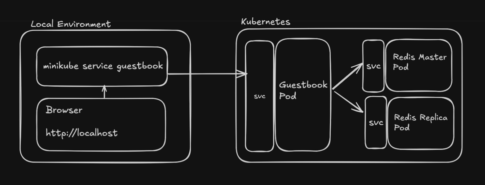

Once we run the minikube service command, we get the below output.

```md
minikube service guestbook                                                        

|-----------|-----------|-------------|---------------------------|
| NAMESPACE |   NAME	| TARGET PORT |        	URL        	|
|-----------|-----------|-------------|---------------------------|
| default   | guestbook |    	3000 | http://192.168.49.2:31233 |
|-----------|-----------|-------------|---------------------------|
🏃  Starting tunnel for service guestbook.
|-----------|-----------|-------------|------------------------|
| NAMESPACE |   NAME	| TARGET PORT |      	URL       	|
|-----------|-----------|-------------|------------------------|
| default   | guestbook |         	| http://127.0.0.1:57485 |
|-----------|-----------|-------------|------------------------|
🎉  Opening service default/guestbook in default browser...
❗  Because you are using a Docker driver on darwin, the terminal needs to be open to run it.
```

Now we have access to the Guestbook application on http://localhost:57485 as the above output says.
Let’s access this URL from the browser.

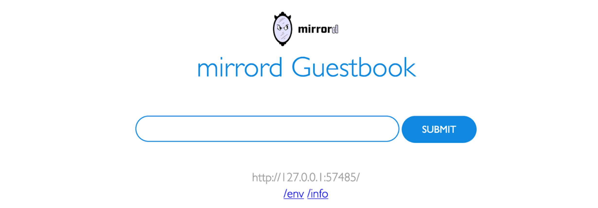

We have our staging application deployed now. Let’s run the microservice with mirrord now. This will allow us to run the local Golang application in the context of Kubernetes without having to build and deploy it over and over again for testing.

## Debug the Guestbook application with Goland and the JetBrains mirrord plugin

In this section of the guide, we are going to use the Goland mirrord plugin to help debug the Go application. If you would like to see how we can do the same in the CLI, go to this section of the guide.

The application in question is Guestbook, a simple note-taking app written in Golang with support for storing notes in Redis. The source code for the test application is available on GitHub at [https://github.com/waveywaves/mirrord-go-debug-example](https://github.com/waveywaves/mirrord-go-debug-example). We will use it as a follow-along Go application for debugging with mirrord.

1. **Setup Goland with the mirrord plugin**

To get started, install mirrord in Goland.

#### Plugin installation

You can install the plugin by searching for the Plugin in the Plugins settings.

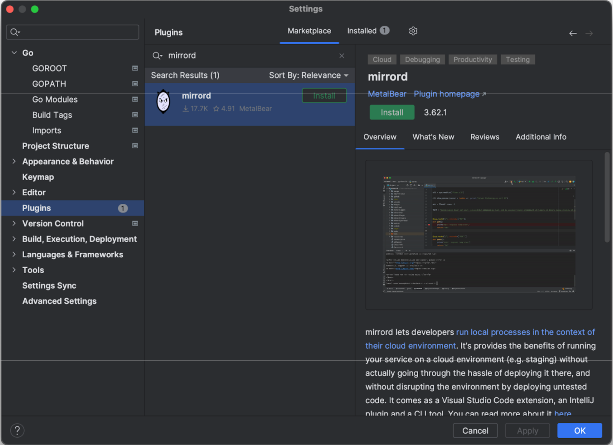

After installing the plugin and restarting the IDE, a dialog box like the one below will appear.

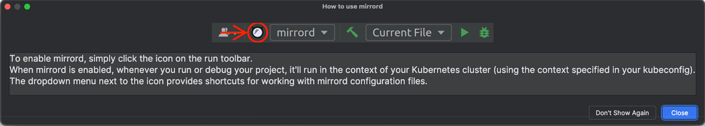

This dialogue box appears as mirrord is successfully installed. It contains the directions for how to use mirrord in the Goland IDE. Let’s set up the mirrord configuration.

#### mirrord configuration

You will see a mirrord button and a dropdown menu in the top right corner of the screen.


If you don’t already have a .mirrord/.mirrord.json configuration file for this application, you can create one using the Settings option in the plugin dropdown menu.


Let’s update the new config file created and opened in the editor. The configuration below contains the target deployment from where we need to mirror the context. 

```json
{
   "feature": {
       "network": {
           "incoming": "mirror",
           "outgoing": true
       },
       "fs": "read",
       "env": true
   },
   "target": {
       "path": "deployment/guestbook",
       "namespace": "default"
   }
}
```

If you want to mirror traffic from a multipod deployment, you can learn more about mirrord for teams [/mirrord/docs/overview/teams/](https://metalbear.com/mirrord/docs/overview/teams/) which provides this feature. Right now we only have one pod in this deployment and mirrord’s OSS features should work perfectly for us.

2. **Run the application with and without mirrord in the Goland IDE?**

#### Running the application with the mirrord plugin disabled

Choose the config by selecting the button above and setting it as the active config. Once that’s done, let’s add a “go build” run configuration like the one below.

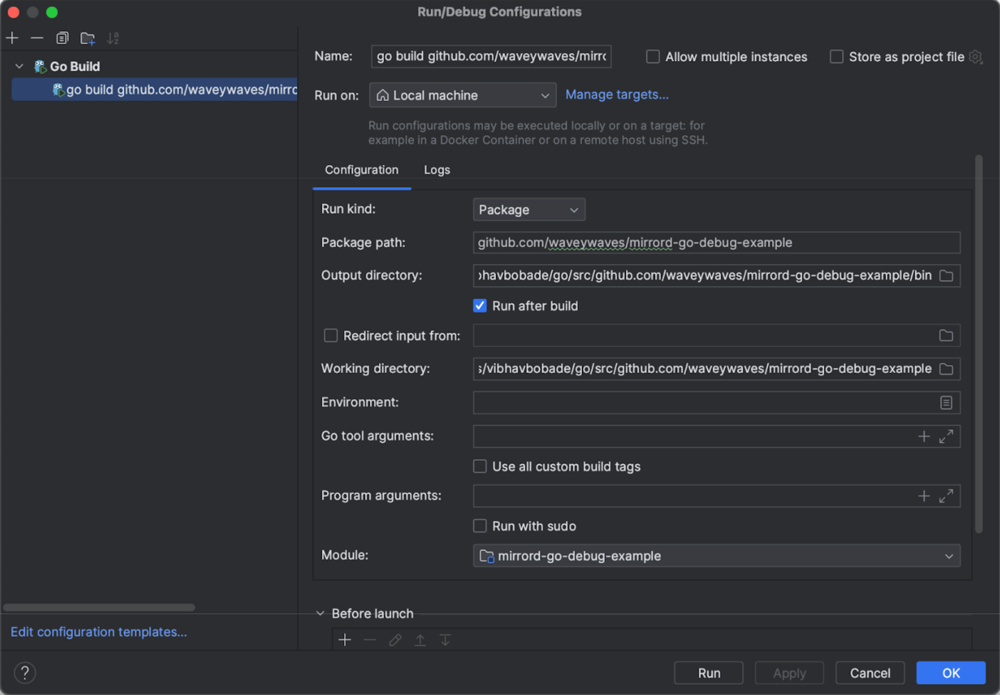

After adding the above configuration, let’s start the application without mirrord first to test if it runs well when not running with the Kubernetes context. 
A disabled mirrord button will be shown with a slash in front of it if mirrord is disabled.

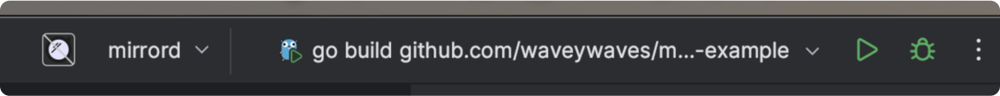

Once we run the application without mirrord we can see that the guestbook fails because it can’t connect to a Redis instance, the application throws errors accordingly as well.

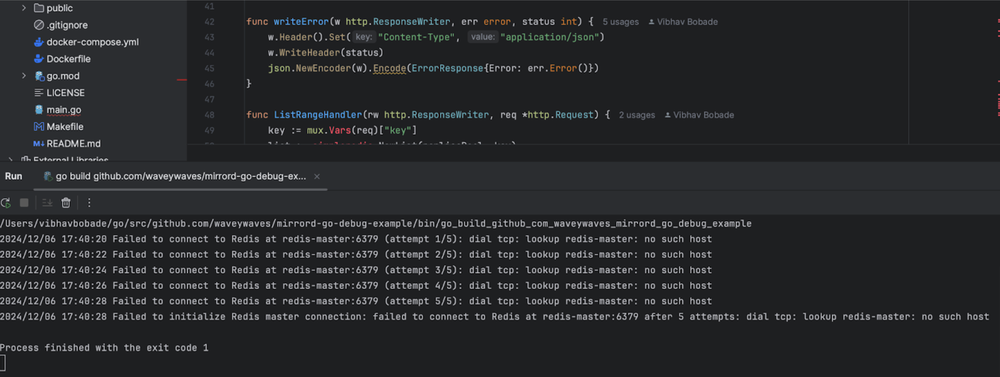

It is failing to connect to a Redis instance. The Redis instance is running in our Kubernetes cluster.
Let’s try running the application in the context of the Kubernetes cluster with mirrord.

#### Running the application with the mirrord plugin enabled

Click the “mirrord” button to enable the mirrord plugin. A “mirrord enabled” notification will appear in the bottom-right corner of the screen.


Once mirrord is enabled, let’s run the application once again.
Below you can see the successful run of the Guestbook application.

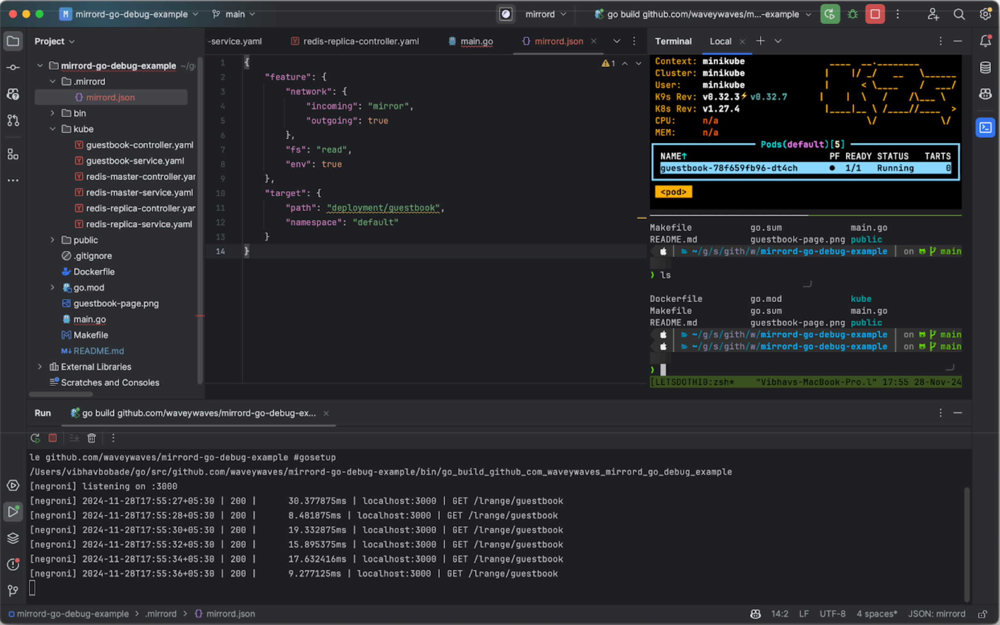

As the application starts successfully, you should be able to access the Go application listening on http://localhost:3000 on your local machine. Let’s access the endpoint in the browser.

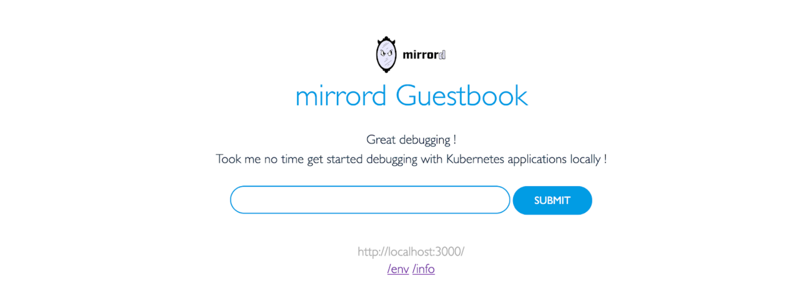

We can see that this debuggable instance of Guestbook also has access to the stored notes in Redis which are reflected above the submit button. 

3. **Debugging the application with the mirrord plugin**

Now that we can run the application, let’s understand what our setup looks like with the mirrord-agent working with the target-impersonated Pod. The target impersonated Pod here is the Guestbook Pod.

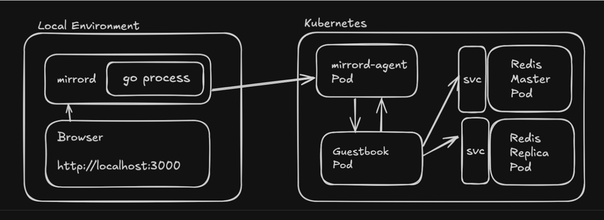

If you would like to learn more about how the mirrord-agent in the above architecture works, go check out the reference here [/mirrord/docs/reference/architecture/#mirrord-agent](https://metalbear.com/mirrord/docs/reference/architecture/#mirrord-agent).

We can now be sure that mirrord is working properly. 

Moving forward, let’s set a debug breakpoint in the application and see how it runs. I want to put a breakpoint in the application every time I create a note with the Guestbook application. The below line of code is where I am going to put the breakpoint.

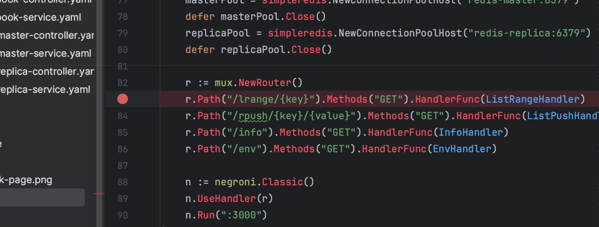

Start debugging by pressing the debug button below.


From [http://localhost:8080](http://localhost:8080) create a new note and publish it.
On the application run, you should hit the breakpoint as shown below:

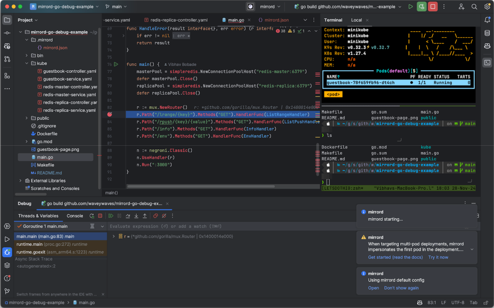

We can debug the issue now as the breakpoint is hit.

You now know how to debug your Go microservice with Goland + mirrord without having to build and deploy your application anew.

Next, let’s see how to debug our microservice in the CLI with go and mirrord.

## Debug in the CLI with go and mirrord

1. **Run the application with go in the CLI**

Let’s run the following command to check the same (we expect this execution to fail).

```bash
go run main.go
```

On the run above we can see that the application run fails because this local execution doesn’t have access to the services running inside the Kubernetes cluster we have created. 

The microservice needs access to the “redis” service hosted on the cluster. To run the Go microservice with Kubernetes, we can use the mirrord CLI tool.

2. **Installing mirrord**

Install the mirrord CLI tool and run Guestbook with the required Kubernetes context. Follow the installation guide for mirrord here [/mirrord/docs/overview/quick-start/#installation](https://metalbear.com/mirrord/docs/overview/quick-start/#installation) and run the below command.

3. **Run the Guestbook application with go and mirrord in the CLI**

Run the following command to run the guestbook application in the context of Kubernetes.

```bash
mirrord exec -t deployment/guestbook go run main.go
```

You should see the following output which will let you know that the guestbook has started in debug mode.

```console
...
⠉ mirrord exec
	✓ update to 3.125.1 available
	✓ ready to launch process
  	✓ layer extracted
  	✓ operator not found
  	✓ agent pod created
  	✓ pod is ready
  	✓ arm64 layer library extracted
	✓ config summary                                                                   
    
    [negroni] listening on :3000
[negroni] 2024-11-28T18:06:36+05:30 | 200 |  	18.884042ms | localhost:3000 | GET /lrange/guestbook
[negroni] 2024-11-28T18:06:38+05:30 | 200 |  	11.609291ms | localhost:3000 | GET /lrange/guestbook
[negroni] 2024-11-28T18:06:40+05:30 | 200 |  	8.066ms | localhost:3000 | GET /lrange/guestbook
[negroni] 2024-11-28T18:06:42+05:30 | 200 |  	11.456667ms | localhost:3000 | GET /lrange/guestboo
```

After you have run the guestbook program with mirrord you should be able to make your changes and rerun the service as necessary. You can even run the program in debug mode and attach a debugger if required.

## Debugging with mirrord vs. other debugging techniques

mirrord distinguishes itself by eliminating the need for repeated building and deployment cycles. It allows developers to run the application locally while providing the necessary network and execution context of the target Kubernetes Pod. In this case, the local application behaves as if it were running within the cluster, enabling developers to debug using familiar tools without the overhead to build and deploy.

## Conclusion

This guide explored how to use mirrord with Goland and the mirrord CLI. We demonstrated how developers can set breakpoints in their IDE or CLI debugger and step through code execution while leveraging the live Kubernetes environment.

By enabling local execution with Kubernetes context, mirrord helps developers save substantial time during debugging.

Curious to try it out? Give [mirrord](https://app.metalbear.com/account/sign-up) a go and see how it works for you. Got questions? Hop into our [Slack](https://metalbear.com/slack) and let us know!