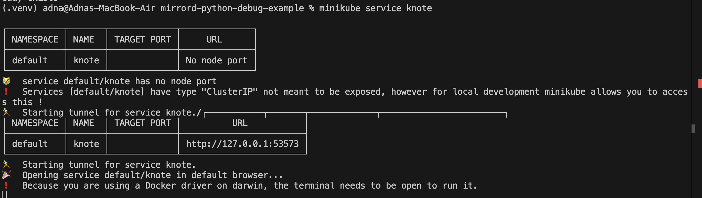
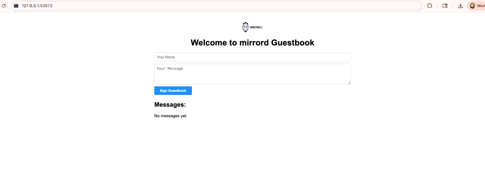
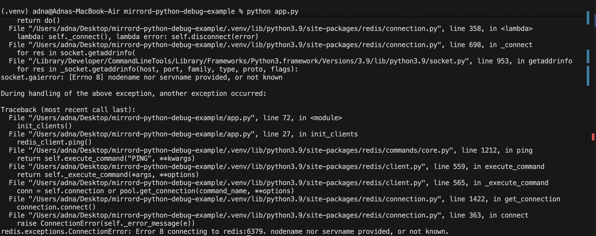
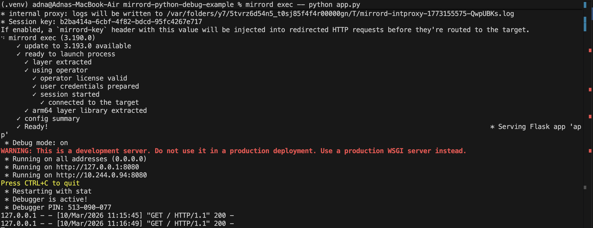
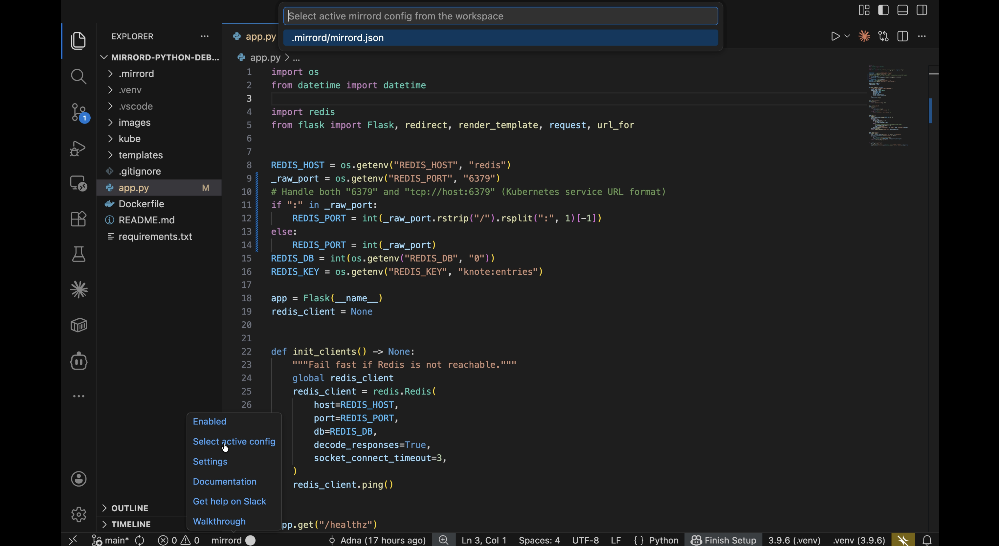
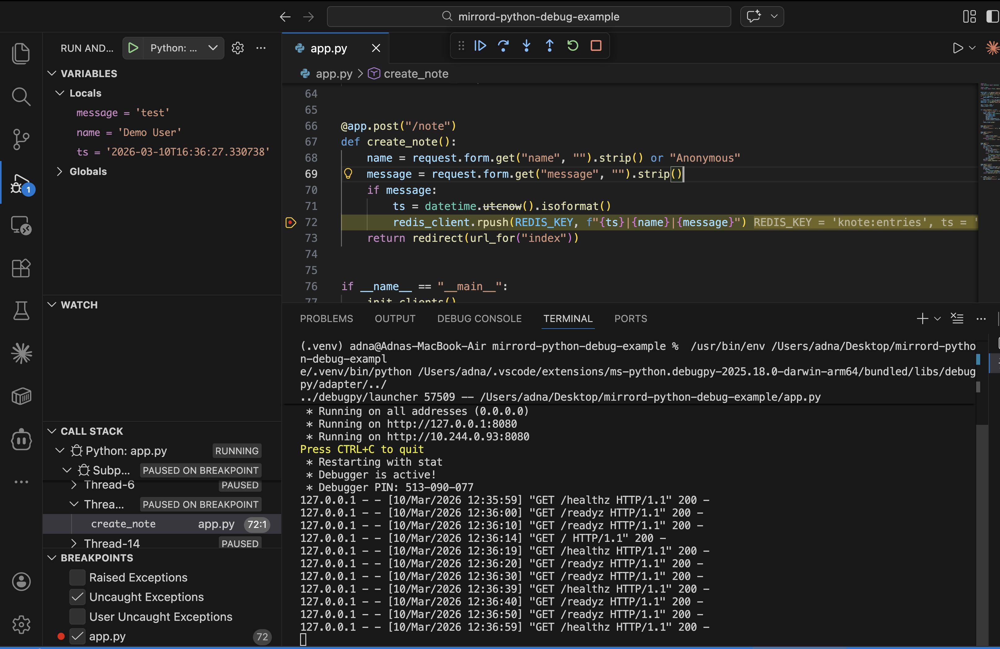
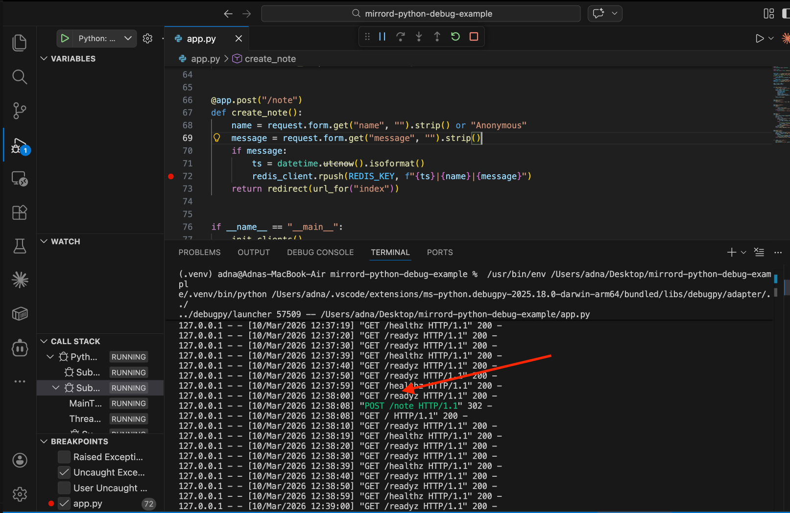
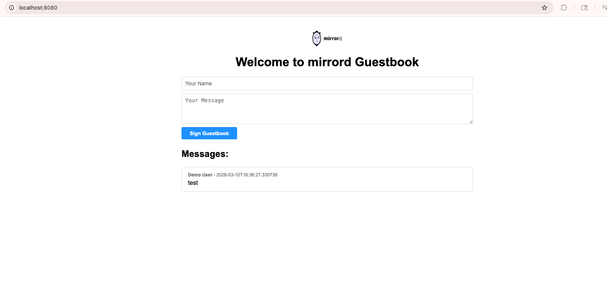

# How to Debug a Python Microservice

In this guide, we'll cover how to debug a Python microservice running in a Kubernetes environment using mirrord. You'll learn how to set up and use mirrord from VS Code and from the command line.

Tip: You can use [mirrord](https://metalbear.com/mirrord/) to debug, test, and troubleshoot applications locally with Kubernetes context, without rebuilding and redeploying on every change.

## Common debugging techniques for Python microservices

Debugging microservices in Kubernetes can be slow, especially when your service depends on in-cluster components such as Redis, queues, or internal APIs. These are common approaches:

### Build and deploy to a test environment

Build a new image and deploy it for every code change. This works, but the build/deploy/test loop is slow for iterative debugging.

### Log analysis

Logs are useful for understanding behavior over time, but they are not a replacement for stepping through code with breakpoints.

### Remote debugging

You can attach a debugger to an in-cluster process, but this usually requires extra debug configuration and can add operational overhead.

## Introduction to debugging Python microservices with mirrord

With mirrord, your Python process runs locally while using the network and runtime context of a target workload in Kubernetes. That lets you keep fast local iteration while still debugging against real in-cluster dependencies.

## Sample application setup

In this walkthrough, we use a Python sample app deployed to Kubernetes, then run the same app locally with mirrord and compare the behavior.

### Prerequisites

1. Python 3.8 or later and a development Kubernetes cluster (minikube used here as an example):

```bash
minikube start
```

2. Clone the sample repository:

```bash
git clone https://github.com/metalbear-co/mirrord-python-debug-example.git
cd mirrord-python-debug-example
```

3. Build the sample image into minikube:

```bash
minikube image build -t mirrord-python-debug-example:0.1.0 .
```

4. Deploy the sample resources:

```bash
kubectl create -f ./kube
```

5. Verify the in-cluster app is reachable:

```bash
minikube service knote
```

When you run this command, minikube looks up the `knote` Service, opens a local tunnel to it, and prints a local URL (usually `http://127.0.0.1:<port>`). It can also open that URL in your browser automatically, so you can validate the app is reachable before starting local mirrord debugging.



At this point, the app is running in Kubernetes with its dependencies, and we can compare local runs with and without mirrord.



## Debug in the CLI with Python and mirrord

### 1) Run the application locally without mirrord

Create a virtual environment and start the app:

```bash
python3 -m venv .venv
source .venv/bin/activate
pip install -U pip
pip install -r requirements.txt
python app.py
```

This run is expected to fail in most setups because local execution does not have access to in-cluster services such as `redis`.



### 2) Install mirrord

Install mirrord by following the [quick start installation steps](https://metalbear.com/mirrord/docs/overview/quick-start/#installation).

### 3) Run the application with mirrord

```bash
mirrord exec -- python app.py
```

mirrord discovers config from `.mirrord/mirrord.json` (or `mirrord.json` in the project root) by default. This starts your local Python process in the context of the target deployment (for example `deployment/knote`).



The "Debugger is active!" message is from Flask's built-in debugger (`debug=True`). The app is reachable at `http://localhost:8080`. For breakpoints and step-through debugging, use VS Code with the mirrord extension (see below).

## Debug the Python app with VS Code and the mirrord extension

In this section, we'll debug the same service using VS Code. If you skipped the CLI section, ensure you have a virtual environment and dependencies installed (see CLI step 1, or use your usual setup).

### 1) Install required VS Code extensions

- [mirrord](https://marketplace.visualstudio.com/items?itemName=MetalBear.mirrord) — [Install guide](https://metalbear.com/mirrord/docs/getting-started/installing-mirrord/vscode)
- [Python](https://marketplace.visualstudio.com/items?itemName=ms-python.python) (Microsoft)

Select the project's Python interpreter (e.g. from your `.venv`) so the debugger uses the correct environment. If you get `ModuleNotFoundError` when debugging with mirrord enabled, add `PYTHONPATH` to your launch config's `env`, pointing at your venv's `site-packages` folder. Use the path that matches your venv (e.g. `"PYTHONPATH": "${workspaceFolder}/.venv/lib/python3.11/site-packages"` for Python 3.11).

### 2) Configure mirrord target

Use your existing `mirrord.json` (or `.mirrord/mirrord.json`) and point it at your target deployment.

Example:

```json
{
  "target": "deployment/knote",
  "feature": {
    "network": {
      "incoming": "steal",
      "outgoing": true
    }
  }
}
```

Click the mirrord icon in the VS Code status bar and choose **Select active config**, then pick `.mirrord/mirrord.json`.



If you expect multiple replicas and need advanced traffic behavior, check [mirrord for Teams](https://metalbear.com/mirrord/docs/overview/teams/).

### 3) Run and debug without mirrord first

Run your Python launch configuration once with mirrord disabled to reproduce the dependency failure baseline.

### 4) Enable mirrord and run again

Enable mirrord in VS Code, run the same configuration, and confirm the app starts successfully in Kubernetes context.

Open the local app URL and exercise the relevant endpoint.

### 5) Set a breakpoint and debug a real request

Set a breakpoint in `create_note` in `app.py`, then submit a request from the UI (or curl/postman).  
You should hit the breakpoint and be able to inspect variables, call stack, and request payload in real time.



Continue past the breakpoint and the request completes—you'll see the POST return a 302 redirect back to the index page.



The new note appears on the page, stored in Redis via the cluster context.



## Debugging with mirrord vs. other debugging techniques

mirrord removes most of the build-and-redeploy cycle by letting you run code locally while borrowing Kubernetes context from a target workload. You keep local debugger speed while testing against real cluster dependencies.

## Conclusion

In this guide, we covered running the Python app with mirrord from the CLI and debugging it with VS Code and the mirrord extension. Both let you debug locally while working against live Kubernetes context.