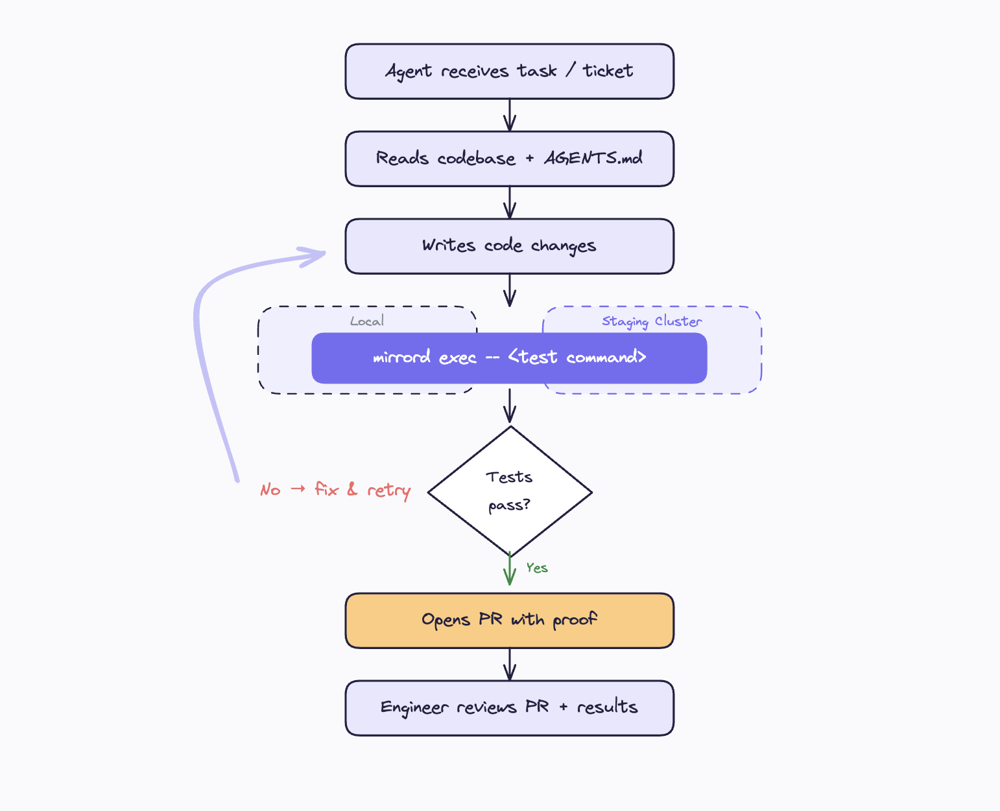

# How to Run AI Agents with mirrord

In this guide, we'll cover how to set up an AI coding agent to test its own changes against real Kubernetes services using mirrord. You'll configure per-service mirrord configs, helper scripts, and an `AGENTS.md` so the agent runs your existing E2E tests after every change.

---

**Tip:** This guide builds on [How to Test AI Code with mirrord](testing-ai-generated-code.md). Start there if you haven't set up mirrord for AI workflows yet.

---



## Prerequisites

- A Kubernetes cluster with your services running (staging or dev)
- [mirrord CLI installed](https://metalbear.com/mirrord/docs/installing-mirrord/cli)
- An existing E2E test suite that covers your critical happy paths (Playwright, Cypress, Jest, pytest, bash scripts, or any test runner)
- An AI coding agent that can execute shell commands (Claude Code, Cursor, Codex)

## Step 1: Set up mirrord configs per service

Create a mirrord config for each service an agent might work on. If you already have a config from the [Testing AI-Generated Code](testing-ai-generated-code.md#1-create-a-mirrord-config) guide, you can reuse it. For multi-service repos, create one config per service in `.mirrord/`:

`.mirrord/mirrord-order-service.json`:

```json
{
  "target": {
    "namespace": "shop",
    "path": {
      "deployment": "order-service"
    }
  },
  "feature": {
    "network": {
      "incoming": {
        "mode": "steal",
        "http_filter": {
          "header_filter": "X-Agent-Session: autonomous"
        }
      },
      "outgoing": true
    },
    "fs": {
      "mode": "read"
    },
    "env": true
  }
}
```

**Tip:** You can auto-generate configs and helper scripts for every service using the meta-prompt in [Using mirrord with AI Agents](https://metalbear.com/mirrord/docs/using-mirrord-with-ai).

## Step 2: Create helper scripts

Wrapper scripts add pre-flight checks so the agent doesn't waste time debugging environment issues:

```bash
#!/usr/bin/env bash
# scripts/mirrord-order-service.sh
set -euo pipefail

# Pre-flight checks
command -v mirrord >/dev/null || { echo "FAIL: mirrord not installed"; exit 1; }
kubectl get deployment order-service -n shop >/dev/null 2>&1 || {
  echo "FAIL: deployment/order-service not found in namespace shop"; exit 1
}

echo "Starting order-service with mirrord (targeting deployment/order-service in shop)"
mirrord exec --config-file .mirrord/mirrord-order-service.json -- "$@"
```

The agent calls `./scripts/mirrord-order-service.sh npm start` instead of dealing with raw mirrord commands.

## Step 3: Write AGENTS.md for autonomous operation

The `AGENTS.md` file is what turns a code-generation agent into an autonomous one. Use strong imperative language, agents respond more reliably to direct instructions.

```markdown
# Agent Instructions

## ATTENTION: Testing is REQUIRED

You MUST test all code changes against the staging cluster using mirrord
before opening a PR. Do NOT rely on mocks or unit tests alone.

## Services

| Service | Config | Helper Script | Test Command |
|---------|--------|---------------|--------------|
| order-service | `.mirrord/mirrord-order-service.json` | `scripts/mirrord-order-service.sh` | `./ci/demo_e2e.sh` |

## Workflow

1. Read this file and understand the service you're modifying
2. Make code changes
3. Start the service with mirrord in the background:

   ./scripts/mirrord-order-service.sh <start command> &

4. Wait for the service to be ready, then run E2E tests:

   ./ci/demo_e2e.sh

5. If tests FAIL: read the failure output, fix your code, re-run
6. If tests PASS: continue to the next change
7. Stop the background service before starting the next test cycle
8. After ALL changes pass, open a PR with test output in the description
9. NEVER open a PR without passing E2E tests against staging

## Verification

After starting the service with mirrord, verify it works:
curl http://localhost:<port>/health

## Safety

- NEVER target production clusters
- ALWAYS use the provided mirrord configs (they include traffic filters)
- If mirrord fails to start, check kubectl access and deployment status
```

**Tip:** For per-tool setup (Claude Code, Cursor, Copilot, Windsurf), see [Setting Up mirrord for Your AI Coding Tool](setting-up-mirrord-for-ai-tools.md).

## Example: AI agent testing an order service

This example uses the [MetalBear playground](https://github.com/metalbear-co/playground), a sample microservices app with an order service, inventory, and payment processing.

### The E2E test script

```bash
#!/usr/bin/env bash
set -euo pipefail

SHOP_URL="${SHOP_URL:-http://localhost:3000}"
HEADER_ARGS=(-H "baggage: mirrord=e2e-test")

# Health check
curl -sS --fail "${HEADER_ARGS[@]}" "${SHOP_URL}/banner" >/dev/null || {
  echo "FAIL: Service not reachable"; exit 1
}

# Create an order
order_resp="$(curl -sS -X POST "${HEADER_ARGS[@]}" "${SHOP_URL}/orders" \
  -H "Content-Type: application/json" \
  -d '{"items": [{"productId": 1, "quantity": 1}], "total_cents": 1999}')"

order_id="$(echo "$order_resp" | jq -e '.orderId')" || {
  echo "FAIL: orderId missing"; exit 1
}

# Verify order status
echo "$order_resp" | jq -e '.status == "confirmed"' >/dev/null || {
  echo "FAIL: Expected status 'confirmed'"; exit 1
}

echo "OK: E2E tests passed"
```

This script tests the happy path: create an order, verify it's confirmed. It runs against real Postgres, real payment service, real inventory service. Any regression in the order flow fails the script. Adjust the port and base URL to match your service.

### The agent in action

**Task:** "Add a `discount_cents` field to the order response based on order total."

```console
Agent: Reading AGENTS.md and codebase...
Agent: I see order-service returns orders from POST /orders.
       I'll add discount_cents calculation to the order handler.

Agent: Making changes to order-service/src/handlers/orders.ts...
       Added calculateDiscount() function and discount_cents to response.

Agent: Starting service with mirrord in the background...
       $ ./scripts/mirrord-order-service.sh npm start &
       OK: Service started with mirrord

Agent: Running E2E tests...
       $ ./ci/demo_e2e.sh
       FAIL: ERROR: expected status 'confirmed', got 'pending'

Agent: Stopping service. The discount calculation is triggering an async
       payment re-check. Fixing: add discount after payment confirmation,
       not before.

Agent: Restarting service and re-running tests...
       $ ./scripts/mirrord-order-service.sh npm start &
       $ ./ci/demo_e2e.sh
       OK: E2E tests passed

Agent: All tests pass. Opening PR with test results attached.
```

The agent caught and fixed the bug without human intervention. Nobody wrote new tests for this change. The existing E2E tests acted as **guardrails**, the agent could change the code freely, but the happy paths that the team already validated were protected. The engineer reviews a PR that already includes proof nothing broke.

## Architecture patterns for safe autonomous agents

### Scoped permissions

Give agents the minimum Kubernetes access they need. Create a dedicated service account with access scoped to their target namespace. If you're using the mirrord Operator, you can use [Policies](https://metalbear.com/mirrord/docs/sharing-the-cluster/policies) to control which targets agents can access and what traffic modes they can use.

### Isolated namespaces

For teams running multiple agents concurrently, use separate namespaces or mirrord for Teams' session management to prevent agents from interfering with each other. See [Sharing the Cluster](https://metalbear.com/mirrord/docs/sharing-the-cluster/overview).

### Traffic filtering

The `http_filter` in mirrord configs controls which traffic is stolen from the remote pod. Only requests matching the header are redirected to the local process, everything else flows to the remote pod normally. Your E2E tests hit `localhost` directly, so they reach the local process regardless of the header, but including the header in test requests is good practice for consistency.

```json
"http_filter": {
  "header_filter": "X-Agent-Session: agent-task-1234"
}
```

Use unique session identifiers per agent run to prevent collisions.

### Read-only database access

For agents that shouldn't modify data, configure your staging environment with read-only database credentials. The agent can still test query logic against real schema and data without risk of corruption.

**Warning:** Keep your AI agent in approval mode until you're comfortable with the workflow. Start with one service at a time. Never target production clusters.

## Next steps

- [How to Test AI Code with mirrord](testing-ai-generated-code.md): test AI-generated code against real services step by step
- [How to Set Up AI Tools with mirrord](setting-up-mirrord-for-ai-tools.md): per-tool config for Cursor, Claude Code, Copilot, and Codex
- [Using mirrord with AI Agents](https://metalbear.com/mirrord/docs/using-mirrord-with-ai): auto-generate mirrord configs and AGENTS.md for your repo
- [Sharing the Cluster](https://metalbear.com/mirrord/docs/sharing-the-cluster/overview): manage concurrent agent sessions with mirrord for Teams
