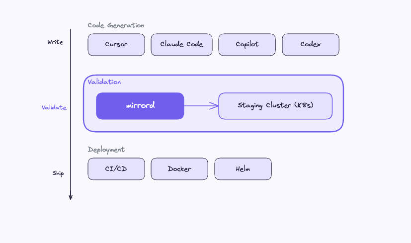

# Setting Up mirrord for Your AI Coding Tool

This guide walks through configuring mirrord with the best AI coding tools engineers use today, Cursor, Claude Code, GitHub Copilot, Codex, and Windsurf. Each tool has a different way of receiving instructions, but the core workflow is the same: the coding agent runs your code through mirrord so it can test against real staging services instead of mocks. Whether you're doing React development, building Python APIs, or working on Node.js services, the setup is the same.

---

**_Tip:_** This guide assumes familiarity with mirrord basics. If you're new to mirrord, start with the [Quick Start](https://metalbear.com/mirrord/docs/getting-started/quick-start).

---

## Where mirrord fits in the AI dev productivity stack

Most AI agent devtools focus on code generation. mirrord sits in the validation layer of the software development toolkit, it's what makes AI-generated code trustworthy before it reaches CI/CD.



The setup for every tool follows the same pattern:

1. **mirrord config**: tells mirrord which Kubernetes deployment to target
2. **Instructions file**: tells the AI agent to use mirrord when testing
3. **Helper scripts** (optional): wrap mirrord commands with pre-flight checks

## Common setup: mirrord config

Before configuring any AI tool, create a mirrord config at `.mirrord/mirrord.json`:

```json
{
  "target": {
    "namespace": "your-namespace",
    "path": {
      "deployment": "your-service"
    }
  },
  "feature": {
    "network": {
      "incoming": {
        "mode": "steal",
        "http_filter": {
          "header_filter": "X-Test-Agent: dev"
        }
      },
      "outgoing": true
    },
    "fs": {
      "mode": "read"
    },
    "env": true
  }
}
```

For repos with multiple services, create one config per service: `.mirrord/mirrord-<service>.json`.

**Tip:** You can auto-generate configs, helper scripts, and agent instructions for your entire repo using the meta-prompt in [Using mirrord with AI Agents](https://metalbear.com/mirrord/docs/using-mirrord-with-ai). The sections below show what to set up manually if you prefer.

## Claude Code

Claude Code reads instructions from `CLAUDE.md` at the repo root. It also reads `AGENTS.md` if present.

### Fast path: install mirrord skills

MetalBear publishes a [skills package](https://github.com/metalbear-co/skills) that gives Claude Code mirrord capabilities out of the box, config generation, quickstart, CI setup, operator installation, and database branching:

```bash
/plugin marketplace add metalbear-co/skills
```

Or with npx:

```bash
npx skills add metalbear-co/skills
```

Once installed, Claude Code can generate mirrord configs, run services against staging, and set up your repo without manual instructions. If you want more control over the instructions, create a `CLAUDE.md` manually instead.

### Manual setup

Create `CLAUDE.md`:

```markdown
# Agent Instructions

## Testing with mirrord

You MUST test code changes against the staging cluster using mirrord before
opening a PR. Do NOT rely on mocks or assume code works without testing.

### Running the service locally with staging context:

mirrord exec --config-file .mirrord/mirrord.json -- <start command>

### Running tests against staging:

mirrord exec --config-file .mirrord/mirrord.json -- <test command>

### Workflow:
1. Make code changes
2. Start the service with mirrord
3. Verify the change works (send requests, run tests)
4. If tests fail, fix and re-run
5. NEVER open a PR without testing against staging
```

### Usage

```console
> Read AGENTS.md. I changed the /orders endpoint to include a discount field.
  Test it against staging.

Claude Code: I'll start the service with mirrord and test your change...
$ mirrord exec --config-file .mirrord/mirrord.json -- npm start
$ curl -H "X-Test-Agent: dev" http://localhost:3000/orders/42
{"orderId": 42, "status": "confirmed", "discount_cents": 150}
OK: The discount field is present and calculated correctly.
```

## Cursor

Cursor reads project-level instructions from `.cursor/rules/` directory. Each file in this directory is loaded as a rule.

### Setup

Create `.cursor/rules/mirrord.mdc`:

```yaml
---
description: Testing code changes against Kubernetes staging using mirrord
globs:
---

You are working in a repository that uses mirrord to test code against a
Kubernetes staging cluster.

RULES:
- ALWAYS test code changes against staging using mirrord before suggesting
  they are complete
- Use this command to run the service with staging context:
  mirrord exec --config-file .mirrord/mirrord.json -- <start command>
- Use this command to run tests against staging:
  mirrord exec --config-file .mirrord/mirrord.json -- <test command>
- If a test fails, read the error output and fix the issue before retrying
- NEVER mark a task as done without testing against real infrastructure

SERVICE CONFIGS:
- Default: .mirrord/mirrord.json
- For specific services, check .mirrord/mirrord-<service>.json

VERIFICATION:
After starting with mirrord, verify the service is running:
  curl -H "X-Test-Agent: dev" http://localhost:<port>/health
```

### Using with Cursor Agent

When using Cursor's Agent mode for multi-file changes, Cursor reads rules from `.cursor/rules/` automatically. Ask it to test:

```console
Make the change and test it with mirrord against staging.
```

Cursor will generate the code, run `mirrord exec`, and verify the result.

## GitHub Copilot

GitHub Copilot CLI and Copilot Workspace read instructions from `.github/copilot-instructions.md`.

### Setup

Create `.github/copilot-instructions.md`:

```markdown
## Testing

This project uses mirrord to test against a live Kubernetes staging cluster.

When making code changes:
1. Run the service with mirrord:
   
   mirrord exec --config-file .mirrord/mirrord.json -- <start command>
   
2. Verify the change works by sending test requests
3. Run the test suite through mirrord:
   
   mirrord exec --config-file .mirrord/mirrord.json -- <test command>

The mirrord config at `.mirrord/mirrord.json` targets the staging deployment.
Traffic filtering ensures only your test requests are intercepted.
```

## Codex / Windsurf

OpenAI Codex reads from `AGENTS.md`. Windsurf reads from `.windsurfrules`.

### Setup for Codex

Use the same `AGENTS.md` format as Claude Code above. Codex follows the same conventions.

### Setup for Windsurf

Create `.windsurfrules`:

```markdown
This project uses mirrord to connect local processes to a Kubernetes staging
cluster for testing.

Testing workflow:
1. Run with mirrord: mirrord exec --config-file .mirrord/mirrord.json -- <cmd>
2. Test the change against real services
3. Fix any failures before completing the task

mirrord configs are in .mirrord/, one per service.
```

## Using the meta-prompt for any tool

Instead of writing configs manually, you can paste the meta-prompt from [Using mirrord with AI Agents](https://metalbear.com/mirrord/docs/using-mirrord-with-ai) into any AI tool. It will:

1. Scan your repo to discover services
2. Ask you which deployments to target
3. Generate `.mirrord/mirrord-<service>.json` configs
4. Generate `scripts/mirrord-<service>.sh` helper scripts
5. Generate an `AGENTS.md` with instructions for your specific setup

This works with Claude Code, Cursor, Copilot CLI, and Gemini CLI.

## IDE plugin integration

If you use mirrord's IDE plugins (VS Code or JetBrains), your AI agent's code runs with mirrord context automatically when you hit Run or Debug, no `mirrord exec` needed.

### VS Code and Cursor

If you're comparing Cursor vs VS Code for AI-assisted development, the mirrord extension works in both. Cursor is built on VS Code, so the same extension is compatible.

1. Install the [mirrord extension](https://marketplace.visualstudio.com/items?itemName=MetalBear.mirrord)
2. Enable mirrord from the status bar
3. When your AI agent says "run the service", use the Run/Debug button, mirrord is already active

### JetBrains (IntelliJ, GoLand, PyCharm, etc.)

1. Install the [mirrord plugin](https://plugins.jetbrains.com/plugin/19772-mirrord)
2. Enable mirrord and select your config
3. Run/Debug your application, mirrord handles the cluster connection

This is useful when you're pair-programming with an AI agent in the IDE rather than letting it run autonomously via CLI.

## Verifying the setup

After configuring any tool, test the integration:

1. Ask the agent to make a trivial change (e.g., add a log line)
2. Ask it to test the change using mirrord
3. Verify the agent runs `mirrord exec` and checks the output
4. Confirm the agent reports real responses from staging, not mock data

If the agent skips the mirrord step, strengthen the language in your instructions file, use "MUST", "ALWAYS", "NEVER" instead of "should" or "please".

## Conclusion

Every AI code assistant has a way to receive instructions. The setup is the same regardless of tool: a mirrord config targeting your deployment, an instructions file telling the agent to verify AI code against real infrastructure, and optionally a helper script with pre-flight checks. Once configured, the coding agent validates every change against real staging services before marking it complete.

## Next steps

- [Testing AI-Generated Code Against Real Services](testing-ai-generated-code.md): why testing against real services matters for AI workflows
- [Running AI Agents with mirrord](running-ai-agents-with-mirrord.md): the full agent loop, E2E guardrails, AGENTS.md setup, and safety patterns
- [Using mirrord with AI Agents](https://metalbear.com/mirrord/docs/using-mirrord-with-ai): the meta-prompt and detailed setup reference
