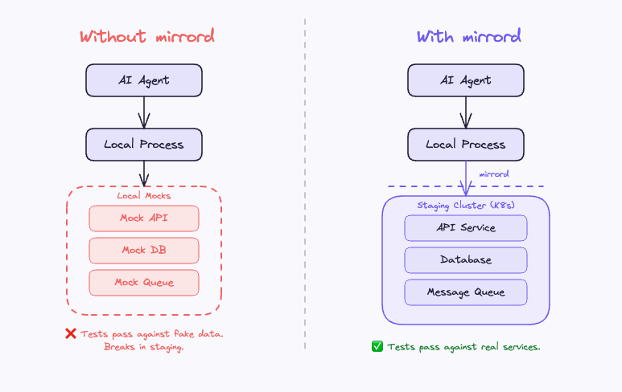

# Testing AI-Generated Code Against Real Services

AI coding tools generate code in minutes. But validating that code still takes hours, waiting on CI/CD pipelines, staging deploys, and environment provisioning. The bottleneck in AI for software development has shifted from writing code to proving it works. mirrord closes this gap by connecting your local process directly to your staging cluster, so you can test AI-generated code against real services without building or deploying anything. It tightens the developer inner loop from hours to seconds.

---

**Tip:** This guide assumes familiarity with mirrord basics. If you're new to mirrord, start with the [Quick Start](https://metalbear.com/mirrord/docs/getting-started/quick-start).

---

## The problem: AI writes fast, validation is slow

The typical AI-assisted workflow looks like this:

1. AI generates code in 2-5 minutes
2. Developer pushes to a branch
3. CI builds a container image (5-10 minutes)
4. CI deploys to a test environment (5-10 minutes)
5. E2E tests run against the deployed service (5-15 minutes)
6. Tests fail, back to step 1

A single iteration takes 20-40 minutes. If the AI-generated code needs 3 rounds of fixes, you've spent 1-2 hours validating what took 5 minutes to write.

## Why mocks don't solve this

The instinct is to skip the deploy step and test locally against mocks. But AI agents are uniquely bad at working with mocks:

**AI doesn't know when mocks are stale.** A human developer who wrote a mock has a mental model of what the real API returns. An AI agent has no such context, it treats the mock as truth, even when the mock diverges from reality.

**AI can hallucinate mock responses.** When an AI writes tests, it can generate mock responses that look plausible but don't match your actual backend. The tests pass beautifully against responses that would never come from your real services.

**Mocks hide integration bugs.** The difference between unit testing and integration testing matters here. Unit tests verify isolated logic. Integration tests verify that services work together. The bugs that matter most in microservice architectures, schema mismatches, auth failures, timeout behavior, queue delivery semantics, are integration bugs that mocks can't surface.



## The mirrord approach: test locally against real services

mirrord connects your local process to a remote Kubernetes cluster. Your code runs on your machine, but it talks to real services in staging, real databases, real APIs, real message queues, real environment variables.

This means you can test AI-generated code against your actual infrastructure without building a container image or deploying anything:

```bash
mirrord exec --config-file .mirrord/mirrord.json -- <start command>
```

Your local process now behaves as if it's running inside the cluster. Outgoing requests reach real services. Incoming traffic (mirrored or stolen) flows to your local process. File reads and environment variables come from the remote pod.

## Hands-on: validating AI-generated code with mirrord

### Prerequisites

- A Kubernetes cluster with your services running (staging or dev)
- [mirrord CLI installed](https://metalbear.com/mirrord/docs/installing-mirrord/cli)
- An AI coding tool (Claude Code, Cursor, Copilot, Codex)

### 1. Create a mirrord config

Create `.mirrord/mirrord.json` targeting the service you're working on:

```json
{
  "target": {
    "namespace": "your-namespace",
    "path": {
      "deployment": "your-service"
    }
  },
  "feature": {
    "network": {
      "incoming": {
        "mode": "steal",
        "http_filter": {
          "header_filter": "X-Test-Agent: dev"
        }
      },
      "outgoing": true
    },
    "fs": {
      "mode": "read"
    },
    "env": true
  }
}
```

The `http_filter` ensures you only intercept traffic with your header, other developers and services using the same deployment are unaffected.

### 2. Let AI generate code, then validate immediately

Instead of the build, deploy, test cycle, the workflow becomes:

1. AI generates code changes
2. Run locally with mirrord (substitute your framework's start command and port):
   ```bash
   mirrord exec --config-file .mirrord/mirrord.json -- <start command>
   ```
3. Send a test request:
   ```bash
   curl http://localhost:<port>/your-endpoint
   ```
4. See real responses from real services, no mocks, no deploy

If something is wrong, fix it and re-run. Each iteration takes seconds, not minutes.

### 3. Run your test suite through mirrord

For automated validation, you have two options depending on your test setup:

**Option A: Run the test runner through mirrord.** This works when your tests start the service themselves (common with frameworks like FastAPI's TestClient or supertest):

```bash
mirrord exec --config-file .mirrord/mirrord.json -- pytest tests/integration/
```

**Option B: Start the service via mirrord, then run tests against localhost.** This works when your tests hit an already-running service (curl-based scripts, Playwright, Cypress):

```bash
# Terminal 1: start the service
mirrord exec --config-file .mirrord/mirrord.json -- <start command>

# Terminal 2: run tests against localhost
./ci/e2e_test.sh
```

Either way, your tests hit real infrastructure. No mock setup, no Docker Compose, no fake data.

## Example: validating a new endpoint

An AI agent adds a `/discount` endpoint to an order service. Without mirrord, you'd need to build, deploy, and test against staging. With mirrord:

```bash
# AI generates the code
# Run locally with staging context
mirrord exec -t deployment/order-service -- <start command>
```

```bash
# Test the new endpoint against real data
curl http://localhost:<port>/discount \
  -H "Content-Type: application/json" \
  -d '{"orderId": 42}'
```

The request reaches your local code, but when your code queries the database or calls other services, those calls go to the real staging cluster. You immediately know:

- Does the database query work with real schema and data?
- Do downstream service calls return what the AI expected?
- Do auth tokens and permissions work correctly?
- Is the response format compatible with the frontend?

## Integrating with AI coding tools

Add mirrord to your agent's instructions so it validates automatically. In your `AGENTS.md`, `CLAUDE.md`, or `.cursor/rules/`:

```markdown
## Validating code changes

ALWAYS validate code changes against the staging cluster before opening a PR.

1. Start the service with mirrord:
   
   mirrord exec --config-file .mirrord/mirrord.json -- <start command>
   
2. Send test requests to verify the change works
3. If the service fails to start or requests fail, fix the issue and retry
4. NEVER assume code works without testing against real infrastructure
```

**Tip:** For a complete auto-generated setup including helper scripts and per-service configs, see [Using mirrord with AI Agents](https://metalbear.com/mirrord/docs/using-mirrord-with-ai).

## The inner loop: from hours to seconds

| Step | Without mirrord | With mirrord |
|------|----------------|--------------|
| Code generation | 2-5 min | 2-5 min |
| Build container | 5-10 min | **Skipped** |
| Deploy to staging | 5-10 min | **Skipped** |
| Run tests | 5-15 min | 10-30 sec |
| Fix and re-test | 20-40 min per round | **Seconds** |
| **Total (3 iterations)** | **1-2 hours** | **10-15 min** |

For teams running multiple AI-assisted iterations per day, the difference adds up quickly.

## What you catch that mocks miss

Testing against real infrastructure doesn't just verify happy paths. It catches:

- **Schema drift**: your AI-generated code expects a field that was renamed last week
- **Auth changes**: a new permission was added that the mock doesn't enforce
- **Performance regressions**: real latency reveals timeouts that 0ms mock responses hide
- **Data edge cases**: real staging and production data has nulls, Unicode, and unexpected formats that seed data doesn't
- **Service version mismatches**: the downstream service was updated and its response format changed

## Conclusion

The bottleneck in AI-assisted software development is validation, not code generation. mirrord removes the build-deploy-test cycle entirely by connecting your local process to your staging cluster. Whether you're building a React frontend, a Python API, or a Node.js service, the inner loop is the same: AI generates the code, you verify it against real services in seconds, and iterate until it works.

## Next steps

- [Running AI Agents with mirrord](running-ai-agents-with-mirrord.md): the full agent loop, E2E guardrails, AGENTS.md setup, and safety patterns
- [Setting Up mirrord for Your AI Coding Tool](setting-up-mirrord-for-ai-tools.md): per-tool setup for Cursor, Claude Code, Copilot, and Codex
- [Using mirrord with AI Agents](https://metalbear.com/mirrord/docs/using-mirrord-with-ai): auto-generate mirrord configs and AGENTS.md for your repo
